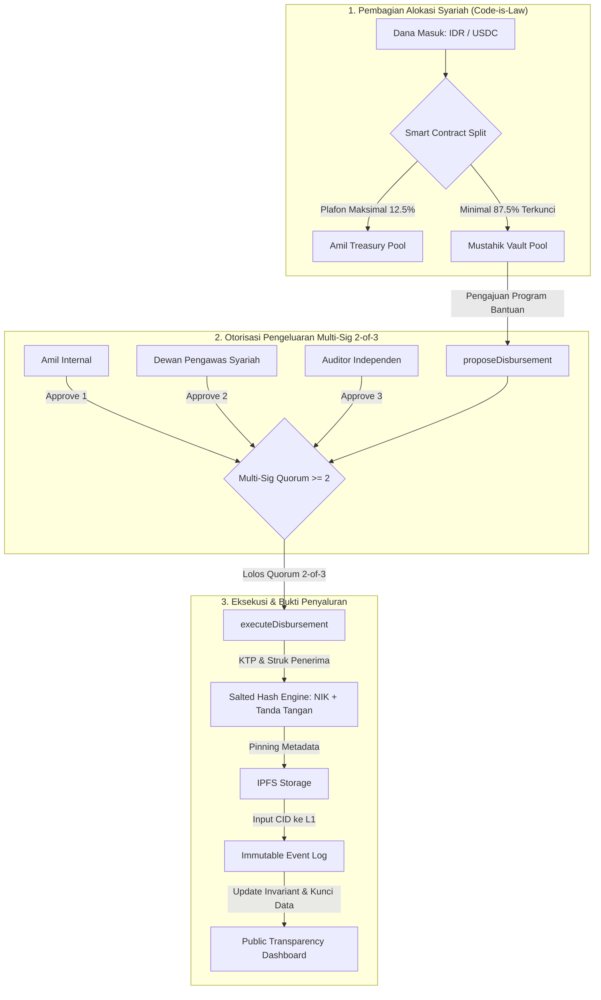

# CONTEXT.md: Zakat Transparency & Anti-Corruption Protocol (ZAKAT-L1)

## 1. Executive Summary & Problem Framing

- **Core Problem**: Korupsi dan ketidakpercayaan publik pada lembaga amil zakat (penggelapan dana masuk, penggelembungan hak operasional amil, penahanan dana gelap, serta mustahik fiktif).
- **Target Audience**:
  - **Primary (Web2/Awam)**: Muzakki Indonesia yang ingin berdonasi via fiat (QRIS / Virtual Account) tanpa perlu tahu apa itu gas fee, seed phrase, atau dompet Web3.
  - **Secondary (Web3 Native)**: Komunitas kripto/diaspora yang ingin menyalurkan zakat secara on-chain langsung via token USDC.
- **Core Architecture Strategy**: Multi-Unit Ledger Architecture (No Complex FX Oracle). Smart contract memisahkan pencatatan saldo akuntansi Fiat (IDR) dan custody aset nyata (USDC) secara independen.
- **Target Network**: **Ethereum Sepolia Testnet** (Direct EVM L1 Data Availability).
- **Technology Stack**:
  - **Smart Contract**: Solidity v0.8.20 + Foundry (`sc/`).
  - **Frontend**: TanStack Start / Vite + React 19 + Wagmi v3 + ConnectKit + Viem + TailwindCSS (`frontend/`).
  - **Backend / Relayer**: Bun + Hono API + Drizzle ORM + Neon PostgreSQL (`backend/`).

---

## 2. Live Deployed Smart Contracts & Infrastructure (Sepolia L1)

| Komponen | Alamat Kontrak / URL | Keterangan |
| :--- | :--- | :--- |
| **ZakatProtocolL1** | [`0x72b60a0C37a78dF62295F88294E790083089f665`](https://sepolia.etherscan.io/address/0x72b60a0C37a78dF62295F88294E790083089f665) | Core Vault, Multi-Sig 2-of-3, Invariant Split, Merkle Roots |
| **Official Sepolia USDC** | [`0x1c7D4B196Cb0C7B01d743Fbc6116a902379C7238`](https://sepolia.etherscan.io/token/0x1c7D4B196Cb0C7B01d743Fbc6116a902379C7238) | Circle Testnet ERC-20 Token |
| **Database Cloud** | Neon Serverless PostgreSQL (`ep-calm-glade-...`) | Drizzle ORM Live Persistence |
| **Wallet Connector** | ConnectKit by Family + Wagmi v3 (Project ID: `b6808bd11499531c85eddbf3cbc72e65`) | EIP-6963 Multi-Injected Discovery |

---

## 3. Inflow Architecture: Dual-Gate Ingestion

```
                ┌─────────────────────────────────────────────────────────┐
                │                    ZAKAT INFLOW GATE                    │
                └─────────────────────────────────────────────────────────┘
                               │                           │
                [JALUR A: FIAT QRIS / VA]        [JALUR B: WEB3 DIRECT USDC]
                               │                           │
               Payment Gateway (Midtrans/Xendit)  Direct Web3 Deposit (ERC-20 Transfer)
                               │                           │
                Rekening Escrow Bank Amil          Smart Contract Vault (On-Chain Custody)
                               │                           │
                   Off-Chain Batching Engine               │
                  (Build Daily Merkle Tree)                │
                               │                           │
                               └─────────────┬─────────────┘
                                             ▼
                            ┌─────────────────────────────────┐
                            │     ETHEREUM L1 SMART CONTRACT   │
                            │        (ZakatProtocolL1.sol)    │
                            └─────────────────────────────────┘
```

### A. Jalur Fiat (QRIS / Virtual Account)
- **Karakteristik**: Uang fisik mengendap di rekening bank/escrow amil. Smart contract hanya mencatat State Root (Merkle Root) dan akumulasi nilai IDR untuk efisiensi gas fee L1.
- **Batching Settlement**: Relayer mengagregasi ratusan donasi fiat harian menjadi 1 transaksi L1 (`recordFiatBatchSettlement`).
- **Muzakki Verification**: Muzakki menerima Merkle Inclusion Proof di web client untuk memverifikasi donasinya tercatat pada Root yang terkunci di L1.

### B. Jalur Web3-Native (USDC Custody Vault)
- **Karakteristik**: Smart contract bertindak sebagai Custodial Vault yang secara riil menampung token ERC-20 USDC (`usdcToken.safeTransferFrom(msg.sender, address(this), amount)`).
- **Allowance Flow**: Frontend menerapkan 2-step automated allowance check (`approve` ➔ `depositUSDC`).
- **EIP-6963 Protection**: Menggunakan `account.connector.getProvider()` untuk memisahkan ekstensi MetaMask dan Phantom tanpa konflik `window.ethereum`.

---

## 4. Downstream Governance & Anti-Corruption Execution



### A. Pembagian Hak Amil Otomatis (Invariant Lock) & 8 Asnaf BAZNAS
Smart contract mengunci batas atas hak amil maksimal 12.5% (1/8) secara terprogram (`MAX_AMIL_BPS = 1250`). Sisanya (minimal 87.5%) mutlak terkunci hanya untuk 7 asnaf mustahik lainnya (Fakir, Miskin, Muallaf, Riqab, Gharimin, Fisabilillah, Ibnu Sabil) sesuai ketentuan syariah Islam dan regulasi BAZNAS Indonesia.

### B. Otorisasi Penyaluran (Hybrid Multi-Sig 2-of-3)
Penyaluran dana mustahik wajib mendapatkan persetujuan minimal 2 dari 3 entitas kunci:
1. **Amil Operasional** (`DEFAULT_ADMIN_ROLE` / `AMIL_ROLE`).
2. **Dewan Pengawas Syariah (DPS)** (`SHARIA_SUPERVISOR_ROLE`).
3. **Auditor Eksternal / Independen** (`AUDITOR_ROLE`).

*Signer Interoperability*: Akun pemegang role dapat berupa EOA standar ataupun **Safe.global Smart Account** (Gnosis Safe 2-of-3) yang terhubung via WalletConnect / Safe Apps.

### C. Alur Pengajuan Proposal & Dual-Receipt IPFS Pipeline
1. **Tahap 1 (Intake & Pre-Approval Metadata)**:
   - Amil mengunggah data survei mustahik ke backend.
   - Sistem menghasilkan `beneficiaryHash = Keccak256(NIK + Nama + SecretSalt)` (perlindungan privasi UU PDP & anti-doxxing) dan menyematkan dokumen survei/SKTM ke IPFS (`proposalMetadataCID`).
   - Amil memanggil fungsi smart contract `proposeDisbursement(...)`.
2. **Tahap 2 (Verifikasi Syariah & Audit)**:
   - DPS dan Auditor menelaah proposal dan metadata IPFS melalui portal web, lalu memanggil `approveDisbursement(proposalId)`.
3. **Tahap 3 (Eksekusi Penyaluran & Post-Disbursement BAST Receipt)**:
   - **Jalur USDC (`currencyType = 1`)**: Kontrak mentransfer token USDC langsung ke dompet mustahik/vendor (`usdcRecipient`).
   - **Jalur IDR (`currencyType = 0`)**: Amil mentransfer dana dari Rekening Escrow Bank ke rekening mustahik, mengunggah Berita Acara Serah Terima (BAST) & foto dokumentasi ke IPFS (`disbursementReceiptCID`), lalu memanggil `executeDisbursement(...)` untuk memperbarui ledger L1.
4. **Anti-Double Claim**: Smart contract mengunci mapping `hasReceivedZakat[beneficiaryHash][periodId] = true` untuk mencegah mustahik fiktif atau klaim ganda dalam satu periode bantuan.

---

## 5. Completed Tasks & Current Project Status

- [x] **Smart Contract (L1)**: `ZakatProtocolL1.sol` deployed on Sepolia with SafeERC20, Invariant Split, Multi-Sig 2-of-3, and Emergency Cancel.
- [x] **Backend & Database**: Bun + Hono API + Neon PostgreSQL via Drizzle ORM + Merkle Tree batch settlement engine (`bun test` 13 pass).
- [x] **Frontend Web3**: TanStack Start + ConnectKit (Soft Syariah Theme) + Wagmi v3 + Viem + ERC-20 Allowance flow + EIP-6963 provider isolation.
- [x] **Architecture Diagrams**: Comprehensive flowcharts in `FLOWCHART.md`.

---

## 6. Next Steps & Recommended Milestones

1. **Auto-Sync USDC Donations to Neon DB**:
   Tambahkan `POST /api/donations/usdc` di backend dan panggil dari frontend saat konfirmasi MetaMask sukses untuk buku kas terpadu (Fiat + USDC).
2. **ZK Anonymous Commitment Pipeline**:
   Integrasikan sirkuit ZK / hashing client-side untuk daun Merkle donasi USDC Hamba Allah.
3. **Multi-Sig Execution Testing**:
   Lakukan pengujian end-to-end otorisasi proposal multi-sig dengan akun DPS & Auditor di Sepolia.