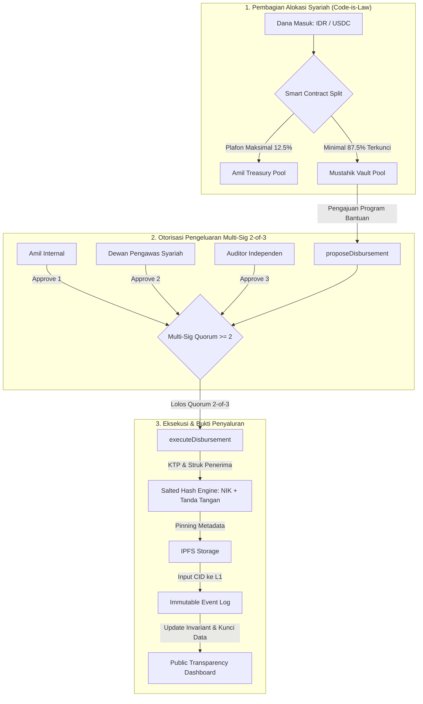

# CONTEXT.md: Zakat Transparency & Anti-Corruption Protocol (ZAKAT-L1)

## 1. Executive Summary & Problem Framing

- **Core Problem**: Korupsi dan ketidakpercayaan publik pada lembaga amil zakat (penggelapan dana masuk, penggelembungan hak operasional amil, penahanan dana gelap, serta mustahik fiktif).
- **Target Audience**:
  - **Primary (Web2/Awam)**: Muzakki Indonesia yang ingin berdonasi via fiat (QRIS / Virtual Account) tanpa perlu tahu apa itu gas fee, seed phrase, atau dompet Web3.
  - **Secondary (Web3 Native)**: Komunitas kripto/diaspora yang ingin menyalurkan zakat secara on-chain langsung via token USDC.
- **Core Architecture Strategy**: Multi-Unit Ledger Architecture (No Complex FX Oracle). Smart contract memisahkan pencatatan saldo akuntansi Fiat (IDR) dan custody aset nyata (USDC) secara independen.
- **Target Network**: **Ethereum Sepolia Testnet** (Direct EVM L1 Data Availability).
- **Technology Stack**:
  - **Smart Contract**: Solidity v0.8.20 + Foundry (`sc/`).
  - **Frontend**: Vite + React + TailwindCSS + Viem/Wagmi (`fe/`).
  - **Backend / Relayer**: Bun + Hono API (`backend/`).

## 2. Inflow Architecture: Dual-Gate Ingestion
                    ┌─────────────────────────────────────────────────────────┐
                    │                    ZAKAT INFLOW GATE                    │
                    └─────────────────────────────────────────────────────────┘
                                   │                           │
                    [JALUR A: FIAT QRIS / VA]        [JALUR B: WEB3 DIRECT USDC]
                                   │                           │
                   Payment Gateway (Midtrans/Xendit)  Direct Web3 Deposit (ERC-20 Transfer)
                                   │                           │
                    Rekening Escrow Bank Amil          Smart Contract Vault (On-Chain Custody)
                                   │                           │
                       Off-Chain Batching Engine               │
                      (Build Daily Merkle Tree)                │
                                   │                           │
                                   └─────────────┬─────────────┘
                                                 ▼
                                ┌─────────────────────────────────┐
                                │     ETHEREUM L1 SMART CONTRACT   │
                                │         (ZakatVault.sol)        │
                                └─────────────────────────────────┘
### A. Jalur Fiat (QRIS / Virtual Account)
- **Karakteristik**: Uang fisik mengendap di rekening bank/escrow amil. Smart contract hanya mencatat State Root (Merkle Root) dan akumulasi nilai IDR untuk efisiensi gas fee L1.
- **Batching Settlement**: Relayer mengagregasi ratusan donasi fiat harian menjadi 1 transaksi L1 (`recordFiatBatchSettlement`).
- **Muzakki Verification**: Muzakki menerima Merkle Inclusion Proof di web client untuk memverifikasi donasinya tercatat pada Root yang terkunci di L1.

### B. Jalur Web3-Native (USDC Custody Vault)
- **Karakteristik**: Smart contract bertindak sebagai Custodial Vault yang secara riil menampung token ERC-20 USDC (`usdcToken.transferFrom(msg.sender, address(this), amount)`).
- **Direct Execution**: Tidak memerlukan batching relayer; transaksi dieksekusi langsung oleh wallet donatur ke smart contract L1.

---

## 3. Privacy Mechanism: "Mode Publik" vs "Mode Hamba Allah"

Sistem menyediakan opsi privasi di kedua jalur pembayaran:

| Mode Privasi | Implementasi Jalur Fiat (QRIS) | Implementasi Jalur Web3 (USDC) |
| :--- | :--- | :--- |
| **Mode Publik** | Nama muzakki dicatat di metadata off-chain & dashboard transparansi. | Alamat wallet `msg.sender` dicatat secara publik di log event smart contract. |
| **Mode Hamba Allah (Private)** | Nama disamarkan. Daun Merkle dihitung via salt: `Leaf = Keccak256(TrxID + Salt + Amount)`. Muzakki memegang Salt sebagai bukti kepemilikan independen. | Muzakki menyetor dengan komitmen hash (`anonymousCommitment`) tanpa mengaitkan identitas Web2. |

---

## 4. Downstream Governance & Anti-Corruption Execution



### A. Pembagian Hak Amil Otomatis (Invariant Lock)
Smart contract mengunci batas atas hak amil maksimal 12.5% (1/8) secara terprogram (`MAX_AMIL_BPS = 1250`). Sisanya (minimal 87.5%) mutlak terkunci hanya untuk 7 asnaf mustahik lainnya.

### B. Otorisasi Penyaluran (On-Chain Multi-Sig 2-of-3)
Penyaluran dana mustahik wajib mendapatkan persetujuan minimal 2 dari 3 entitas kunci:
1. **Amil Operasional** (`DEFAULT_ADMIN_ROLE` / `AMIL_ROLE`).
2. **Dewan Pengawas Syariah (DPS)** (`SHARIA_SUPERVISOR_ROLE`).
3. **Auditor Eksternal / Independen** (`AUDITOR_ROLE`).

### C. Proof-of-Disbursement & Anti-Mustahik Fiktif
- **Salted Hashing NIK**: `beneficiaryHash = Keccak256(NIK + Nama + SecretSalt)` untuk menjaga privasi penerima dari doxxing sekaligus mencegah manipulasi data.
- **Anti-Double Claim**: Smart contract mencatat mapping `hasReceivedZakat[beneficiaryHash][periodId]` agar 1 identitas tidak bisa diklaim ganda dalam 1 periode bantuan.
- **IPFS Evidence CID**: Foto penyerahan tersamar (blur), struk bank, dan tanda tangan digital diunggah ke IPFS dan diikat permanen ke transaksi L1.

---

## 5. Technical Specifications: Solidity Smart Contract Interface

```solidity
// SPDX-License-Identifier: MIT
pragma solidity ^0.8.20;

import "@openzeppelin/contracts/token/ERC20/IERC20.sol";
import "@openzeppelin/contracts/access/AccessControl.sol";
import "@openzeppelin/contracts/utils/cryptography/MerkleProof.sol";

contract ZakatProtocolL1 is AccessControl {
    bytes32 public constant RELAYER_ROLE = keccak256("RELAYER_ROLE");
    bytes32 public constant AUDITOR_ROLE = keccak256("AUDITOR_ROLE");
    bytes32 public constant SHARIA_SUPERVISOR_ROLE = keccak256("SHARIA_SUPERVISOR_ROLE");

    uint256 public constant MAX_AMIL_BPS = 1250; // 12.5% (Basis Points / 10000)
    uint256 public constant REQUIRED_APPROVALS = 2; // 2-of-3 Multi-Sig Quorum

    IERC20 public immutable usdcToken;

    // --- FIAT LEDGER (Accounting Invariant in IDR) ---
    uint256 public totalCollectedIDR;
    uint256 public mustahikVaultIDR;
    uint256 public amilTreasuryIDR;
    uint256 public totalDisbursedIDR;

    // --- USDC VAULT (Real Custody Tokens) ---
    uint256 public totalCollectedUSDC;
    uint256 public mustahikVaultUSDC;
    uint256 public amilTreasuryUSDC;
    uint256 public totalDisbursedUSDC;

    // Batch Settlement: batchId => merkleRoot
    mapping(uint256 => bytes32) public fiatBatchRoots;

    // Anti-Double Claim: beneficiaryHash => (periodId => isClaimed)
    mapping(bytes32 => mapping(uint256 => bool)) public hasReceivedZakat;

    // Proposal Struct
    enum ProposalStatus { Pending, Approved, Executed, Cancelled }

    struct DisbursementProposal {
        uint256 proposalId;
        uint8 currencyType; // 0 = IDR, 1 = USDC
        uint256 amount;
        uint8 asnafCategory;
        bytes32 beneficiaryHash;
        string ipfsProofCID;
        uint256 periodId;
        address usdcRecipient;
        uint256 approvalCount;
        ProposalStatus status;
    }

    uint256 public proposalCounter;
    mapping(uint256 => DisbursementProposal) public proposals;
    mapping(uint256 => mapping(address => bool)) public hasApprovedProposal;

    // Events
    event FiatBatchSettled(uint256 indexed batchId, bytes32 merkleRoot, uint256 totalAmountIDR);
    event USDCDeposited(address indexed donor, uint256 amountUSDC, bool isAnonymous, bytes32 commitmentHash);
    event DisbursementProposed(uint256 indexed proposalId, uint8 currencyType, uint256 amount, bytes32 beneficiaryHash, string ipfsProofCID);
    event DisbursementApproved(uint256 indexed proposalId, address indexed approver, uint256 currentApprovals);
    event DisbursementExecuted(uint256 indexed proposalId, uint8 currencyType, uint256 amount, bytes32 beneficiaryHash, string ipfsProofCID);

    constructor(address _usdcAddress, address _admin, address _relayer, address _dps, address _auditor) {
        usdcToken = IERC20(_usdcAddress);
        _grantRole(DEFAULT_ADMIN_ROLE, _admin);
        _grantRole(RELAYER_ROLE, _relayer);
        _grantRole(SHARIA_SUPERVISOR_ROLE, _dps);
        _grantRole(AUDITOR_ROLE, _auditor);
    }

    // --- INFLOW: FIAT BATCH SETTLEMENT ---
    function recordFiatBatchSettlement(
        uint256 _batchId,
        bytes32 _merkleRoot,
        uint256 _totalBatchAmountIDR
    ) external onlyRole(RELAYER_ROLE) {
        require(fiatBatchRoots[_batchId] == bytes32(0), "Batch already settled");

        uint256 amilShare = (_totalBatchAmountIDR * MAX_AMIL_BPS) / 10000;
        uint256 mustahikShare = _totalBatchAmountIDR - amilShare;

        fiatBatchRoots[_batchId] = _merkleRoot;
        totalCollectedIDR += _totalBatchAmountIDR;
        amilTreasuryIDR += amilShare;
        mustahikVaultIDR += mustahikShare;

        emit FiatBatchSettled(_batchId, _merkleRoot, _totalBatchAmountIDR);
    }

    // --- INFLOW: DIRECT USDC DEPOSIT ---
    function depositUSDC(
        uint256 _amountUSDC,
        bool _isAnonymous,
        bytes32 _anonymousCommitment
    ) external {
        require(_amountUSDC > 0, "Amount must be > 0");
        require(usdcToken.transferFrom(msg.sender, address(this), _amountUSDC), "USDC Transfer failed");

        uint256 amilShare = (_amountUSDC * MAX_AMIL_BPS) / 10000;
        uint256 mustahikShare = _amountUSDC - amilShare;

        totalCollectedUSDC += _amountUSDC;
        amilTreasuryUSDC += amilShare;
        mustahikVaultUSDC += mustahikShare;

        emit USDCDeposited(
            _isAnonymous ? address(0) : msg.sender,
            _amountUSDC,
            _isAnonymous,
            _anonymousCommitment
        );
    }

    // --- OUTFLOW: 2-OF-3 MULTISIG PROPOSAL & EXECUTION ---
    function proposeDisbursement(
        uint8 _currencyType,
        uint256 _amount,
        uint8 _asnafCategory,
        bytes32 _beneficiaryHash,
        string calldata _ipfsProofCID,
        uint256 _periodId,
        address _usdcRecipient
    ) external returns (uint256 proposalId) {
        require(hasRole(DEFAULT_ADMIN_ROLE, msg.sender) || hasRole(RELAYER_ROLE, msg.sender), "Not authorized to propose");
        require(!hasReceivedZakat[_beneficiaryHash][_periodId], "Double claim detected for beneficiary");

        if (_currencyType == 0) {
            require(_amount <= mustahikVaultIDR, "Insufficient IDR vault balance");
        } else if (_currencyType == 1) {
            require(_amount <= mustahikVaultUSDC, "Insufficient USDC vault balance");
            require(_usdcRecipient != address(0), "Invalid recipient address");
        } else {
            revert("Invalid currency type");
        }

        proposalId = ++proposalCounter;
        proposals[proposalId] = DisbursementProposal({
            proposalId: proposalId,
            currencyType: _currencyType,
            amount: _amount,
            asnafCategory: _asnafCategory,
            beneficiaryHash: _beneficiaryHash,
            ipfsProofCID: _ipfsProofCID,
            periodId: _periodId,
            usdcRecipient: _usdcRecipient,
            approvalCount: 1, // Proposer automatic approval if has valid role
            status: ProposalStatus.Pending
        });

        hasApprovedProposal[proposalId][msg.sender] = true;

        emit DisbursementProposed(proposalId, _currencyType, _amount, _beneficiaryHash, _ipfsProofCID);
        emit DisbursementApproved(proposalId, msg.sender, 1);
    }

    function approveDisbursement(uint256 _proposalId) external {
        require(
            hasRole(DEFAULT_ADMIN_ROLE, msg.sender) ||
            hasRole(SHARIA_SUPERVISOR_ROLE, msg.sender) ||
            hasRole(AUDITOR_ROLE, msg.sender),
            "Not an authorized signatory"
        );

        DisbursementProposal storage proposal = proposals[_proposalId];
        require(proposal.status == ProposalStatus.Pending, "Proposal is not pending");
        require(!hasApprovedProposal[_proposalId][msg.sender], "Already approved by this address");

        hasApprovedProposal[_proposalId][msg.sender] = true;
        proposal.approvalCount++;

        emit DisbursementApproved(_proposalId, msg.sender, proposal.approvalCount);

        if (proposal.approvalCount >= REQUIRED_APPROVALS) {
            proposal.status = ProposalStatus.Approved;
        }
    }

    function executeDisbursement(uint256 _proposalId) external {
        DisbursementProposal storage proposal = proposals[_proposalId];
        require(proposal.status == ProposalStatus.Approved || proposal.approvalCount >= REQUIRED_APPROVALS, "Quorum not met");
        require(proposal.status != ProposalStatus.Executed, "Already executed");
        require(!hasReceivedZakat[proposal.beneficiaryHash][proposal.periodId], "Double claim detected");

        if (proposal.currencyType == 0) {
            require(proposal.amount <= mustahikVaultIDR, "Insufficient IDR vault");
            mustahikVaultIDR -= proposal.amount;
            totalDisbursedIDR += proposal.amount;
        } else if (proposal.currencyType == 1) {
            require(proposal.amount <= mustahikVaultUSDC, "Insufficient USDC vault");
            mustahikVaultUSDC -= proposal.amount;
            totalDisbursedUSDC += proposal.amount;
            require(usdcToken.transfer(proposal.usdcRecipient, proposal.amount), "USDC transfer failed");
        }

        hasReceivedZakat[proposal.beneficiaryHash][proposal.periodId] = true;
        proposal.status = ProposalStatus.Executed;

        emit DisbursementExecuted(
            _proposalId,
            proposal.currencyType,
            proposal.amount,
            proposal.beneficiaryHash,
            proposal.ipfsProofCID
        );
    }
}
```

---

## 6. End-to-End Verification Pipeline

### A. Verifikasi Muzakki (Client-Side Merkle Check)
1. Muzakki memasukkan **Transaction ID** dan **Secret Salt** di antarmuka web.
2. Browser menghitung leaf $\text{Keccak256}(\text{TrxID} + \text{Salt} + \text{Amount})$ dan menarik *sibling proof* dari Bun Hono backend (`/api/verify-receipt`).
3. Browser memvalidasi bukti terhadap `fiatBatchRoots[batchId]` di L1 secara lokal menggunakan library Viem/Ethers tanpa membebankan gas fee ke muzakki.

### B. Audit Publik (Dashboard Transparansi)
1. Dashboard menampilkan total kas masuk vs total kas keluar untuk IDR dan USDC secara *real-time*.
2. Menampilkan daftar **Disbursement Proposals** (Pending, Approved, Executed) beserta status persetujuan Multi-Sig 2-of-3.
3. Setiap pengeluaran memiliki tautan langsung ke **IPFS CID** bukti penyaluran (foto penyerahan, struk) dan identifier hash penerima zakat.