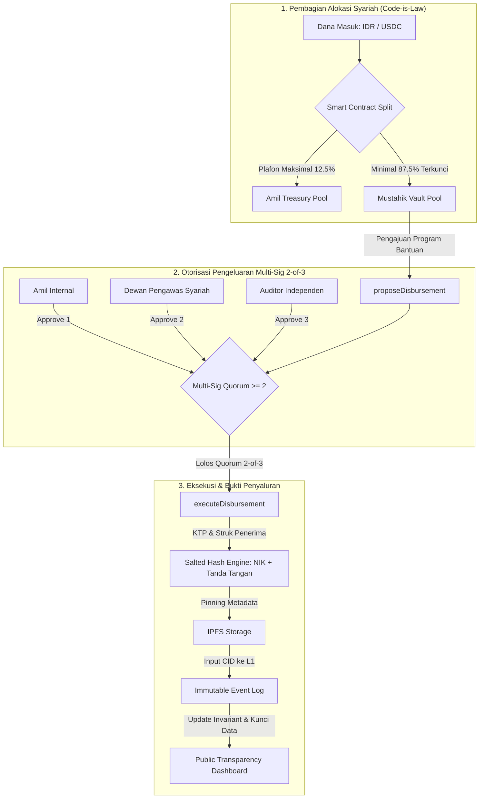

# CONTEXT.md: Zakat Transparency & Anti-Corruption Protocol (ZAKAT-L1)

## 1. Executive Summary & Problem Framing

- **Core Problem**: Korupsi dan ketidakpercayaan publik pada lembaga amil zakat (penggelapan dana masuk, penggelembungan hak operasional amil, penahanan dana gelap, serta mustahik fiktif).
- **Target Audience**:
  - **Primary (Web2/Awam)**: Muzakki Indonesia yang ingin berdonasi via fiat (QRIS / Virtual Account) tanpa perlu tahu apa itu gas fee, seed phrase, atau dompet Web3.
  - **Secondary (Web3 Native)**: Komunitas kripto/diaspora yang ingin menyalurkan zakat secara on-chain langsung via token USDC.
- **Core Architecture Strategy**: Multi-Unit Ledger Architecture (No Complex FX Oracle). Smart contract memisahkan pencatatan saldo akuntansi Fiat (IDR) dan custody aset nyata (USDC) secara independen.
- **Target Network**: **Ethereum Sepolia Testnet** (Direct EVM L1 Data Availability).
- **Technology Stack**:
  - **Smart Contract**: Solidity v0.8.20 + Foundry (`sc/`).
  - **Frontend**: TanStack Start / Vite + React 19 + Wagmi v3 + ConnectKit + Viem + TailwindCSS (`frontend/`).
  - **Backend / Relayer**: Bun + Hono API + Drizzle ORM + Neon PostgreSQL (`backend/`).

---

## 2. Live Deployed Smart Contracts & Infrastructure (Sepolia L1)

| **ZakatProtocolL1** | [`0x6014542ce8f759946aa6f3f9af54fb91685065a5`](https://sepolia.etherscan.io/address/0x6014542ce8f759946aa6f3f9af54fb91685065a5) | Core Vault, Multi-Sig 2-of-3, Invariant Split, Merkle Roots |
| **Safe DPS Multisig** | [`0xb4E4253e2aFfdC0710Cb9394b8C4E935F11B00f1`](https://app.safe.global/home?safe=sep:0xb4E4253e2aFfdC0710Cb9394b8C4E935F11B00f1) | 2-of-3 Institutional Sharia Supervisory Board Account |
| **Official Sepolia USDC** | [`0x1c7D4B196Cb0C7B01d743Fbc6116a902379C7238`](https://sepolia.etherscan.io/token/0x1c7D4B196Cb0C7B01d743Fbc6116a902379C7238) | Circle Testnet ERC-20 Token |
| **Database Cloud** | Neon Serverless PostgreSQL (`ep-calm-glade-...`) | Drizzle ORM Live Persistence (Clean Zero-Seed State) |
| **Wallet Connector** | ConnectKit by Family + Wagmi v3 (Project ID: `b6808bd11499531c85eddbf3cbc72e65`) | EIP-6963 Multi-Injected Discovery |

---

## 3. Inflow Architecture: Dual-Gate Ingestion

```
                ┌─────────────────────────────────────────────────────────┐
                │                    ZAKAT INFLOW GATE                    │
                └─────────────────────────────────────────────────────────┘
                               │                           │
                [JALUR A: FIAT QRIS / VA]        [JALUR B: WEB3 DIRECT USDC]
                               │                           │
               Payment Gateway (Midtrans/Xendit)  Direct Web3 Deposit (ERC-20 Transfer)
                               │                           │
                Rekening Escrow Bank Amil          Smart Contract Vault (On-Chain Custody)
                               │                           │
                   Off-Chain Batching Engine               │
                  (Build Daily Merkle Tree)                │
                               │                           │
                               └─────────────┬─────────────┘
                                             ▼
                            ┌─────────────────────────────────┐
                            │     ETHEREUM L1 SMART CONTRACT   │
                            │        (ZakatProtocolL1.sol)    │
                            └─────────────────────────────────┘
```

### A. Jalur Fiat (QRIS / Virtual Account)
- **Karakteristik**: Uang fisik mengendap di rekening bank/escrow amil. Smart contract hanya mencatat State Root (Merkle Root) dan akumulasi nilai IDR untuk efisiensi gas fee L1.
- **Batching Settlement**: Relayer mengagregasi ratusan donasi fiat harian menjadi 1 transaksi L1 (`recordFiatBatchSettlement`).
- **Muzakki Verification**: Muzakki menerima Merkle Inclusion Proof di web client untuk memverifikasi donasinya tercatat pada Root yang terkunci di L1.

### B. Jalur Web3-Native (USDC Custody Vault)
- **Karakteristik**: Smart contract bertindak sebagai Custodial Vault yang secara riil menampung token ERC-20 USDC (`usdcToken.safeTransferFrom(msg.sender, address(this), amount)`).
- **Allowance Flow**: Frontend menerapkan 2-step automated allowance check (`approve` ➔ `depositUSDC`).
- **EIP-6963 Protection**: Menggunakan `account.connector.getProvider()` untuk memisahkan ekstensi MetaMask dan Phantom tanpa konflik `window.ethereum`.

---

## 4. Downstream Governance & Anti-Corruption Execution


```mermaid
flowchart TD
    subgraph Invariant_Split ["1. Pembagian Alokasi Syariah (Code-is-Law)"]
        A[Dana Masuk: IDR / USDC] --> B{Smart Contract Split}
        B -->|Plafon Maksimal 12.5%| C[Amil Treasury Pool]
        B -->|Minimal 87.5% Terkunci| D[Mustahik Vault Pool]
    end

    subgraph MultiSig_Governance ["2. Otorisasi Pengeluaran Multi-Sig 2-of-3"]
        D -->|Pengajuan Program Bantuan| E[proposeDisbursement]
        F[Amil Internal] -->|Approve 1| G{Multi-Sig Quorum >= 2}
        H[Dewan Pengawas Syariah] -->|Approve 2| G
        I[Auditor Independen] -->|Approve 3| G
        E --> G
    end

    subgraph Proof_Of_Disbursement ["3. Eksekusi & Bukti Penyaluran"]
        G -->|Lolos Quorum 2-of-3| J[executeDisbursement]
        J -->|KTP & Struk Penerima| K[Salted Hash Engine: NIK + Tanda Tangan]
        K -->|Pinning Metadata| L[IPFS Storage]
        L -->|Input CID ke L1| M[Immutable Event Log]
        M -->|Update Invariant & Kunci Data| N[Public Transparency Dashboard]
    end
```

### A. Pembagian Hak Amil Otomatis (Invariant Lock) & 8 Asnaf BAZNAS
Smart contract mengunci batas atas hak amil maksimal 12.5% (1/8) secara terprogram (`MAX_AMIL_BPS = 1250`). Sisanya (minimal 87.5%) mutlak terkunci hanya untuk 7 asnaf mustahik lainnya (Fakir, Miskin, Muallaf, Riqab, Gharimin, Fisabilillah, Ibnu Sabil) sesuai ketentuan syariah Islam dan regulasi BAZNAS Indonesia.

### B. Otorisasi Penyaluran & Pemisahan Kekuasaan (Separation of Powers - ADR-0006)
Sesuai regulasi BAZNAS, DSN-MUI, dan standar akuntansi syariah (PSAK 109):
1. **Pre-Disbursement Approval (Persetujuan Awal)**:
   - **Amil Operasional** (`DEFAULT_ADMIN_ROLE`): Mengajukan proposal dan data survei kelayakan.
   - **Dewan Pengawas Syariah (DPS)** (`SHARIA_SUPERVISOR_ROLE`): Komite kolektif (3-5 Ustadz) yang bertindak sebagai pemegang hak veto keabsahan fikih 8 Asnaf. DPS menggunakan **Safe.global Multisig Account** (kuorum 2-of-3 internal ustadz). Persetujuan DPS adalah syarat mutlak sebelum dana boleh keluar.
2. **Ex-Post Independent Audit (Audit Pasca-Penyaluran)**:
   - **Auditor Independen** (`AUDITOR_ROLE`): Bertindak setelah dana tersalurkan (*ex-post*). Auditor mencocokkan mutasi bank, BAST di IPFS, dan bukti on-chain, lalu menerbitkan **Cryptographic Attestation (Opini WTP)** di ledger L1 tanpa terlibat dalam konflik kepentingan persetujuan harian.

### C. Alur Pengajuan Proposal & Dual-Receipt IPFS Pipeline
1. **Tahap 1 (Intake & Pre-Approval Metadata)**:
   - Amil mengunggah data survei mustahik ke backend.
   - Sistem menghasilkan `beneficiaryHash = Keccak256(NIK + Nama + SecretSalt)` (perlindungan privasi UU PDP & anti-doxxing) dan menyematkan dokumen survei/SKTM ke IPFS (`proposalMetadataCID`).
   - Amil memanggil fungsi smart contract `proposeDisbursement(...)`.
2. **Tahap 2 (Verifikasi Syariah oleh DPS)**:
   - DPS menelaah dossier IPFS melalui portal web dan menandatangani persetujuan on-chain melalui Safe.global (`approveDisbursement(proposalId)`).
3. **Tahap 3 (Eksekusi Penyaluran & Post-Disbursement BAST Receipt)**:
   - **Jalur USDC (`currencyType = 1`)**: Kontrak mentransfer token USDC langsung ke dompet mustahik/vendor (`usdcRecipient`).
   - **Jalur IDR (`currencyType = 0`)**: Amil mentransfer dana dari Rekening Escrow Bank ke rekening mustahik, mengunggah Berita Acara Serah Terima (BAST) & bukti transfer ke IPFS (`disbursementReceiptCID`), lalu memanggil `executeDisbursement(...)` untuk memperbarui ledger L1.
4. **Tahap 4 (Jejak Audit & Attestation)**:
   - Auditor menginspeksi dual-receipt di Public Explorer dan menerbitkan stempel atestasi kepatuhan syariah dan akuntansi.
5. **Anti-Double Claim**: Smart contract mengunci mapping `hasReceivedZakat[beneficiaryHash][periodId] = true` untuk mencegah mustahik fiktif atau klaim ganda dalam satu periode bantuan.

### D. Indexer & Automated On-Chain Synchronization (ADR-0008)
1. **Embedded Viem Poller**: Background worker di backend Bun yang melakukan sinkronisasi blok Sepolia L1 setiap 10 detik.
2. **Event Store & Multi-Table Persistence**:
   - Menangkap `USDCDeposited` dan otomatis mengarsipkan ke tabel `donations`.
   - Menangkap `DisbursementProposed`, `DisbursementApproved`, `DisbursementExecuted`, `DisbursementCancelled` untuk menyinkronkan status proposal di PostgreSQL.
   - Menangkap `RoleGranted` dan `RoleRevoked` untuk mengelola data keanggotaan aktif (`role_members`).
3. **API Endpoints**:
   - `GET /api/indexer/status`: Status ketinggian block dan kesehatan indexer.
   - `GET /api/events`: Log event on-chain publik.
   - `GET /api/governance/roles`: Data pemegang peran DPS, Auditor, Admin, Relayer.

### E. Public Role Governance Panel (`/admin/roles`)
1. **Roster Transparansi Publik**: Menampilkan 4 peran kunci (`DEFAULT_ADMIN_ROLE`, `SHARIA_SUPERVISOR_ROLE`, `AUDITOR_ROLE`, `RELAYER_ROLE`).
2. **Identifikasi Safe Multisig**: Menandai akun DPS Safe Global (`0xb4E4253e2aFfdC0710Cb9394b8C4E935F11B00f1`) dengan badge khusus dan link ke aplikasi Safe.
3. **Eksekusi Hak Admin On-Chain**: Form pemberian (`grantRole`) dan pencabutan (`revokeRole`) peran langsung ke smart contract Sepolia bagi wallet dengan hak Admin.

### F. UX Feedback & Syariah Error Decoding
1. **Global Toast Notification (Sonner)**: Notifikasi siklus transaksi interaktif (Proses ➔ Sukses ➔ Tautan Sepolia Etherscan).
2. **Human-Readable Revert Translation**: Menerjemahkan error contract Solidity (`DoubleClaimDetected`, `InsufficientVaultBalance`, `QuorumNotMet`, `Unauthorized`) ke dalam istilah syariah operasional yang ramah bagi pengguna awam.
3. **Graceful Error Boundary**: Komponen penangkap crash UI di level halaman untuk menjaga kestabilan aplikasi.

### G. Universal Gasless EIP-712 Governance for Amil, DPS, & Auditor (ADR-0009 & ADR-0015)
1. **EIP-712 Typed Structured Data**: Standar tanda tangan digital human-readable di pop-up dompet (MetaMask/Rabby/Coinbase) untuk seluruh aksi tata kelola:
   - **Amil**: Pembuatan proposal (`AmilProposal`), eksekusi pencairan (`AmilExecution`), dan pembatalan (`ProposalCancellation`).
   - **DPS**: Persetujuan kelayakan syariah (`DpsApproval`) dan pembatalan syariah (`ProposalCancellation`).
   - **Auditor**: Atestasi ex-post opini WTP (`AuditorAttestation`).
2. **Universal Gasless Experience**: Amil dan DPS tidak perlu memiliki atau mengelola saldo ETH gas fee. Relayer backend memvalidasi tanda tangan EIP-712, memeriksa kewenangan role secara on-chain/DB, dan menanggung biaya gas untuk transaksi on-chain.
3. **Clean & Professional Typography**: Antarmuka tata kelola menggunakan tipografi natural tanpa label mencolok seperti "0 Gas / Gasless Sponsored".

### H. Real Decentralized Storage & Dedicated IPFS Gateway (ADR-0010)
1. **Real Multipart File Uploads**: Endpoint `POST /api/ipfs/upload-file` mengunggah berkas fisik asli (scan BAST PDF, foto serah terima bantuan, sertifikat audit KAP) ke Pinata IPFS via `pinFileToIPFS`.
2. **Dedicated Fast Gateway**: Akses berkas instan berkecepatan tinggi melalui gateway privat `white-lazy-marten-351.mypinata.cloud/ipfs/` dengan multi-gateway fallback otomatis.
3. **Strict Validation & Zero-Broken-Link Policy**: Validasi ketat pengunggahan IPFS; mencegah pencatatan CID rusak/palsu ke smart contract on-chain Sepolia.

### I. Real-Time WebSocket Architecture & Event-Driven Invalidation (ADR-0011)
1. **Native Bun + Hono WebSocket (`/ws`)**: Jalur komunikasi real-time dua arah ultra-cepat yang menggantikan polling interval pada frontend.
2. **Event Broadcaster Engine**: Meneruskan event on-chain dari Indexer Viem dan mutasi transaksi API (proposal baru, persetujuan DPS, pencairan BAST, atestasi audit, pembayaran QRIS) ke seluruh client yang terhubung secara instan.
3. **Thin Invalidation Strategy**: Mengirim sinyal event ringan (< 200 bytes) untuk memicu pembaruan state frontend & notifikasi Sonner Toast tanpa beban jaringan berlebih.
### J. Frontend Feature-Driven Architecture & Human-Centric Syariah UX (ADR-0012)
1. **Multi-Route Information Architecture (TanStack Router)**:
   - `/` (Beranda): Nilai transparansi, kalkulator zakat kilat, ringkasan saldo & penyaluran real-time, pilar pengawasan 3 lapis, program bantuan unggulan.
   - `/donasi`: Alur penyaluran zakat khusus (Zakat Maal, Zakat Penghasilan, Zakat Fitrah, Infaq) dengan metode QRIS / Virtual Account / USDC Web3 & lafal niat/akad zakat.
   - `/transparansi`: Pusat transparansi & explorer publik (neraca kas real-time, grafik alokasi 8 Asnaf BAZNAS, riwayat penyaluran mustahik, berkas BAST IPFS, & tautan Sepolia Etherscan).
   - `/verifikasi`: Cek bukti donasi digital (pencarian via ID Transaksi / Hash NIK, verifikasi Merkle inclusion proof instan, unduh sertifikat/kwitansi zakat).
   - `/tata-kelola`: Portal operasional terpadu untuk Amil (pengajuan & BAST upload), Dewan Pengawas Syariah (DPS Safe Multisig approval), Auditor Independen (Gasless EIP-712 WTP Attestation).
   - `/tata-kelola/roles`: Roster transparansi dan manajemen peran on-chain.
   - `/rekonsiliasi`: Mesin rekonsiliasi (ADR-0017) — bandingkan rekap Laporan Zakat Wilayah dengan Laporan Kinerja kabupaten/kota, plus panel mode internal (basis data versus ledger on-chain) untuk Auditor Independen.
2. **Feature-Driven / Vertical Slice Structure**:
   - `src/components/ui/`: UI Primitives (Button, Dialog, Card, Badge, Input, Tabs, Table) berbasis Tailwind + Radix.
   - `src/features/`: Modul domain mandiri (`landing/`, `donation/`, `transparency/`, `verification/`, `governance/`, `evidence/`, `reconciliation/`) berisi subkomponen terisolasi (< 150 baris), hooks, types, dan API helper.
3. **Indonesian Islamic Fiqh Copywriting**:
   - Memprioritaskan bahasa fikih dan filantropi Islam Indonesia yang menenangkan bagi Muzakki awam.
   - Menjadikan kapabilitas kriptografi/web3 sebagai bukti jaminan syariah otomatis, dengan opsi penelusuran data teknis on-chain di tab/accordion sekunder bagi auditor.
4. **Interactive BAZNAS Zakat Calculator**:
   - Menghitung Zakat Penghasilan & Zakat Maal berdasarkan nisab emas BAZNAS, dengan tombol integrasi langsung ke formulir donasi.
5. **State & Render Optimization**:
   - Isolasi form state pada leaf components, TanStack Query v5 granular caching, dan WebSocket thin invalidation tanpa trigger re-render masif.

### K. Reconciliation Engine v0 (ADR-0017)

Mesin murni yang menerima dua **sisi ledger** dan mengembalikan setiap titik perbedaan beserta entri penyebabnya. Satu inti, dua pemanggil: mode antar-lembaga (data diunggah pengguna) dan mode internal (server membangun sendiri kedua sisi dari PostgreSQL dan event on-chain terindeks).

**Kosakata domain** (mengikuti PerBAZNAS 1/2023 dan LPZN):

| Istilah | Arti dalam sistem ini |
| :--- | :--- |
| **Pengelola Zakat (PZ)** | Lembaga zakat berizin: BAZNAS pusat/provinsi/kab-kota dan LAZ pada tiap tingkat. |
| **Laporan Zakat Wilayah** | Rekapitulasi seluruh PZ di satu provinsi yang wajib disusun BAZNAS Provinsi (Pasal 6 ayat (7), tenggat 31 Januari). Menjadi **sisi klaim**. |
| **Laporan Kinerja** | Laporan tiap PZ kabupaten/kota yang mendasari rekap tersebut. Menjadi **sisi sumber**. |
| **Sisi klaim / sisi sumber** | Angka yang dilaporkan versus catatan yang mendasarinya. `delta` selalu bertanda: klaim dikurangi sumber. |
| **Jenis dana** | Zakat, Fitrah, Infak/Sedekah, Kurban, DSKL. Dimensi bucket bawaan; dimensi lain (mis. jenis PZ) harus dinyatakan eksplisit. |
| **Posisi neraca** | *On* atau *off balance sheet*. Direkonsiliasi terpisah agar selisih di satu sisi tidak menutupi selisih di sisi lain. |
| **Periode pelaporan** | Semester (1 Jan–30 Jun) atau akhir tahun (1 Jan–31 Des). |
| **LPZN** | Laporan Pengelola Zakat Nasional, publikasi resmi BAZNAS. Edisi Akhir Tahun 2024 dipakai sebagai fixture emas: Tabel 2.2 versus Tabel 2.3 berselisih **Rp668.020.210.274** *on balance sheet*. |

**Kelas selisih**: `AMOUNT_MISMATCH`, `MISSING_IN_CLAIM`, `MISSING_IN_SOURCE` (tingkat entri, masuk `netDelta`); `BUCKET_TOTAL_MISMATCH`, `GRAND_TOTAL_MISMATCH`, `DUPLICATE_KEY` (tingkat total, dilaporkan terpisah agar tidak terhitung ganda).

**Batas yang diketahui**: deposit USDC belum bisa dicocokkan per transaksi (baris `donations` hanya menyimpan taksiran IDR tanpa txHash); rentang blok hanya membatasi sisi on-chain; hasil tidak disimpan (v0 stateless).

### L. Laporan Periode Terverifikasi — Validator Deterministik (ADR-0018)

Laporan periode yang **angkanya diverifikasi sebelum ditandatangani**. Sistem menghitung angka periode dari ledger, sebuah draf disusun terhadap angka itu, lalu validator deterministik memutuskan: lolos atau ditolak. Keluaran AI tidak pernah menjadi langkah terakhir dan tidak pernah dipercaya tanpa diperiksa.

**Modul murni** (tanpa basis data, `store`, `viem`, atau jaringan):

| Modul | Peran |
| :--- | :--- |
| `backend/src/period-report.ts` | Menerima baris (donasi, proposal) dan periode pelaporan, mengembalikan seluruh **angka periode** di bawah nama mesin yang stabil — satu-satunya angka yang boleh diklaim sebuah draf. |
| `backend/src/report-validator.ts` | Menerima angka periode dan sebuah draf, mengembalikan **vonis**. Fungsi murni: tanpa model, jaringan, jam, maupun keacakan. |
| `backend/src/wire.ts` | Kodek kawat bersama untuk uang dan periode pelaporan, dipakai route rekonsiliasi dan route laporan periode. Jumlah melintas sebagai teks desimal di kedua arah. |
| `backend/src/ledger-rows.ts` | Pembacaan baris tersimpan yang dipakai bersama: jumlah tersimpan menjadi `bigint`, serta penempatan stempel waktu terhadap periode (`INSIDE` / `OUTSIDE` / `UNDATED`). |

**Kontrak draf**: dua bagian yang dipisahkan tegas — **daftar klaim** (nama angka → nilai) dan **narasi**. Pemisahan ini membuat pemeriksaan angka menjadi pencocokan tepat, bukan penafsiran teks.

**Tiga pemeriksaan validator**: (1) **kecocokan klaim** — sama persis, tanpa toleransi pembulatan; (2) **kebocoran narasi** — setiap angka berbentuk rupiah di narasi harus ada di daftar klaim yang sudah lolos; (3) **invariant** — porsi hak amil tidak boleh melampaui plafon 12,5%, dibaca dari ledger, bukan dari draf.

**Kelas temuan**: `KLAIM_TIDAK_COCOK`, `KLAIM_TIDAK_DIKENAL`, `KLAIM_GANDA`, `ANGKA_NARASI_TIDAK_DIKLAIM`, `PLAFON_HAK_AMIL_TERLAMPAUI`. Vonis bersifat **lolos atau ditolak** — tidak ada tingkat peringatan.

**Endpoint**: `POST /api/period-report/verify` — stateless, tanpa tabel baru dan tanpa migrasi. Draf bersifat opsional; tanpa draf, angka periode tetap dikembalikan dan ketiadaan vonis dinyatakan terbuka.

**Baris tanpa tanggal** dikeluarkan dari setiap periode — bukan dihitung di semuanya — dan jumlahnya dilaporkan sebagai angka `baris.tanpa_tanggal`, sehingga tidak ada yang hilang diam-diam. Rekonsiliasi tetap memakai aturan longgarnya sendiri, karena baris yang tersembunyi di sana berarti selisih yang tak terlaporkan.

**Batas yang diketahui**: validator memeriksa angka, bukan kata sifat; `donations` tidak menyimpan jenis dana sehingga seluruh donasi fiat dihitung sebagai Zakat; donasi USDC dilaporkan terpisah sebagai estimasi rupiah; label asnaf di luar tabel yang dikenal masuk ke `LAINNYA`; angka rupiah tanpa awalan `Rp`, tanpa titik ribuan, dan tanpa kata satuan tidak terdeteksi oleh pemindai narasi.

---

## 5. Completed Tasks & Current Project Status

- [x] **Smart Contract (L1)**: `ZakatProtocolL1.sol` deployed on Sepolia (`0x2d6fe1e81b633e8a310d1365524f4fb47024f7d7`) with SafeERC20, Invariant Split, Multi-Sig 2-of-3, and Emergency Cancel.
- [x] **Backend & Database**: Bun + Hono API + Neon PostgreSQL via Drizzle ORM + Merkle Tree batch settlement engine + Embedded Viem Indexer Engine + Real-time WebSocket Server.
- [x] **Frontend Web3**: TanStack Start + ConnectKit (Soft Syariah Theme) + Wagmi v3 + Viem + Public Role Governance Panel (`/admin/roles`) + Sonner Toasts + Error Boundary + WebSocket Live Invalidation Client.
- [x] **Architecture Decisions**: ADR-0001 s/d ADR-0012 tercatat lengkap di `docs/adr/`.