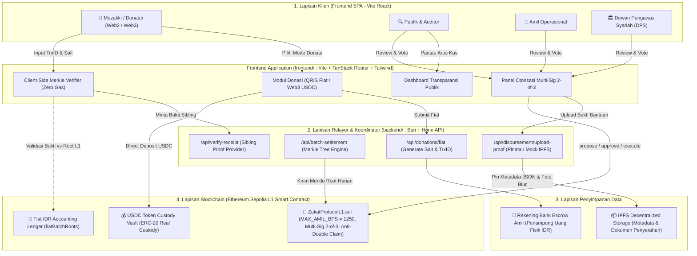
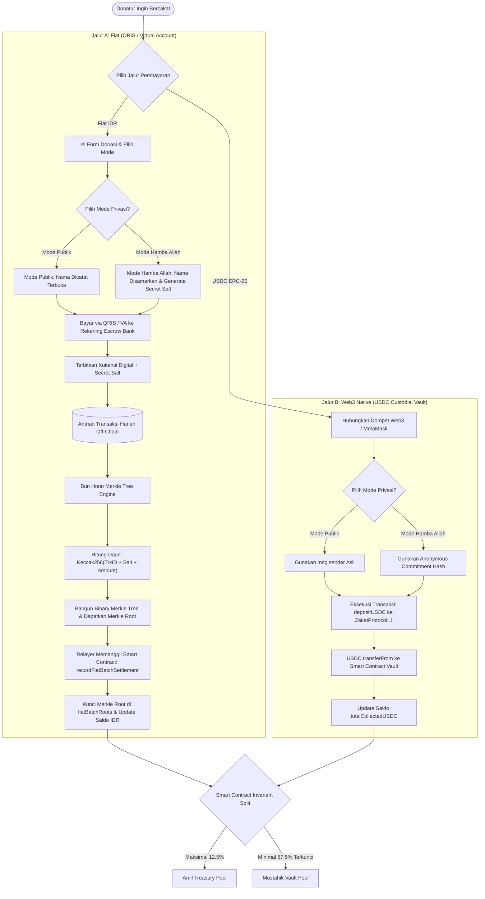
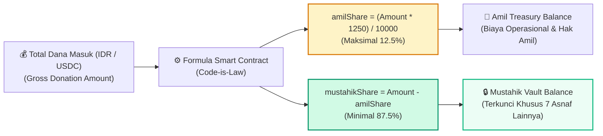
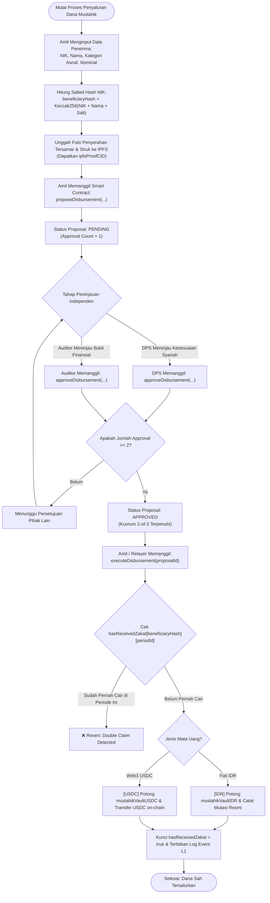
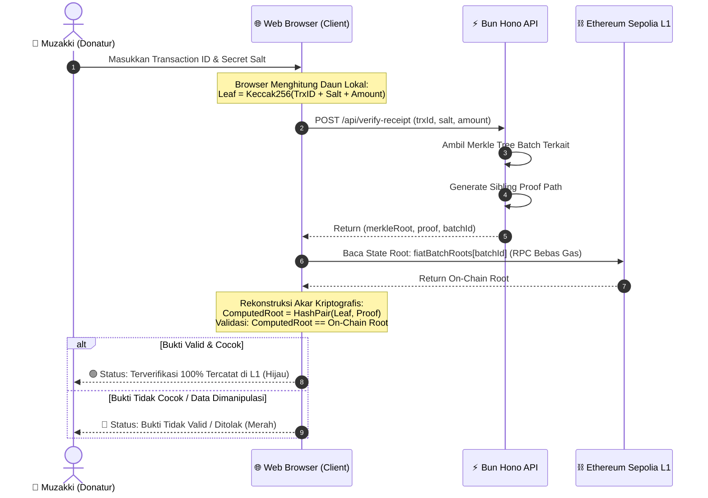
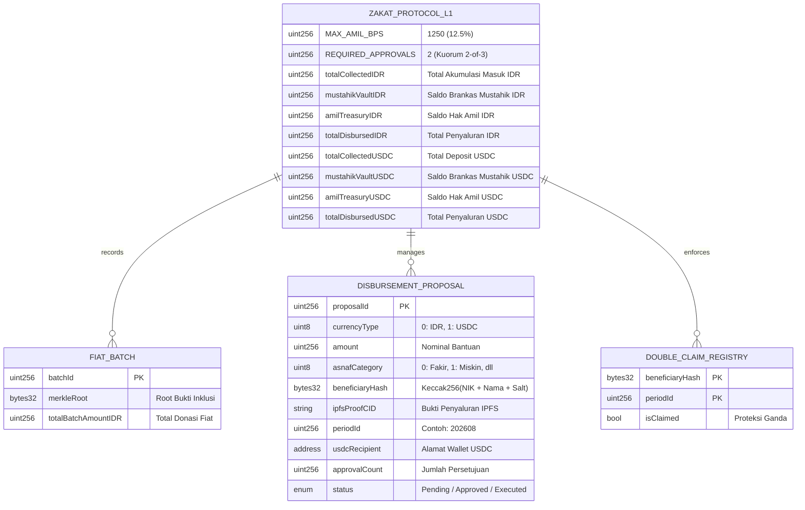

# Arsitektur & Diagram Alir (Flowcharts) — Tawf Zakat Protocol

Dokumen ini memuat seluruh diagram alir (*flowchart*) arsitektur sistem protokol transparansi zakat (**ZAKAT-L1**) yang telah diimplementasikan pada branch ini.

---

## 1. Diagram Arsitektur Sistem Menyeluruh (High-Level Architecture)

Menampilkan interaksi antara lapisan **Frontend SPA (Vite React)**, **Backend API (Bun + Hono)**, **Smart Contract Ethereum Sepolia (`ZakatProtocolL1.sol`)**, serta **Jaringan Penyimpanan IPFS**.

---

## 2. Diagram Alir Arus Kas Masuk (Dual-Gate Inflow Architecture)

Memperlihatkan perbedaan alur pemrosesan antara **Jalur A (Fiat QRIS/VA via Merkle Batching)** dan **Jalur B (Web3 USDC Direct Custody)**.

---

## 3. Diagram Alir Pembagian Alokasi Syariah (12.5% Invariant Lock)

Menjelaskan rumus matematika kepatuhan syariah yang dikunci pada smart contract (`MAX_AMIL_BPS = 1250`).

---

## 4. Diagram Alir Tata Kelola Penyaluran (Multi-Sig 2-of-3 Governance)

Menjelaskan siklus hidup proposal penyaluran dana mustahik dari pengajuan, persetujuan kuorum, hingga eksekusi anti-klaim ganda.

---

## 5. Diagram Alir Verifikasi Muzakki Tanpa Gas Fee (Client-Side Merkle Verification)

Menjelaskan bagaimana browser Muzakki memvalidasi bukti kriptografis secara mandiri tanpa biaya gas blockchain.

---

## 6. Diagram Struktur Entitas & Relasi Data Smart Contract

