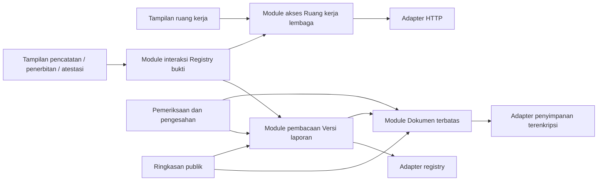

# Pendalaman arsitektur backend dan frontend

Tanggal: 2026-09-09. Dasar: pengguna memilih mendalami keempat kandidat pada survei `improve-codebase-architecture`.

Status: **disepakati sebagai dasar implementasi** pada 2026-09-09. Pengguna menerima kebijakan draf pada Q1, lalu menerima rancangan lengkap empat module pada Q2. Dokumen ini menetapkan rancangan; implementation dan verifikasinya merupakan pekerjaan berikutnya. Tidak ada perubahan kontrak, migrasi, deployment, atau format commitment melalui persetujuan ini.

Spesifikasi dan kriteria penerimaan dicatat pada [GitHub #81](https://github.com/tawf-labs/tawf-zakat/issues/81). GitHub mengarahkan nama repo lama `tawf-labs/zkt-hackathon` ke `tawf-labs/tawf-zakat`.

| Tiket implementasi | Bergantung pada |
|---|---|
| [#82 — Dokumen terbatas](https://github.com/tawf-labs/tawf-zakat/issues/82) | Tidak ada |
| [#83 — Akses Ruang kerja lembaga](https://github.com/tawf-labs/tawf-zakat/issues/83) | Tidak ada |
| [#84 — Pembacaan Versi laporan](https://github.com/tawf-labs/tawf-zakat/issues/84) | #82 |
| [#85 — Interaksi Registry bukti](https://github.com/tawf-labs/tawf-zakat/issues/85) | #83 dan #84 |

## Keputusan yang sudah disepakati

**Q1 — Draf laporan ketika sesi habis: diterima.** Draf yang belum tersimpan disembunyikan dan dipertahankan hanya dalam memori tab. Draf dapat dipulihkan setelah akun dan Ruang kerja lembaga yang sama berhasil diverifikasi kembali. Keluar secara eksplisit, berganti akun, atau pencabutan akses yang diketahui menghapus draf tersebut. Tidak ada penambahan penyimpanan draf persisten pada browser.

Penerapan keputusan ini harus membedakan masukan pengguna dari material pengesahan: tanda tangan, persetujuan bahwa paket sudah ditinjau, kewenangan terakhir, dan status transaksi tidak dipulihkan sebagai izin bertindak. Paket serta transaksi yang sudah tersimpan tetap dibaca ulang dari backend.

Revokasi hanya dapat ditanggapi browser ketika diketahui; rancangan ini tidak menjanjikan penghapusan salinan yang sudah diunduh atau deteksi pencabutan saat perangkat tidak terhubung.

**Q2 — Rancangan lengkap: diterima.** Gunakan tiga operasi untuk Dokumen terbatas, akses privat yang terikat konteks dan kebijakan Q1, tiga alur registry dengan implementation lifecycle bersama, serta pembacaan Versi laporan berdasarkan satu acuan blok. Urutan kerja: Dokumen terbatas, Akses Ruang kerja lembaga, Pembacaan Versi laporan, lalu Interaksi Registry bukti. Akses dapat dikerjakan independen; interaksi registry memerlukan akses dan pembacaan versi yang baru.

## Aturan yang sudah mengikat

- ADR-0021/0024: sumber berasal dari snapshot kanonik dengan commitment bersalt; Dokumen terbatas terenkripsi; proyeksi publik menyebut field secara eksplisit.
- ADR-0022/0023: Peran ruang kerja, Pengesahan lembaga, Pengesahan layanan validator, dan Mandat auditor mengatur tindakan yang berbeda.
- Registry menentukan Versi resmi terkini dan Garis resmi laporan; urutan database dan label versi tidak menggantikannya.
- [Pemeriksaan publik](public-report-examination.md): kegagalan RPC menghasilkan 503 dan menghapus klaim keberhasilan yang tidak dapat diperiksa; konten immutable tetap tersimpan.
- [Pemulihan registry](registry-recovery-operations.md): retry memakai byte transaksi tersimpan; hasil lama bukan bukti status terbaru. Blok acuan dan hash canonical sudah dipakai dalam pemulihan.
- Format ekspor pemeriksaan v1, byte snapshot, digest paket, dan domain pengesahan lama harus tetap dapat diverifikasi.

## Hubungan antarmodule



Module akses memiliki sesi dan permintaan privat. Module interaksi registry memiliki urutan tindakan dan konteks pengesahan. Module Dokumen terbatas memiliki pembacaan byte terverifikasi. Module Versi laporan memiliki perakitan pengamatan registry yang konsisten. Formulir tetap memiliki masukan domain, dengan umur draf mengikuti Q1.

## 1. Module Dokumen terbatas

**Bukti:** `report-examination.ts:16` mengubah setiap kegagalan baca menjadi `UNAVAILABLE`; `evidence-recovery.ts:35` mempertahankan `CORRUPT`. Probe lokal atas kegagalan adapter yang sama membuktikan perbedaan tersebut. Beberapa pemanggil juga memakai hash pada baris relasional, sedangkan pemulihan memakai ekspektasi dari snapshot yang telah diverifikasi commitment-nya.

**Depth yang dicari:** pemanggil tidak lagi perlu mengetahui urutan mencari dokumen, memeriksa commitment, membaca byte, memeriksa hash/ukuran, dan menggolongkan kegagalan.

Implementation memiliki:

- Daftar dokumen dan ekspektasi hash/ukuran dari material kanonik yang commitment-nya sah.
- Baris relasional sebagai pemasok locator; hilangnya baris tidak menghilangkan dokumen dari daftar yang sudah dikomitmenkan.
- Pemeriksaan ukuran dan hash sebelum byte diberikan kepada pemanggil.
- Keadaan internal `AVAILABLE`, `MISSING`, `CORRUPT`, `UNAVAILABLE`.
- Pemulihan backup persis, kemudian pembacaan ulang; commitment dan waktu lama tidak ditulis ulang.

Kebijakan akses dan keputusan tindakan tetap pada pemanggilnya. Gagalnya dokumen dapat menghalangi pembekuan pertama atau penerbitan baru, sementara hilangnya berkas setelah penerbitan tidak menghapus riwayat publikasi. Unduhan kertas kerja auditor tetap mengikuti aturan pemiliknya; akses metadata pemulihan setelah konfirmasi tidak menjadi izin unduhan baru.

**Kompatibilitas:** keadaan internal `CORRUPT` dipetakan menjadi `INTEGRITY_FAILED` pada ekspor pemeriksaan v1. Pemulihan tetap memakai `CORRUPT`. Kegagalan AES-GCM tidak membuktikan apakah ciphertext berubah atau kunci yang dipakai salah; pesan harus mencerminkan batas itu.

**Tes yang memberi locality:** satu matriks berkas utuh/hilang/rusak/tidak terbaca, hash relasional berbeda dari snapshot, baris locator hilang, dan backup yang tidak cocok. Pertahankan tes HTTP akses lembaga, privasi kertas kerja auditor, serta adapter filesystem terenkripsi. `registry_api.test.ts` sudah menguji kehilangan sumber setelah publikasi, ekspor rusak, dan pemulihan backup.

**Deletion test:** module enkripsi sudah bernilai. Yang dikonsentrasikan adalah protokol pemeriksaan berulang pada enam jalur; helper hash baru saja tidak memberi depth.

## 2. Module akses Ruang kerja lembaga

**Bukti:** probe respons sintetis menunjukkan `workspaceClient` mempertahankan status dan reason, `evidenceClient` hanya status, dan `recordingClient` tidak mempertahankan keduanya. `useWorkspace` hanya mengakhiri sesi atas 401 dari pembacaan awal ruang kerja; permintaan privat lain tidak memberi umpan balik yang setara.

**Depth yang dicari:** satu pemanggil memperoleh konteks akses yang utuh, tanpa menggabungkan token, lembaga, akun, capabilities, dan aturan penolakan sendiri.

Implementation memiliki:

- Identitas akun dan origin backend, sesi, serta ruang kerja yang telah diverifikasi sebagai satu keadaan yang koheren.
- Pemulihan sesi, pemeriksaan expiry, dan penolakan hasil asynchronous dari konteks lama.
- Permintaan privat JSON dan byte dengan semantik kegagalan yang tidak hilang.
- Penguncian/pembersihan data privat dan siklus pemulihan draf sesuai Q1.

**Kebutuhan backend yang ditemukan:** `tenancy-store.ts:392` meratakan sesi tidak dikenal, kedaluwarsa, dan dicabut menjadi `null`. Database sudah menyimpan `expires_at` serta `revoked_at`. Alasan sesi berakhir dibawa secara aditif untuk token yang diserahkan, tanpa mengungkap identitas/lembaga. Frontend tidak boleh menebak expiry dari 401 generik atau jam perangkat. Bentuk wire dijelaskan pada interface akses di bawah.

| Keadaan | Akibat yang dirancang |
|---|---|
| Expiry dipastikan server | Tutup akses; tahan draf dalam memori untuk verifikasi ulang akun/lembaga yang sama |
| Keluar, akun berganti, pencabutan diketahui | Tutup akses dan buang draf terkait |
| Token tidak dikenal / alasan invalid tidak dapat dipastikan | Tutup akses; jangan klasifikasikan sebagai expiry |
| Sesi sah, tindakan tidak berwenang | Tolak tindakan; tidak otomatis keluar dari ruang kerja |
| RPC/jaringan/503 gagal | Sebut hasil belum dapat diketahui; bukan bukti sesi dicabut atau transaksi tidak terkirim |

Pergantian jaringan wallet membatalkan konteks tindakan registry yang terkait jaringan, tetapi tidak dengan sendirinya membatalkan sesi akses offchain. Keluar lokal tetap dapat selesai ketika jaringan gagal, dengan fakta pencabutan server yang belum terkonfirmasi tetap dinyatakan.

**Tes yang memberi locality:** akun berganti ketika challenge exchange tertunda; token baru tidak berpasangan dengan lembaga lama; respons lama setelah sesi baru; 401 pada unduhan; 403 tindakan tanpa logout; expiry dan revokasi dengan draf; kegagalan jaringan. Browser smoke yang ada memasang formulir dengan token fixture sehingga belum menguji seluruh siklus `useWorkspace`.

## 3. Module interaksi Registry bukti

**Bukti:** `RecordingPanel` dan `AttestationPanel` mengulang riwayat, penyimpanan retry ID, polling, review, signing, dan invalidasi konteks. Penjaga polling dan responsnya berbeda. `RecordingPanel` membaca garis resmi ketika status observation berubah; koreksi pihak lain dapat terjadi tanpa mengubah receipt versi lama yang tetap `CONFIRMED`.

**Depth yang dicari:** tampilan tidak perlu mengatur sendiri urutan tindakan atau menggabungkan hasil dari akun, intent, paket, maupun jaringan yang berbeda.

Implementation memiliki:

- Konteks tindakan: akun, sesi, lembaga, paket, versi, tindakan, intent, chain, registry, dan digest yang relevan.
- Riwayat percobaan, pemeriksaan otoritas, review, signing, submit, pembacaan status, dan retry.
- Penolakan hasil asynchronous yang sudah tidak relevan serta pencegahan pembacaan yang bertumpuk.
- Pembacaan ulang garis resmi yang tidak hanya bergantung pada perubahan receipt lama.

Pencatatan, penerbitan dua pengesahan, dan atestasi per versi tetap memiliki aturan masing-masing. Kesamaan mekanisme interaksi tidak menyamakan kewenangan atau isi yang ditandatangani. Membatalkan tampilan tidak membatalkan transaksi yang telanjur dikirim; riwayat dapat dipulihkan lewat backend.

**Tes yang memberi locality:** akun/chain/intent berubah ketika wallet masih menunggu; respons polling lama; otoritas berubah sebelum submit; broadcast ambigu; retry menggunakan percobaan tersimpan; koreksi dari pihak lain ketika receipt lama tetap terkonfirmasi. Pertahankan browser tests untuk alur review/sign/confirm/reorg/retry serta atestasi.

**Seam yang sudah bernilai:** `registry-relay.ts` sudah memiliki penyimpanan byte transaksi sebelum broadcast dan retry. Module frontend memakai perilaku itu, tanpa menyalin implementation relayer. Rancangan awal tidak membutuhkan perpindahan seluruh fitur ke sistem WebSocket privat baru.

## 4. Module pembacaan Versi laporan

**Bukti baru:** probe dengan implementation asli dan adapter sintetis pada satu versi/satu publication intent menghasilkan hitungan berikut.

| Pemanggilan adapter | Ringkasan publik | Ekspor pemeriksaan |
|---|---:|---:|
| Observasi transaksi yang sama | 3 | 4 |
| Pembacaan Versi resmi terkini | 2 | 2 |
| Pembacaan atestasi versi | 3 | 2 |

Ini hitungan pemanggilan adapter, bukan jumlah HTTP RPC atau benchmark latensi. Saat jawaban adapter berubah selama satu permintaan, respons nyata dapat memuat `PUBLISHED` bersama observation `INCLUDED`, serta paket `p1` sebagai versi resmi sementara riwayat menyatakan `p2` resmi. Ini bukti pada seam pengujian, bukan laporan insiden deployment. Rekomendasi kandidat dinaikkan dari **Worth exploring** menjadi **Strong**.

**Depth yang dicari:** satu pembacaan mengikat identitas versi, garis resmi, atestasi, dan observation ke satu acuan yang konsisten.

Implementation memiliki:

- Blok acuan terbaru pada awal pembacaan, termasuk nomor dan hash.
- Pembacaan contract/log dan kedalaman konfirmasi yang merujuk acuan tersebut.
- Penggunaan ulang pengamatan di dalam permintaan yang sama.
- Pemeriksaan ulang canonical hash sebelum hasil diberikan; reorg pada acuan menghasilkan kegagalan yang jelas, bukan respons campuran.
- Perakitan Versi laporan dan Garis resmi laporan untuk proyeksi publik serta ekspor yang tetap terpisah.

Ini bukan perubahan ke riwayat `confirmed-only`: garis resmi saat ini juga mengenal versi yang diterima registry dengan anchor `INCLUDED`, atau tanpa anchor lokal jika panggilan langsung. Status penerbitan aplikasi dan atestasi tetap mengikuti syarat konfirmasinya masing-masing. Blok baru setelah acuan terlihat pada pembacaan berikutnya; kedalaman blok tetap bukan finalitas settlement L1.

**Tes yang memberi locality:** konfirmasi bertambah di tengah pembacaan, koreksi baru selama pembacaan, reorg mengganti acuan, RPC gagal setelah hasil parsial, publikasi langsung tanpa anchor lokal, atestasi versi lama tidak diwariskan. Pertahankan integrasi HTTP/Anvil. Hindari tes yang hanya mematok jumlah pemanggilan: konsistensi hasil adalah perilaku yang harus dibuktikan.

## Perbandingan tiga desain

**A — Interface minimal.** Dokumen memakai tiga operasi; akses dan registry memakai sedikit entry point dengan command yang membedakan tindakan. Pembacaan versi menghasilkan satu model pengamatan untuk seluruh proyeksi. Ini mengurangi jumlah entry point, tetapi command registry tetap membawa banyak aturan; jumlah fungsi yang kecil tidak dengan sendirinya berarti interface kecil. Pembacaan versi yang selalu memuat seluruh bukti juga dapat membebani ringkasan publik.

**B — Handle terikat konteks.** Pemanggil memperoleh pembaca/pemulih dokumen, akses ruang kerja, slot draf, tindakan registry, atau scope pembacaan versi. Setiap handle memeriksa ulang generasi/konteks sebelum bekerja. Ini memberi fleksibilitas, tetapi memperkenalkan banyak umur objek dan aturan pemakaian; khususnya memisahkan review, signing, dan submit akan mengembalikan pengetahuan urutan kepada pemanggil.

**C — Interface mengikuti pekerjaan pemanggil.** Tampilan memakai alur pencatatan, penerbitan, atau atestasi yang berbeda; route meminta ringkasan atau pemeriksaan. Implementation internal menyatukan mekanisme yang sama. Leverage tinggi bagi pemanggil aktif sekarang, dengan risiko module menjadi terlalu luas bila semua kebijakan akses dan proyeksi dimasukkan tanpa batas.

| Ukuran penilaian | A: minimal | B: handle fleksibel | C: pekerjaan pemanggil |
|---|---|---|---|
| Depth | Baik bila command menyembunyikan urutan | Baik pada handle yang mengikat konteks | Tinggi pada alur yang digunakan sekarang |
| Locality | Baik, tetapi rawan dispatcher membesar | Baik, dengan lebih banyak umur objek | Baik bila mekanisme bersama tetap internal |
| Biaya interface | Sedikit fungsi, banyak varian input | Banyak konsep handle dan lifecycle | Nama tugas lebih banyak, urutan lebih sedikit |
| Seam | Operasi umum | Kemampuan dan konteks | Tugas pemanggil, adapter internal |

**Rekomendasi:** gunakan C untuk alur registry dan pembacaan versi, tiga operasi A untuk Dokumen terbatas, serta pengikatan akses B yang disembunyikan di balik hook frontend. Jangan membuat framework command/plugin umum, objek izin review yang beredar antarformulir, atau sistem draf generik.

## Bentuk interface yang direkomendasikan

Sketsa berikut ilustratif, bukan deklarasi TypeScript yang sudah diimplementasikan. Interface mencakup invariant, error, serta urutan yang dijelaskan di tiap bagian; bukan hanya method yang tampak pada sketsa.

### Dokumen terbatas

```ts
interface RestrictedDocuments {
  inspect(subject: DocumentSubject): Promise<DocumentInspection[]>;
  read(subject: DocumentSubject, fileId: string): Promise<VerifiedDocument>;
  restore(subject: DocumentSubject, fileId: string, backup: Uint8Array):
    Promise<DocumentInspection>;
}
```

`DocumentSubject` membedakan sumber persiapan dan bukti atestasi, terikat lembaga dan identitas tersimpan. Route lebih dahulu menerapkan kebijakan akses tindakan tersebut. Module memuat dan memverifikasi material commitment sendiri; pemanggil tidak memasok hash/ukuran yang dianggap benar. Byte hanya keluar melalui `read` setelah verifikasi. `inspect` tidak membentuk base64 bila hanya status yang dibutuhkan.

Pemakaian: route unduhan memeriksa akses, memanggil `documents.read(subject, fileId)`, lalu membentuk respons unduhan yang ada. Jalur pemeriksaan memetakan keadaan rusak ke `INTEGRITY_FAILED`; jalur publik hanya memilih hitungan. Kertas kerja auditor tetap hanya dapat diunduh pemiliknya, termasuk setelah konfirmasi.

### Akses Ruang kerja lembaga

```ts
useWorkspaceAccess():
  | { state: "CLOSED"; enter(institutionId: string): Promise<void> }
  | { state: "OPENING" }
  | { state: "READY"; workspace: Workspace;
      requests: PrivateRequests; leave(): Promise<LogoutOutcome> };

useUnsavedReport(preparationId: string):
  | { state: "HIDDEN" }
  | { state: "EDITABLE"; value: UnsavedReport;
      change(next: UnsavedReport): void };
```

Client bukti/laporan menerima `PrivateRequests` yang terikat konteks; token tidak diteruskan sebagai props. Client domain tetap memiliki path, input, dan decoding miliknya. Module akses tidak mengambil alih semua operasi domain tersebut. `requests` yang disimpan pemanggil menjadi tidak berlaku setelah generasi akses berubah, walaupun referensinya masih ada.

`useUnsavedReport` hanya memegang masukan laporan yang belum tersimpan: narasi, klaim, dan isian identitas/koreksi yang sedang disusun. Ia mengikuti siklus akses tanpa memegang signature, pengesahan, atau persetujuan peninjauan. Lampiran yang belum diunggah dan seluruh editor lain bukan tambahan otomatis pada kebijakan draf laporan ini. Tidak ada janji draf bertahan setelah reload atau penutupan tab.

Untuk Q1, pertahankan HTTP 401 dan `reason: unauthenticated` yang ada, lalu tambahkan field opsional khusus sesi `sessionEnd: EXPIRED | REVOKED | UNKNOWN`. Field `expired` lama untuk Tantangan akses tidak diubah. Hanya hash token yang diserahkan yang dicari; tidak ada identitas akun/lembaga dalam respons penolakan. Revokasi dan keanggotaan tidak sah mengalahkan expiry. Penolakan generik dari backend lama atau token tidak dikenal menutup akses dan membuang draf secara konservatif, alih-alih menganggap sesi habis.

Ketika masuk ulang, draf tetap tersembunyi sampai origin, akun, lembaga, dan persiapan cocok serta pencabutan sesi lama telah diperiksa. Keberhasilan masuk baru saja tidak cukup jika akses lama sempat dicabut lalu diberikan kembali. Pada akhir sesi, semua material review/signature dibuang; masukan yang dipulihkan wajib melalui peninjauan baru.

### Interaksi Registry bukti

```ts
useRecording(frozenPackage): RecordingFlow;
usePublication(frozenPackage): PublicationFlow;
useAttestation(publishedVersion, attestationDraft): AttestationFlow;
```

Tiap flow memberi keadaan tampilan dan tindakan yang sesuai: menyiapkan, memilih percobaan, menyatakan tinjauan atas material yang sedang ditampilkan, mengirim, memeriksa status, atau retry percobaan tersimpan. Implementation flow memiliki pemeriksaan ulang kewenangan dan konteks sebelum/sesudah wallet menjawab. Pemanggil tidak merangkai `sign` dan `submit` sendiri.

Tiga interface memakai implementation lifecycle bersama. Perbedaan input, pengikatan statement, dua pengesahan publikasi, riwayat auditor, dan riwayat paket tetap typed. Retry tidak meminta otorisasi baru. Perubahan sesi/akun/chain/intent/digest menggugurkan review dan hasil tertunda; permintaan yang sudah dikirim tetap dipulihkan sebagai fakta backend.

### Pembacaan Versi laporan

```ts
interface ReportVersions {
  publicSummary(packageId: string): Promise<PublicReportSummary>;
  examination(subject: ReportSubject): Promise<ExaminationV1>;
  publicationView(subject: ReportSubject): Promise<PublicationView>;
}
```

Route privat memeriksa akses sebelum memanggil module. `publicationView` merangkai status versi, garis resmi, dan pengamatan relevan dari satu pembacaan; endpoint lama dapat memilih proyeksi yang dibutuhkannya. Untuk tampilan frontend yang menampilkan versi dan riwayat bersama, keduanya perlu berasal dari respons yang sama. Field tambahan pada respons versi dapat menyediakan view ini secara aditif, tanpa menghapus route/field lama.

Di dalam module, satu scope pembacaan memegang acuan blok dan hasil yang digunakan ulang. Proyeksi publik serta privat tetap terpisah secara eksplisit; jalur publik tidak perlu memuat seluruh byte atau proof ekspor. Semua hasil dibuang bila acuan berubah canonical atau pembacaan wajib gagal. Respons tetap 503; refresh berikutnya memulai pengamatan baru, tanpa loop retry tersembunyi.

## Urutan implementation yang disarankan

1. **Dokumen terbatas:** satukan pembacaan berdasarkan commitment dan matriks integritas; pertahankan proyeksi serta kebijakan tiap pemanggil.
2. **Akses Ruang kerja lembaga:** bawa alasan sesi dari backend, ikat seluruh permintaan privat, lalu jalankan kebijakan draf yang telah disepakati.
3. **Pembacaan Versi laporan:** satukan pengamatan pada satu acuan dan sediakan view versi/riwayat yang koheren.
4. **Interaksi Registry bukti:** gunakan akses dari langkah 2 dan pembacaan dari langkah 3 untuk mengganti lifecycle yang berulang di tampilan.

Setiap irisan perlu mempertahankan tes perilaku yang ada dan menambahkan regresi pada interface module untuk masalah yang dibuktikannya. Adapter test sintetis membuktikan pergantian konteks/chain; PGlite, filesystem temp, dan Anvil mempertahankan bukti integrasi. Keputusan ini belum membutuhkan dependensi baru.

## Bukti dan status penyelarasan

Survei awal: `/tmp/architecture-review-20260909-014846-233054.html`.

Probe versi: `/tmp/architecture-version-read-probe.ts`, dijalankan ulang melalui `bun /tmp/architecture-version-read-probe.ts`. Probe memakai implementation asli dengan adapter sintetis; tidak mengakses RPC langsung. Probe frontend hanya mengganti `fetch` dengan respons sintetis. Pada tahap survei, race React belum diuji melalui browser dan suite aplikasi belum dijalankan. Regresi implementasi berikutnya mencakup pemilik sesi asli dan alur pengesahan dalam browser.

Q1 dan Q2 telah diterima. Rekomendasi gabungan, invariant, sketsa interface, dan urutan di atas menjadi dasar spesifikasi serta tiket implementasi. Nama internal dalam sketsa boleh disesuaikan selama perilaku dan seam yang disepakati terjaga. Persetujuan rancangan tidak merupakan deployment, migrasi data, atau pengiriman transaksi.


## Implementasi #82–#85

- #82: `backend/src/restricted-documents.ts` menjadi pemilik verifikasi byte terhadap commitment, inspeksi ketersediaan, serta pemulihan backup yang tepat.
- #83: `workspaceAccessController.ts` dan `useWorkspaceAccess.tsx` memiliki generasi akses, transport privat, serta draf laporan sementara. API mempertahankan 401 dengan alasan akhir sesi yang aditif.
- #84: `backend/src/report-versions.ts` memakai satu acuan canonical dan cache per permintaan untuk pembacaan chain serta percobaan lokal. View gabungan tersedia melalui `GET …/publication?view=versions`; ID intent `view` tetap sah. Ringkasan publik baru hanya disimpan sesudah pemeriksaan canonical. Konflik insert immutable menghasilkan 503; permintaan berikutnya membaca hasil yang tersimpan.
- #85: `registryInteraction.ts` memiliki lifecycle tiga tugas; `useRecording`, `usePublication`, dan `useAttestation` dipakai tampilan aktif. Pemeriksaan otoritas dilakukan lagi sesudah wallet menjawab. Polling serial berlanjut sesudah konfirmasi dan membuang klaim resmi ketika pengamatan gagal.

Review Standards dan Spec dilakukan pada setiap irisan; temuan diperbaiki dan diperiksa ulang. Tidak ada perubahan kontrak, format pemeriksaan v1, atau dependensi.

### Verifikasi

Suite frontend: 156 tes lulus. Build produksi berhasil; halaman `/ruang-kerja` dari hasil build merespons HTTP 200. Tes tambahan pembacaan versi memakai module produksi dengan adapter terkontrol: pemulihan percobaan saat permintaan berjalan, reorg acuan, kegagalan parsial, dan konflik ringkasan immutable.

Suite registry lengkap pada Anvil baru: 54 tes lulus, termasuk seluruh tujuh tes browser. Enam tes pembacaan dengan adapter terkontrol juga lulus. Suite backend saat penyelesaian #82–#85: 649 lulus, tujuh browser dilewati pada invocation default (semuanya lulus pada invocation registry berkonfigurasi browser), dan 20 gagal. Dua puluh kegagalan pada tes legacy direproduksi pada baseline `ef594df` melalui sepuluh file tes yang sama. Typecheck masih memuat 13 error backend dan 138 error frontend yang sudah ada pada baseline; perubahan ini tidak menambah error typecheck.

Fixture registry memeriksa kepemilikan port Anvil sebelum mulai dan menunggu penutupan server/proses. Ini mencegah proses tertinggal dari eksekusi yang terhenti membuat tes berikutnya memakai chain lama.


### Tindak lanjut kegagalan backend — 2026-09-09

Penelusuran 20 kegagalan menemukan 16 tes yang masih memakai jalur governance yang dipensiunkan ADR-0019, tiga tes yang mengharapkan relayer sukses meskipun signing dimatikan dalam lingkungan tes, dan satu tes persistensi role tanpa database. Tes daftar proposal juga bergantung pada data sisa tes lain: jika dijalankan sendiri, ia gagal pada baseline maupun hasil refactor.

Settlement antrean kosong memiliki bug terpisah yang sudah ada pada baseline: request membuat donasi contoh Rp2.500.000 berstatus PAID sebelum transaksi gagal. Fallback tersebut dihapus. Endpoint kini mengembalikan 409 tanpa menulis donasi atau menyiarkan transaksi jika tidak ada donasi fiat yang layak. Status BATCHED juga dipertahankan ketika hasil pembacaan database berupa objek terpisah disalin ke memori.

Tes lama diperbarui tanpa menambahkan skip: jalur yang dipensiunkan harus menolak tanpa mutasi; alur aktif melewati HTTP, decoding receipt, persistensi, dan pembacaan publik dengan RPC terkontrol. Cakupan mencakup propose, approve, execute, cancel, metadata BAST bertanda tangan, penolakan signature auditor palsu, serta kegagalan relayer tanpa hash transaksi buatan. Fixture menyimpan dan memulihkan state tiap tes. Tes role tanpa database membuktikan tidak ada role yang diciptakan; ia tidak mengklaim menguji persistensi PostgreSQL. Tes auditor dengan signature valid membuktikan penolakan saat relayer belum dikonfigurasi, bukan keberhasilan broadcast live.

Verifikasi final: **675 lulus, 7 browser dilewati oleh konfigurasi default, 0 gagal**, 682 tes dalam 57 file. Sepuluh file yang diperbarui juga lulus masing-masing dalam proses terpisah. Reproduksi awal kini menghasilkan 409 dengan jumlah donasi tetap nol. Browser tidak dijalankan ulang pada tindak lanjut ini. `bunx tsc --noEmit` dari direktori backend masih menghasilkan 16 diagnostik lama; dibandingkan dengan perintah yang sama pada baseline `ef594df`, isinya identik setelah normalisasi nomor baris/kolom. Tidak ada diagnostik baru dari perubahan ini.
