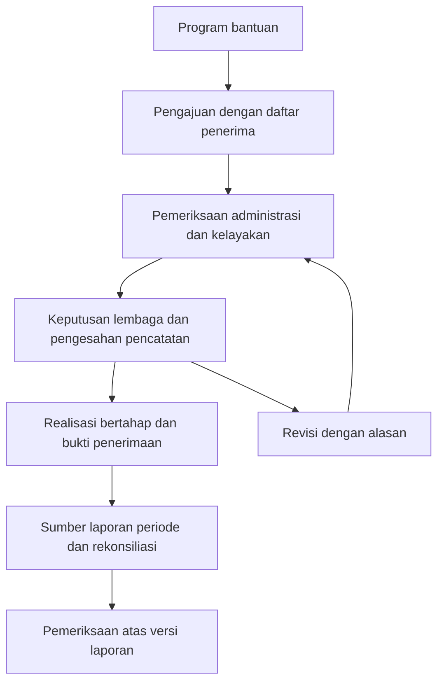

# Desain pengajuan penyaluran dan pemeriksaan

- Status: Accepted — seluruh keputusan Q1–Q23 dan rangkuman pemahaman bersama dikonfirmasi pengguna pada 2026-09-15. Spec implementasi diterbitkan sebagai [issue #86](https://github.com/tawf-labs/tawf-zakat/issues/86) dengan label `ready-for-agent`; dokumen ini mempertahankan dasar desain.
- Acuan: BAZNAS kabupaten/kota; kebutuhan mitra tertentu belum divalidasi.
- Sumber dan keputusan: [riset/wawancara 0005](../research/0005-pengajuan-penyaluran-dan-ux-grilling.md), ADR-0026–0030, [glosarium](../../CONTEXT.md).
- Dokumen ini membedakan keputusan domain dari usulan tata letak. Kontrak implementasi dan penerimaan berada pada issue #86; dokumen ini bukan template resmi BAZNAS atau bukti fitur sudah tersedia.

## 1. Model dan perjalanan kerja yang disepakati

Satu program memiliki banyak pengajuan; satu pengajuan memiliki satu atau banyak penerima dan rincian bantuan masing-masing. Penanggung jawab, perwakilan penerima, dan pihak penerima pembayaran dicatat sesuai fungsi masing-masing. Bantuan awal berupa uang/barang kepada penerima terdaftar. Fasilitas kolektif dan portal pemohon eksternal menjadi kemungkinan perluasan berikutnya.

Amil internal menyiapkan pengajuan beserta asal permohonan. Pemeriksa menelaah administrasi/kelayakan; pihak berwenang memutuskan menurut SOP lembaga. Penyusun tidak menyetujui sendiri. Pengesahan pencatatan oleh pejabat tidak membuktikan kuorum digital seluruh peserta pleno. Pengawasan syariah mengikuti SOP, dan auditor memeriksa setelah kegiatan.

Hubungan realisasi dengan sumber laporan perlu adapter dan snapshot yang dapat ditelusuri; keberadaan diagram tidak berarti seluruh laporan hanya boleh berasal dari aplikasi ini. Sumber eksternal dan batas paket periode ADR-0021/0022 tetap berlaku.

## 2. Susunan layar yang diusulkan

| Layar | Isi utama | Tindakan utama |
| --- | --- | --- |
| Beranda ruang kerja | Antrean pengajuan perlu diperiksa/revisi, realisasi belum lengkap, pemeriksaan sesuai akses | Buka pekerjaan yang perlu ditindaklanjuti |
| Program | Tujuan program dan daftar pengajuan terkait; periode/cakupan ditampilkan jelas | Buka atau mulai pengajuan |
| Pengajuan | Daftar penerima, rincian bantuan, dokumen pengajuan, hasil pemeriksaan, keputusan, riwayat revisi | Simpan draf, ajukan, periksa, atau catat keputusan menurut kewenangan |
| Realisasi | Bantuan disetujui, sudah disalurkan, sisa, dan bukti terkait | Catat realisasi bertahap atau lengkapi bukti |
| Rekonsiliasi | Sumber, cakupan, satuan, kesalahan masukan, serta hasil perbandingan | Impor, periksa, dan persiapkan sumber |
| Laporan/Pemeriksaan | Versi laporan dan sumber terikat, status pengesahan, atestasi, serta temuan | Telusuri bukti, catat temuan, beri tanggapan atau tindak lanjut sesuai peran |

Nama menu serta pengelompokan Laporan/Pemeriksaan masih dapat diperbaiki saat uji tugas. Navigasi publik berdiri tersendiri. Laptop menjadi perangkat utama untuk tabel/impor/pemeriksaan; ponsel mendukung status dan bukti lapangan. Versi awal memerlukan koneksi, dengan penanda tersimpan/belum tersimpan dan tindakan mencoba ulang.

Header yang disepakati menampilkan nama akun, lembaga, dan peran yang sah; alamat wallet tersedia pada detail. Akun kerja pribadi mengenali petugas, sedangkan akun bersama dipakai untuk pengesahan lembaga. Riwayat membedakan pelaku pekerjaan dengan akun pengesah; nama operator tidak ditebak dari wallet bersama. Label peran bukan sumber otorisasi, dan perubahan nama tidak memberi hak transaksi. Protokol autentikasi serta pengikatan tindakan ke pengesahan harus diperinci dalam spec sesuai ADR-0030.

## 3. Pengajuan baru — usulan susunan form

1. **Program dan tujuan:** pilih program, catat asal permohonan, tujuan, periode bantuan, serta penanggung jawab.
2. **Penerima dan bantuan:** tambah satu penerima atau impor template; tampilkan jenis bantuan, jumlah uang/barang, asnaf yang relevan, serta total. Pisahkan pihak penerima pembayaran bila berbeda.
3. **Dokumen pengajuan:** kaitkan bukti kelayakan dengan penerima atau pengajuan. Identitas alternatif/perwakilan perlu ditelaah, tanpa NIK fiktif atau satu NIK menggantikan seluruh penerima.
4. **Periksa pengajuan:** ringkasan penerima, total, dokumen belum lengkap, dan kemungkinan duplikasi. Draf boleh belum lengkap; kesalahan wajib harus diselesaikan sebelum meminta persetujuan.

Susunan empat langkah adalah usulan tata letak untuk diuji, bukan keputusan jumlah layar wajib. Pemeriksa dapat mengembalikan kebutuhan perbaikan dengan alasan; nama status dan detail transisi ini masih perlu dinyatakan dalam spec.

## 4. Template dan impor

Keputusan format: XLSX utama dan CSV alternatif; JSON menjadi detail teknis. Daftar penerima dan sumber laporan memiliki template terpisah karena objek serta maknanya berbeda.

### Usulan kelompok kolom — belum skema final

| Template | Kelompok informasi |
| --- | --- |
| Daftar penerima | Pengenal baris/penerima; nama; dasar identitas; hubungan perwakilan bila berlaku; alamat/cakupan; kategori penerima; rincian uang/barang; penerima pembayaran bila berbeda; rujukan bukti |
| Sumber laporan | Identitas entri/sumber; lembaga/unit; periode/cut-off; jenis dana; posisi pencatatan jika relevan; tanggal; jumlah dan satuan; referensi transaksi/dokumen |

Form mengumpulkan keterangan bersama seperti program, lembaga, dan cakupan satu berkas agar petugas tidak perlu mengulangnya tanpa alasan pada setiap baris. Metadata asal sumber tetap dipertahankan. Penggabungan metadata form dan baris harus dibekukan bersama ketika menjadi snapshot.

Alur: unduh template → isi → unggah → pratinjau baris/total/kesalahan → konfirmasi. Unggah ulang menampilkan tambahan, perubahan, dan penghapusan sebelum diterapkan. Duplikasi baris persis diblokir. Kesamaan penerima/program/periode perlu pemeriksaan, bukan larangan bantuan berulang otomatis. Pengenal baris stabil, perlakuan NIK sebagai teks, nilai kosong, format tanggal/uang, dan pencegahan isi spreadsheet berbahaya menjadi rincian implementasi yang harus diuji.

Masukan bermasalah boleh disimpan sebagai draf dengan kesalahan tetap terlihat. Baris tidak dihilangkan diam-diam, dan sumber belum valid tidak disebut snapshot siap diperiksa. Penggantian sumber yang sudah dibekukan mempertahankan versi sebelumnya. Tidak ada klaim semua format ekspor SiMBA langsung didukung.

## 5. Status yang harus tetap terpisah

| Dimensi | Makna yang ditampilkan |
| --- | --- |
| Pengajuan/keputusan | Draf, masih diperiksa, atau keputusan yang benar-benar tercatat; nama status final mengikuti spec |
| Realisasi | Disetujui, tersalurkan, dan sisa dalam jumlah uang/barang yang relevan |
| Kelengkapan bukti | Bukti tersedia atau perlu dilengkapi; unggahan tidak otomatis membuktikan kebenaran |
| Pemeriksaan | Belum diperiksa, hasil/lingkup atestasi pada versi tertentu, dan temuan sesuai catatan pemeriksa |
| Penyimpanan/pengesahan teknis | Belum tersimpan, tersimpan, pengesahan/konfirmasi yang sebenarnya tersedia |

Tidak ada status “Selesai & WTP” yang diturunkan hanya dari penyaluran. Riwayat pembatalan tidak boleh tampil sebagai menunggu persetujuan. Kesimpulan auditor tetap terikat versi laporan, tidak diwariskan otomatis ke versi koreksi.

## 6. Realisasi dan perubahan

Seratus penerima disetujui dan delapan puluh menerima berarti penyaluran sebagian. Bukti dapat terkait satu penerima atau kelompok penyerahan selama rinciannya dapat ditelusuri. Transfer memerlukan bukti pembayaran; tunai/barang memerlukan bukti penerimaan atau BAST beserta jumlah. Pembayaran sekolah/penyedia membedakan pihak penerima pembayaran dari penerima manfaat. Foto merupakan pendukung.

Realisasi yang dilaporkan dengan bukti belum lengkap tetap terlihat sebagai perlu dilengkapi dan belum dinyatakan selesai. Perubahan penerima/hak bantuan setelah persetujuan memerlukan revisi, alasan, dan persetujuan kembali. Realisasi lama tetap tersimpan. Penutupan sisa yang tidak disalurkan memerlukan keputusan dan alasan lembaga; sisa tidak dipindahkan ke penerima lain tanpa persetujuan.

## 7. Pembayaran, anggaran, dan pemeriksaan — disepakati Q20–Q23

Alur awal mencatat bantuan IDR/barang dan bukti pembayaran yang dilaksanakan lembaga di luar aplikasi. Tombol “Catat realisasi” tidak mengirim dana. Vault USDC tetap jalur tersendiri; keputusan ini tidak menghapus atau memigrasikan implementasi lama.

Pagu program menjadi referensi dengan peringatan. Lembaga memastikan ketersediaan dana; aplikasi membatasi realisasi sesuai bantuan disetujui per pengajuan dan menampilkan sisa. Reservasi anggaran lintas pengajuan menjadi kemungkinan pengembangan berikutnya. Pagu referensi tidak ditampilkan sebagai saldo bank terverifikasi. Jumlah uang, jumlah barang, satuan, dan mata uang tetap dibedakan.

Auditor bekerja pada versi laporan periode, menelusuri pengajuan, penerima, realisasi, serta bukti sesuai akses. Auditor mencatat temuan; amil memberikan tanggapan atau bukti tambahan; auditor menetapkan tindak lanjutnya. Riwayat temuan/tanggapan dipertahankan tanpa mengubah transaksi atau snapshot yang telah diperiksa. Bila tanggapan memerlukan koreksi sumber resmi, gunakan versi koreksi, dan jangan mewariskan atestasi lama otomatis ke versi baru. Akun kerja pribadi dan akun pengesahan lembaga mengikuti bagian 2 serta ADR-0030.

## 8. Cara menilai desain berikutnya

Usulan skenario uji tugas: membuat pengajuan satu penerima; mengimpor seratus penerima dengan tujuh baris salah; mengunggah ulang berkas tanpa menggandakan data; menemukan peran sendiri; memeriksa pengajuan sebagai pihak berbeda; mencatat realisasi delapan puluh dari seratus penerima; menelusuri bukti dan revisi dari suatu laporan.

Catat keberhasilan tugas, kesalahan, kebutuhan bantuan, dan waktu penyelesaian. Angka sasaran perlu baseline pengguna; belum ada hasil uji kegunaan yang diklaim. Keyboard, label form, fokus kesalahan, kontras, dan status yang tidak hanya bergantung pada warna menjadi kriteria kualitas rancangan. Rujukan prinsip UX tersedia dalam riset 0005.

Sebelum implementasi terkait, spec harus menutup matriks otorisasi/mandat, skema identitas dan template, daftar transisi status, kebijakan dokumen sesuai SOP, pembatasan akses/retensi, hubungan sumber dengan laporan, serta protokol pengesahan. Pilot belum dapat dinyatakan siap lembaga hanya dari persetujuan arah desain ini.

## 9. Rangkuman pemahaman bersama yang disepakati

1. Acuan awal BAZNAS kabupaten/kota; pekerjaan dimulai amil internal di ruang kerja lembaga.
2. Program menaungi banyak pengajuan; setiap pengajuan memiliki daftar penerima serta rincian bantuan. Identitas penanggung jawab, perwakilan, dan penerima pembayaran dibedakan.
3. Masukan utama berupa form dan template XLSX/CSV terpisah sesuai objek. Draf, validasi per baris, pratinjau total, dan perbandingan unggah ulang menjaga data dapat diperiksa sebelum diajukan.
4. Header menampilkan nama, lembaga, dan peran; akun kerja pribadi mengenali petugas, akun institusi dipakai untuk pengesahan.
5. Pemeriksa pengajuan dan pemberi persetujuan mengikuti SOP; penyusun tidak menyetujui sendiri. Keputusan lembaga dicatat beserta dasar dan pengesahnya.
6. Realisasi IDR/barang dicatat bertahap dengan bukti. Revisi memerlukan alasan dan persetujuan kembali; penutupan sisa mempertahankan riwayat.
7. Pengajuan, penyaluran, kelengkapan bukti, dan hasil pemeriksaan mempunyai status terpisah. Auditor memeriksa versi laporan, menelusuri sumber, dan menindaklanjuti tanggapan amil.
8. Laptop menjadi perangkat utama; ponsel mendukung bukti lapangan dengan koneksi. Dana dikelola lembaga, vault USDC terpisah, dan pagu program merupakan referensi.

Seluruh keputusan Q1–Q23 telah diterima. Pengguna mengonfirmasi rangkuman penutup melalui jawaban **“setuju semua”** pada 2026-09-15, setelah rangkuman disajikan sebagai dasar spesifikasi UI/UX berikutnya. Sesi `grill-with-docs` selesai dan tidak memerlukan konfirmasi desain tambahan untuk keputusan yang sudah dicatat. Hasil sesi berupa riset, glosarium, ADR, dan rancangan alur/layar; kode aplikasi belum diubah. Rincian spesifikasi pada bagian 8 tetap harus diselesaikan sebelum implementasi terkait.

## 10. Publikasi spesifikasi

Pengguna kemudian meminta `to-spec` dan mengonfirmasi batas pengujian: HTTP aplikasi terautentikasi sebagai batas utama dengan SQL, berkas privat, dan aturan nyata; smoke browser untuk UX; serta harness registry lokal yang sudah ada untuk integrasi terkait. [Spec #86](https://github.com/tawf-labs/tawf-zakat/issues/86) memuat 60 user stories, keputusan implementasi, dan 26 skenario penerimaan, serta hubungan dengan spec #68 dan #81 beserta irisan #82–#85. Isi publikasi telah dicocokkan dengan draf yang disiapkan dan label `ready-for-agent` diverifikasi.

Tahap `to-spec` tidak mengimplementasikan fitur atau memecah sub-issue. Nilai konfigurasi SOP/mandat mitra tetap merupakan data onboarding; perilaku implementasi mengikuti spec pada tracker.

## 11. Publikasi tiket implementasi

Pengguna menyetujui penggabungan usulan 15 menjadi 13 tiket. Revisi digabung dengan pembatalan/penutupan sisa, dan temuan auditor digabung dengan tanggapan/tindak lanjut. [Peta tiket implementasi](pengajuan-penyaluran-tickets.md) memuat tautan seluruh issue, dependensi, alasan penggabungan, dan keterlacakan 60 user stories serta 26 skenario penerimaan.

Pada verifikasi publikasi 2026-09-15, seluruh 13 issue OPEN dan berlabel `ready-for-agent`; 13 relasi sub-issue ke #86 serta 15 dependensi native telah diperiksa. Tiket awal tanpa blocker adalah [#87](https://github.com/tawf-labs/tawf-zakat/issues/87) dan [#88](https://github.com/tawf-labs/tawf-zakat/issues/88). Judul, isi, dan status spec #86 tetap sama. Status pekerjaan selanjutnya mengikuti tracker; kode aplikasi belum diubah pada tahap ini.
