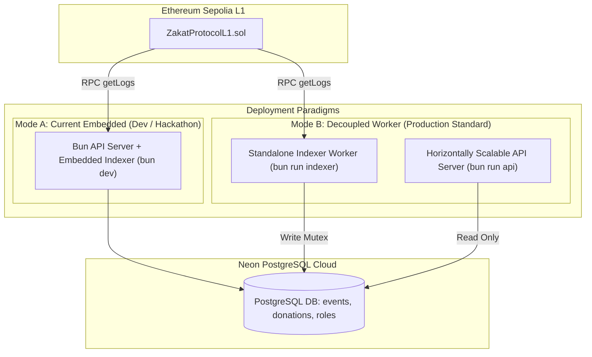

# Research: Blockchain Indexer Architectures — Global Tech Standards vs Embedded Design

- **Status:** Approved
- **Date:** 2026-09-01
- **Domain:** Web3 Data Ingestion, Ethereum EVM Indexing, System Architecture
- **Primary Sources:** Envio, Ponder, Goldsky, The Graph, Paradigm/Reth, Coinbase Engineering

---

## 1. Executive Summary

In modern blockchain and Web3 software engineering, indexing on-chain state into relational/OLAP databases is a foundational requirement. The architectural choice of whether an indexer is **Embedded** (running inside the API HTTP server process) or **Decoupled / Standalone** (running as a dedicated daemon or managed streaming pipeline) follows a clear engineering maturity curve.

| Dimension | Embedded Indexer (Stage 1) | Standalone Worker (Stage 2) | Enterprise Stream (Stage 3 - Ponder/Envio) |
| :--- | :--- | :--- | :--- |
| **Process Model** | Shared process with HTTP API | Separate worker process | Decoupled pipeline + OLAP / GraphQL |
| **Scaling Profile** | Tied to API instances | Independent (Singleton worker, Multi API) | Horizontal distributed workers |
| **Failure Blast Radius** | High (crash affects API) | Low (isolated from API uptime) | Zero (Queue buffered & self-healing) |
| **DevOps Overhead** | Zero (single `bun run dev`) | Minimal (`Procfile` / Docker) | Medium to High (K8s, Redis/Kafka) |
| **Ideal Lifecycle** | Hackathon, POC, Testnet MVP | Seed / Staging / Production DApp | High-Frequency DeFi / L2 Rollups |

---

## 2. Why Global Tech Companies Decouple Indexers from APIs

In production environments of tier-1 crypto companies (e.g., Coinbase, Uniswap Labs, OpenSea, Aave), the indexer is **never** embedded inside the customer-facing API for four primary reasons:

### A. Preventing Race Conditions & Multi-Instance Duplication
- **The Problem**: Customer-facing APIs scale horizontally (e.g., 5 or 10 pods behind an NGINX/Cloudflare load balancer). If the indexer is embedded in the API server, every new pod spawned by autoscaling will start its own polling loop, hammering the Ethereum RPC node and causing simultaneous database write conflicts.
- **The Solution**: The Indexer is deployed as a **Singleton Worker** (single active leader), while the API scales independently across multiple read-only instances querying the shared PostgreSQL database.

### B. Failure Isolation & Resource Contention
- Heavy block processing, event decoding, and Merkle tree calculations consume CPU and event loop ticks. If an RPC call times out or throws unhandled memory spikes, an embedded indexer can crash the HTTP server, causing HTTP 502/504 errors for web users.
- In a decoupled architecture, if the indexer encounters an RPC glitch and restarts, the API continues serving cached database reads to users uninterrupted.

### C. Chain Reorganizations (Reorgs) & Rollback Handling
- Public blockchains occasionally experience block reorganizations (reorgs). A production indexer must track block hashes and roll back invalid database rows when a canonical chain split occurs.
- Isolating this logic in a worker keeps the API surface purely focused on fast CRUD responses.

### D. Rate Limit Optimization (RPC Pooling)
- Dedicated indexer workers can leverage high-speed streaming protocols (such as WebSocket filters, Erigon RPC batching, or Hypersync) without tying up HTTP request handlers.

---

## 3. Recommended Architecture for Tawf Zakat Protocol

Our codebase is engineered to support both modes seamlessly through **modular decoupling**:

### Path Forward:
1. **Current Code Structure**: `backend/src/indexer.ts` is implemented as an independent `IndexerEngine` class.
2. **Decoupled Execution Support**:
   - Running `bun src/index.ts` automatically runs both for zero-config simplicity.
   - Adding a standalone runner `bun src/indexer.ts` allows deploying the indexer as an isolated background daemon on AWS ECS, Fly.io, or Railway anytime production scaling is required.
