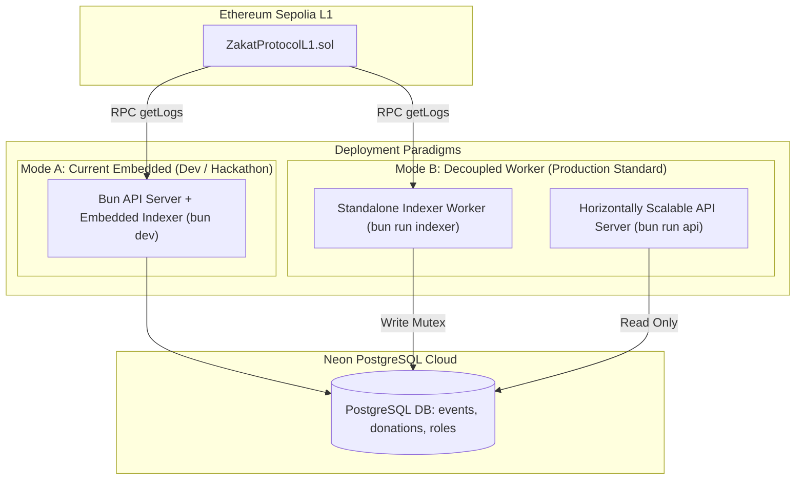

# Research: Blockchain Indexer Architectures — Global Tech Standards vs Embedded Design

- **Status:** Approved
- **Date:** 2026-09-01
- **Domain:** Web3 Data Ingestion, Ethereum EVM Indexing, System Architecture
- **Primary Sources:** Envio, Ponder, Goldsky, The Graph, Paradigm/Reth, Coinbase Engineering

> **Review 2026-09-08:** nama sumber pada header awal belum disertai URL pendukung klaim perusahaan tertentu. Dokumen ini adalah perbandingan opsi arsitektur, bukan bukti standar universal. Referensi primer terarah dan batas implementasi ZKT ditambahkan di bagian 4; diagram Sepolia L1 di bawah adalah konteks historis, sedangkan deployment terbaru tercatat pada manifest Arbitrum Sepolia 2026-09-08.

---

## 1. Executive Summary

In modern blockchain and Web3 software engineering, indexing on-chain state into relational/OLAP databases is a foundational requirement. The architectural choice of whether an indexer is **Embedded** (running inside the API HTTP server process) or **Decoupled / Standalone** (running as a dedicated daemon or managed streaming pipeline) follows a clear engineering maturity curve.

| Dimension | Embedded Indexer (Stage 1) | Standalone Worker (Stage 2) | Enterprise Stream (Stage 3 - Ponder/Envio) |
| :--- | :--- | :--- | :--- |
| **Process Model** | Shared process with HTTP API | Separate worker process | Decoupled pipeline + OLAP / GraphQL |
| **Scaling Profile** | Tied to API instances | Independent (Singleton worker, Multi API) | Horizontal distributed workers |
| **Failure Blast Radius** | Process failure can affect API | Worker failure isolated from API process | Queues can buffer failures; shared dependencies and recovery still matter |
| **DevOps Overhead** | Zero (single `bun run dev`) | Minimal (`Procfile` / Docker) | Medium to High (K8s, Redis/Kafka) |
| **Ideal Lifecycle** | Hackathon, POC, Testnet MVP | Seed / Staging / Production DApp | High-Frequency DeFi / L2 Rollups |

---

## 2. Why Global Tech Companies Decouple Indexers from APIs

Separating an indexer from the customer-facing API can address the following operational concerns. Whether this separation is needed depends on the deployment and its recovery requirements; the original claim that named production companies never embed indexers was not supported by linked evidence.

### A. Preventing Race Conditions & Multi-Instance Duplication
- **The Problem**: Customer-facing APIs scale horizontally (e.g., 5 or 10 pods behind an NGINX/Cloudflare load balancer). If the indexer is embedded in the API server, every new pod spawned by autoscaling will start its own polling loop, hammering the Ethereum RPC node and causing simultaneous database write conflicts.
- **The Solution**: The Indexer is deployed as a **Singleton Worker** (single active leader), while the API scales independently across multiple read-only instances querying the shared PostgreSQL database.

### B. Failure Isolation & Resource Contention
- Heavy block processing, event decoding, and Merkle tree calculations consume CPU and event loop ticks. If an RPC call times out or throws unhandled memory spikes, an embedded indexer can crash the HTTP server, causing HTTP 502/504 errors for web users.
- In a decoupled architecture, if the indexer encounters an RPC glitch and restarts, the API continues serving cached database reads to users uninterrupted.

### C. Chain Reorganizations (Reorgs) & Rollback Handling
- Public blockchains occasionally experience block reorganizations (reorgs). A production indexer must track block hashes and roll back invalid database rows when a canonical chain split occurs.
- Isolating this logic in a worker keeps the API surface purely focused on fast CRUD responses.

### D. Rate Limit Optimization (RPC Pooling)
- Dedicated indexer workers can leverage high-speed streaming protocols (such as WebSocket filters, Erigon RPC batching, or Hypersync) without tying up HTTP request handlers.

---

## 3. Recommended Architecture for Tawf Zakat Protocol

The code exposes an indexer engine that can be run with the API or separately. The diagram describes deployment options; singleton ownership, the pictured write mutex, and reorg recovery must be verified in the actual implementation:

```mermaid
flowchart TD
    subgraph L1_Network["Ethereum Sepolia L1"]
        SC["ZakatProtocolL1.sol"]
    end

    subgraph Storage["Neon PostgreSQL Cloud"]
        DB[(PostgreSQL DB: events, donations, roles)]
    end

    subgraph Architecture_Options["Deployment Paradigms"]
        subgraph Mode_A["Mode A: Current Embedded (Dev / Hackathon)"]
            BunServer["Bun API Server + Embedded Indexer (bun dev)"]
        end

        subgraph Mode_B["Mode B: Decoupled Worker (Production Standard)"]
            Worker["Standalone Indexer Worker (bun run indexer)"]
            APIServer["Horizontally Scalable API Server (bun run api)"]
        end
    end

    SC -->|RPC getLogs| BunServer
    BunServer --> DB

    SC -->|RPC getLogs| Worker
    Worker -->|Write Mutex| DB
    APIServer -->|Read Only| DB
```

### Path Forward:
1. **Current Code Structure**: `backend/src/indexer.ts` is implemented as an independent `IndexerEngine` class.
2. **Decoupled Execution Support**:
   - Running `bun src/index.ts` automatically runs both for zero-config simplicity.
   - Adding a standalone runner `bun src/indexer.ts` allows deploying the indexer as an isolated background daemon on AWS ECS, Fly.io, or Railway anytime production scaling is required.

## 4. Evidence Anchor Reliability Review — 2026-09-08

For the report-evidence pilot, process separation is secondary to preserving correct event provenance and recoverable state:

- **Receipt inclusion and finality differ.** Arbitrum distinguishes sequencer confirmation from parent-chain finality and assertion settlement. Label an anchor according to the confirmation level actually checked. [Arbitrum finality](https://docs.arbitrum.io/how-arbitrum-works/deep-dives/sequencer#finality).
- **Reorgs need explicit recovery.** Geth documents removed logs and repeated notifications during chain reorganizations. Retain block provenance and reconcile projections when canonical history changes. Moving a worker into another process does not implement this. [Geth log subscriptions](https://geth.ethereum.org/docs/interacting-with-geth/rpc/pubsub#logs).
- **Reprocessing needs an event identity and durable progress.** RPC logs expose block/transaction identity and log position. Scope processing to chain and contract, retain the block hash, and advance checkpoints only after the relevant writes succeed. This is a design inference from event semantics. [Ethereum JSON-RPC log fields](https://ethereum.org/developers/docs/apis/json-rpc/#eth_getfilterchanges).

At code snapshot `6a283c5`, [indexer.ts](../../backend/src/indexer.ts):60–86 reads through the latest block and checkpoints a block number without reorg recovery. [governance-chain.ts](../../backend/src/governance-chain.ts):45–68 checks a successful receipt and canonical block at confirmation time, but not finality. [recordOnchainEvent](../../backend/src/db/index.ts):860 catches insert failures, which can allow progress to advance without durable event storage. These are source-inspection findings, not newly reproduced failures; no worker migration or framework replacement was performed.
