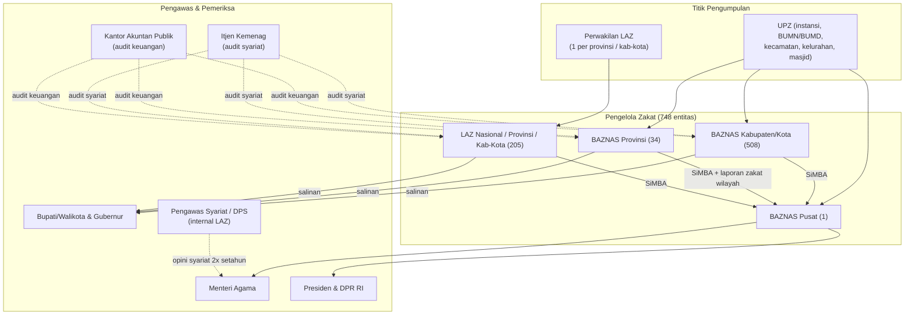

# Research: Ekosistem Pelaporan BAZNAS — Standardisasi, Audit Syariah, Relasi Pusat–Daerah, dan Peran AI

- **Status:** Draft (desk research selesai, validasi lapangan belum)
- **Date:** 2026-09-05
- **Domain:** Regulasi Zakat Indonesia, Akuntansi Syariah, Tata Kelola Lembaga, Applied AI
- **Primary Sources:** UU 23/2011 · PP 14/2014 · PerBAZNAS 1/2023 · KMA 606/2020 · PMA 19/2024 · PSAK 409 · Laporan Pengelolaan Zakat Nasional (LPZN) BAZNAS 2024 & 2025 · arXiv 2025–2026
- **Metode:** Ekstraksi teks langsung dari PDF resmi (`pdftotext`), bukan ringkasan sekunder. Setiap angka disertai tanggal *cut-off* data karena angka BAZNAS berubah antar publikasi.

---

## Penanda Tingkat Keyakinan

Dokumen ini memakai tiga penanda agar tidak ada klaim yang lebih kuat dari buktinya:

| Penanda | Arti |
| :--- | :--- |
| **`[TERVERIFIKASI]`** | Dikutip dari sumber primer (teks peraturan atau tabel laporan resmi) yang diekstraksi langsung dalam riset ini |
| **`[INDIKATIF]`** | Berasal dari satu sumber sekunder (berita, jurnal, siaran pers) yang belum dikonfirmasi silang |
| **`[PERLU VALIDASI LAPANGAN]`** | Hipotesis atau inferensi struktural; butuh wawancara amil/DPS/auditor untuk dipastikan |

---

## 1. Ringkasan Eksekutif

Riset ini berangkat dari satu keluhan yang sudah diketahui — *"reporting zakat memakan waktu lama"* — lalu menelusuri penyebab strukturalnya sampai ke teks peraturan dan ke laporan resmi BAZNAS sendiri. Hasilnya lebih tajam dari dugaan awal.

### Delapan temuan kunci

1. **Regulasi memang memberi tenggat sangat panjang, dan itu legal.** PerBAZNAS 1/2023 Pasal 13 ayat (3) mewajibkan laporan keuangan tahunan **yang sudah diaudit** disampaikan paling lambat **15 Agustus tahun berikutnya** — 7,5 bulan setelah tutup buku. `[TERVERIFIKASI]`

2. **Konsekuensinya, laporan nasional selalu disusun dari angka yang belum diaudit.** Tenggat laporan keuangan *belum diaudit* adalah 15 Februari; LPZN Akhir Tahun 2025 memakai *cut-off* 27 Februari 2026. Artinya potret zakat nasional yang dipublikasikan setiap tahun bukan potret hasil audit. `[TERVERIFIKASI]`

3. **Kepatuhan lapor tinggi, tetapi kualitas dokumen rendah.** LPZN 2025 mencatat kepatuhan **97,33%** (728 dari 748 pengelola zakat). Namun di dokumen yang sama, pengelola zakat yang memiliki dokumen laporan keuangan hanya **175 dari 748 (23,4%)**. `[TERVERIFIKASI]`

4. **Untuk laporan keuangan *teraudit*, angkanya lebih kecil lagi.** LPZN 2024 memberi label kolom secara eksplisit *"Laporan Keuangan Audited 2023"*: hanya **115 dari 722 pengelola zakat (15,9%)** — dan itu diukur pada 11 Februari 2025, yakni ~14 bulan setelah tahun buku 2023 berakhir. `[TERVERIFIKASI]`

5. **Angka nasional tidak rekonsiliasi antar tabel.** Total pengumpulan *on balance sheet* tahun 2024 muncul sebagai **Rp11,622 T**, **Rp10,954 T**, dan **Rp11,795 T** di tiga tabel berbeda — dua di antaranya dalam dokumen yang sama. Selisihnya ±Rp668 miliar. `[TERVERIFIKASI]` (rincian di §5)

6. **Setiap angka 2024 di-*restate* naik pada publikasi 2025.** Kepatuhan 2024 dilaporkan **93,77%** di LPZN 2024, lalu menjadi **96,00%** di LPZN 2025. Semua enam baris kategori direvisi naik. Laporan yang terlambat terus berdatangan setelah *cut-off*, sehingga setiap angka yang terbit bersifat provisional. `[TERVERIFIKASI]`

7. **Kapasitas audit tidak sebanding dengan populasi lembaga.** Cakupan audit syariah 2023 hanya **65 dari ~722 OPZ (9,25%)**, dengan **107 auditor syariah bersertifikat** (rasio 1 : 6,7 lembaga). Kemenag menyatakan butuh 200 auditor. `[INDIKATIF]`

8. **Masalah "komunikasi pusat–daerah" itu nyata, tapi bentuknya struktural, bukan interpersonal.** Empat friksi yang bisa didokumentasikan: pertanggungjawaban ganda, pembiayaan terbelah APBN/APBD, kekosongan kepengurusan yang menunggu pusat, dan adopsi *tooling* yang timpang. `[TERVERIFIKASI]` sebagian, `[PERLU VALIDASI LAPANGAN]` sebagian (§7).

### Dari temuan ke posisi produk

| Masalah terbukti | Konsekuensi operasional | Apa yang ZKT bisa tawarkan |
| :--- | :--- | :--- |
| Laporan teraudit baru wajib 15 Agustus t+1 | Bukti kepatuhan datang setelah keputusan sudah lama dibuat | *Continuous attestation* — bukti per-transaksi, bukan per-tahun |
| 23,4% punya laporan keuangan; 15,9% teraudit | Mayoritas lembaga tidak punya artefak keuangan yang bisa diperiksa | Generator laporan sesuai PerBAZNAS 1/2023 dari ledger |
| Angka nasional tidak rekonsiliasi antar tabel | Agregasi manual, sulit dilacak sumber selisihnya | *Reconciliation engine* on-chain ↔ SiMBA |
| Angka provisional yang di-*restate* tiap tahun | Publik tidak tahu angka mana yang final | Ledger *append-only* dengan versi dan Merkle root |
| Cakupan audit syariah 9,25% | 9 dari 10 lembaga tidak pernah diaudit syariah | Checklist pra-audit DPS yang menurunkan KMA 606/2020 |
| Hak amil dilanggar tanpa terdeteksi cepat (§8) | Deteksi bergantung pada *whistleblower* internal | Invariant `MAX_AMIL_BPS = 1250` yang dipaksakan kontrak |

> **Batasan posisi.** ZKT tidak menggantikan SiMBA atau BAZNAS. Posisinya adalah **lapisan bukti (evidence rail)** yang menyuplai SiMBA dengan data yang sudah terikat kriptografis, untuk amil yang berizin. Lihat §11 soal batasan legal ini.

---

## 2. Peta Aktor & Kelembagaan

### 2.1 Populasi pengelola zakat

Per LPZN Akhir Tahun 2025 (data per 27 Februari 2026), terdapat **748 pengelola zakat (PZ)** resmi. `[TERVERIFIKASI]`

| Jenis Pengelola Zakat | Jumlah 2024 | Jumlah 2025 |
| :--- | ---: | ---: |
| BAZNAS (pusat) | 1 | 1 |
| BAZNAS Provinsi | 34 | 34 |
| BAZNAS Kabupaten/Kota | 514 | 508 |
| LAZ Berskala Nasional | 47 | 56 |
| LAZ Berskala Provinsi | 40 | 44 |
| LAZ Berskala Kabupaten/Kota | 86 | 105 |
| **Total** | **722** | **748** |

Catatan yang perlu diperhatikan:

- Jumlah BAZNAS Kabupaten/Kota **turun** dari 514 ke 508. `[PERLU VALIDASI LAPANGAN]` — penyebabnya belum jelas dari dokumen (pemekaran/penggabungan wilayah, pencabutan, atau koreksi basis data).
- **DKI Jakarta tercatat 0 BAZNAS Kabupaten/Kota** dalam Tabel 2.1 LPZN 2025, sementara provinsi lain punya belasan sampai puluhan. `[TERVERIFIKASI]` — DKI memakai kelembagaan berbeda (BAZIS DKI), sebuah pengecualian yang sudah lama ada.
- LPZN 2025 Tabel 1.1 dan Tabel 1.3 memberi jumlah LAZ yang **berbeda** untuk periode yang sama (LAZ Nasional 56 vs 55; LAZ Provinsi 44 vs 45). `[TERVERIFIKASI]`

### 2.2 Siapa melapor ke siapa



### 2.3 Anomali struktural yang terlihat dari diagram

Perhatikan bahwa **BAZNAS Kabupaten/Kota tidak melapor ke BAZNAS Provinsi melalui SiMBA** — ia melapor langsung ke BAZNAS pusat, sementara BAZNAS Provinsi tetap wajib menyusun "laporan zakat wilayah" yang merupakan rekapitulasi seluruh kabupaten/kota di wilayahnya.

Ini berarti **BAZNAS Provinsi harus merekap data yang tidak melewati tangannya**. Konsekuensinya dibahas di §7.

---

## 3. Standardisasi Pelaporan: Anatomi PerBAZNAS 1/2023

Inilah jawaban atas pertanyaan *"standardisasi reporting BAZNAS itu seperti apa"*. Aturan induknya adalah **Peraturan BAZNAS Nomor 1 Tahun 2023** (ditetapkan 3 November 2023, diundangkan 8 November 2023, Berita Negara No. 885/2023), yang **mencabut PerBAZNAS 4/2018**.

### 3.1 Rantai hukumnya

| Lapis | Instrumen | Yang diatur |
| :--- | :--- | :--- |
| UU | **UU 23/2011** Pasal 29 | Kewajiban lapor berjenjang, "secara berkala" |
| PP | **PP 14/2014** Pasal 71–76 | Frekuensi (6 bulan + akhir tahun); Pasal 75: wajib audit syariat & keuangan |
| Peraturan Badan | **PerBAZNAS 1/2023** | Komponen laporan, format, tenggat spesifik, SiMBA, koreksi, sanksi |
| Standar akuntansi | **PSAK 409** (efektif 1 Jan 2024, menggantikan PSAK 109) + **PSAK 101 Lampiran C** | Pengakuan, pengukuran, penyajian, pengungkapan ZIS |
| Audit | **KMA 606/2020**, **PMA 41/2016**, **PMA 19/2024** | Pedoman audit syariah, perizinan & pengawas syariat LAZ |

Dasar hukum tertingginya singkat dan sengaja tidak detail:

> **UU 23/2011 Pasal 29**
> (1) BAZNAS kabupaten/kota wajib menyampaikan laporan pelaksanaan pengelolaan zakat, infak, sedekah, dan dana sosial keagamaan lainnya kepada BAZNAS provinsi dan pemerintah daerah secara berkala.
> (2) BAZNAS provinsi wajib menyampaikan laporan […] kepada BAZNAS dan pemerintah daerah secara berkala.
> (3) LAZ wajib menyampaikan laporan […] kepada BAZNAS dan pemerintah daerah secara berkala.
> (4) BAZNAS wajib menyampaikan laporan […] kepada Menteri secara berkala.
> (5) Laporan neraca tahunan BAZNAS diumumkan melalui media cetak atau media elektronik.
> (6) Ketentuan lebih lanjut mengenai pelaporan […] diatur dalam Peraturan Pemerintah.

Penjelasan resmi UU untuk Pasal 29 hanya berbunyi **"Cukup jelas."** — seluruh detail operasional diserahkan ke PP dan Peraturan Badan.

Perlu dicatat: **Pasal 29 ayat (1) menyebut BAZNAS kab/kota melapor ke BAZNAS provinsi**, tetapi PerBAZNAS 1/2023 mengarahkan pelaporan kab/kota **langsung ke BAZNAS pusat melalui SiMBA**. Provinsi mendapat perannya lewat kewajiban "laporan zakat wilayah". `[TERVERIFIKASI]`

### 3.2 Prinsip dasar yang ditetapkan

> **PerBAZNAS 1/2023 Pasal 3 ayat (3)**
> Laporan pelaksanaan pengelolaan Zakat, Infak, Sedekah, dan dana sosial keagamaan lainnya sebagaimana dimaksud pada ayat (1) harus disusun secara **lengkap, akurat, terkini, dan tepat waktu**.

> **Pasal 4**
> (1) Laporan […] disusun berdasarkan pencatatan transaksi pada sistem informasi.
> (2) BAZNAS, BAZNAS Provinsi, BAZNAS Kabupaten/Kota, dan LAZ **wajib melakukan pencatatan setiap transaksi** pelaksanaan pengelolaan Zakat, Infak, Sedekah, dan dana sosial keagamaan lainnya pada sistem informasi yang dikelola oleh BAZNAS.

Empat kata kunci "lengkap, akurat, terkini, tepat waktu" ini penting — ia adalah **standar mutu yang dapat diuji secara mesin**, dan sekaligus dasar sanksi di Pasal 24.

### 3.3 Komponen laporan (ini "format standar"-nya)

Ada dua periode (6 bulan dan akhir tahun) dan tiga profil pelapor.

| Pelapor | Komponen laporan |
| :--- | :--- |
| BAZNAS pusat & BAZNAS Provinsi | (a) laporan kinerja, (b) laporan keuangan, (c) **laporan zakat wilayah** |
| BAZNAS Kabupaten/Kota | (a) laporan kinerja, (b) laporan keuangan |
| LAZ (semua skala) | (a) laporan kinerja, (b) laporan keuangan |

**Laporan kinerja BAZNAS** wajib memuat sepuluh blok data (Pasal 6 ayat (3) dan Pasal 8 ayat (3)):

> a. data umum kelembagaan;
> b. data tata kelola;
> c. data pengumpulan;
> d. data muzaki;
> e. data pendistribusian dan pendayagunaan;
> f. data mustahik;
> g. data pengelolaan Zakat, Infak, Sedekah, dan dana sosial keagamaan lainnya **di luar neraca**;
> h. data biaya operasional dari Anggaran Pendapatan dan Belanja Negara (APBN) bagi BAZNAS;
> i. data biaya operasional dari Anggaran Pendapatan dan Belanja Daerah (APBD) bagi BAZNAS Provinsi dan BAZNAS Kabupaten/Kota; dan
> j. data dukungan pemerintah.

**Laporan kinerja LAZ** hanya enam blok (Pasal 7 ayat (2) dan Pasal 9 ayat (2)): butir a–f di atas. LAZ tidak melaporkan data APBN/APBD karena tidak dibiayai anggaran negara.

**Laporan keuangan** dibelah dua (Pasal 6 ayat (4)–(6)):

> a. laporan keuangan **di dalam neraca** — wajib disusun sesuai pernyataan standar akuntansi keuangan di bidang Zakat, Infak, dan Sedekah *(yakni PSAK 409, dulu PSAK 109)*;
> b. laporan keuangan **di luar neraca** — disusun sesuai pedoman yang ditetapkan oleh BAZNAS.

Pemisahan *on balance sheet* / *off balance sheet* inilah yang menjelaskan mengapa angka nasional selalu tampil dalam dua lapis (§5). Secara nasional 2025, *off balance sheet* (Rp32,82 T) hampir **tiga kali lipat** *on balance sheet* (Rp11,88 T) — artinya sebagian besar nilai yang diklaim "dikelola" tidak melewati neraca lembaga manapun.

### 3.4 Matriks tenggat waktu lengkap

Ini bagian paling operasional dan paling menjelaskan keluhan "lama". Semua dari PerBAZNAS 1/2023 Pasal 10–15. `[TERVERIFIKASI]`

**Periode semester (1 Jan – 30 Jun tahun berjalan):**

| Pelapor | Penerima | Jenis laporan | Tenggat | Pasal |
| :--- | :--- | :--- | :--- | :--- |
| BAZNAS Prov / Kab-Kota / LAZ | BAZNAS (via SiMBA) | Laporan kinerja | **10 Juli** | 10(1) |
| BAZNAS Provinsi | BAZNAS (via SiMBA) | Laporan zakat wilayah | **31 Juli** | 10(3) |
| Perwakilan LAZ | LAZ induk (tembusan pemda & Kemenag) | Laporan pelaksanaan | **31 Juli** | 12(1) |
| BAZNAS Prov / Kab-Kota / LAZ | BAZNAS (via SiMBA) | Laporan keuangan **belum diaudit** | **15 Agustus** | 10(2) |
| BAZNAS Kabupaten/Kota | Bupati/Walikota | Laporan semester | **15 Agustus** | 11(1) |
| BAZNAS Provinsi | Gubernur | Laporan semester | **1 September** | 11(2) |
| LAZ | Pemerintah daerah | Laporan semester | **1 September** | 12(2) |
| BAZNAS pusat | Menteri Agama | Laporan semester | **15 September** | 11(3) |

**Periode akhir tahun (1 Jan – 31 Des):**

| Pelapor | Penerima | Jenis laporan | Tenggat | Pasal |
| :--- | :--- | :--- | :--- | :--- |
| BAZNAS Prov / Kab-Kota / LAZ | BAZNAS (via SiMBA) | Laporan kinerja 1 tahun | **10 Januari** t+1 | 13(1) |
| Perwakilan LAZ | LAZ induk (tembusan) | Laporan akhir tahun | **31 Januari** t+1 | 15(1) |
| BAZNAS Provinsi | BAZNAS (via SiMBA) | Laporan zakat wilayah 1 tahun | **31 Januari** t+1 | 13(4) |
| BAZNAS Prov / Kab-Kota / LAZ | BAZNAS (via SiMBA) | Laporan keuangan **belum diaudit** | **15 Februari** t+1 | 13(2) |
| BAZNAS Kabupaten/Kota | Bupati/Walikota | Laporan akhir tahun | **15 Februari** t+1 | 14(1) |
| BAZNAS Provinsi | Gubernur | Laporan akhir tahun | **1 Maret** t+1 | 14(2) |
| LAZ | Pemerintah daerah | Laporan akhir tahun | **1 Maret** t+1 | 15(2) |
| BAZNAS pusat | Menteri Agama | Laporan akhir tahun | **15 Maret** t+1 | 14(3) |
| BAZNAS pusat | Presiden (via Menteri) & DPR RI | Laporan pelaksanaan tugas | min. **1× setahun** | 14(4) |
| BAZNAS Prov / Kab-Kota / LAZ | BAZNAS (via SiMBA) | **Laporan keuangan SUDAH DIAUDIT** | **15 Agustus t+1** | **13(3)** |

Baris terakhir adalah temuan paling penting dari seluruh riset ini:

> **PerBAZNAS 1/2023 Pasal 13 ayat (3)**
> BAZNAS Provinsi, BAZNAS Kabupaten/Kota, dan LAZ wajib menyampaikan laporan keuangan 1 (satu) tahun **yang sudah diaudit** kepada BAZNAS melalui sistem informasi paling lambat pada tanggal **15 Agustus tahun berikutnya**.

Jarak antara tutup buku (31 Desember) dan tenggat laporan teraudit adalah **227 hari (~7,5 bulan)**. Dan BAZNAS pusat sudah wajib menyerahkan laporan akhir tahunnya ke Menteri pada 15 Maret — **lima bulan sebelum** angka teraudit dari daerah wajib masuk.

**Implikasi struktural:** laporan nasional secara desain tidak mungkin berbasis angka teraudit. Ini bukan kelalaian pelaksana; ini konsekuensi langsung dari arsitektur tenggat.

### 3.5 SiMBA sebagai kanal wajib

> **Pasal 17 ayat (2)** Sistem informasi sebagaimana dimaksud pada ayat (1) dikembangkan dan dikelola oleh BAZNAS dalam bentuk aplikasi **SiMBA**.

> **Pasal 18**
> (1) Penggunaan aplikasi SiMBA […] dilakukan dengan cara: a. **input data manual**; atau b. **pertukaran data host to host**.
> (2) Penggunaan aplikasi SiMBA melalui input data manual […] dilakukan **setiap hari** atas transaksi pelaksanaan pengelolaan Zakat, Infak, Sedekah, dan dana sosial keagamaan lainnya.
> (3) Penggunaan aplikasi SiMBA melalui pertukaran data host to host […] dilakukan dengan cara sinkronisasi antara sistem informasi yang digunakan dengan SiMBA.

Dua hal yang layak digarisbawahi:

- Jalur **host-to-host sudah diakui regulasi**. Ini pintu masuk legal bagi sistem pihak ketiga — termasuk ZKT — untuk menyinkronkan data ke SiMBA tanpa mengubah aturan apa pun. `[TERVERIFIKASI]`
- Jalur *default*-nya adalah **input manual harian**. Lembaga yang tidak punya integrasi harus mengetik ulang setiap transaksi ke SiMBA — di samping pembukuan internalnya sendiri. Inilah sumber beban ganda yang dikeluhkan amil di lapangan. `[INDIKATIF]`

Ada pula mekanisme *fallback* luring:

> **Pasal 21 ayat (1)–(2)** Dalam hal SiMBA tidak dapat digunakan karena faktor eksternal […] dapat menggunakan **SIMBALITE** untuk sementara waktu. Faktor eksternal meliputi: tidak tersedianya layanan dalam jaringan; gangguan pada server; SiMBA sedang dalam proses perbaikan; teridentifikasi adanya serangan masif siber ke SiMBA; dan/atau gangguan lainnya.

Keberadaan pasal ini mengonfirmasi bahwa gangguan akses SiMBA adalah risiko yang cukup nyata untuk diatur eksplisit. `[TERVERIFIKASI]`

### 3.6 Petugas, koreksi, dan sanksi

**Petugas (Pasal 20):** setiap lembaga wajib menetapkan *petugas pelaksana* (yang menginput) dan *penanggung jawab* melalui **surat keputusan pimpinan tertinggi**, yang salinannya dilaporkan ke BAZNAS. Ini menciptakan rantai akuntabilitas personal atas kualitas data.

**Koreksi (Pasal 22):** laporan yang sudah masuk hanya bisa dikoreksi lewat permohonan resmi melalui SiMBA, berdasarkan:

> a. permohonan tertulis dari pejabat penanggung jawab data […]; atau
> b. **hasil audit oleh internal audit, Kantor Akuntan Publik, atau auditor syariah**.

Pasal ini adalah pengakuan regulator bahwa **angka akan berubah setelah audit** — dan menjelaskan mengapa data historis di-*restate* (§5.3).

**Sanksi (Pasal 24):**

> (1) BAZNAS Provinsi, BAZNAS Kabupaten/Kota, dan LAZ dikenai sanksi administratif berupa peringatan tertulis apabila: a. tidak menyampaikan laporan […]; dan b. tidak menyampaikan laporan **secara lengkap, akurat, terkini, dan tepat waktu** […].
> (2) Peringatan tertulis […] terdiri atas: a. peringatan tertulis kesatu; b. peringatan tertulis kedua; dan c. peringatan tertulis ketiga.
> (3) Pemberian peringatan tertulis […] dilaksanakan secara bertahap dengan rentang waktu **30 (tiga puluh) hari kerja**.
> (5) Dalam hal […] tidak menyampaikan laporan atau perbaikan data laporan sampai dengan batas waktu peringatan tertulis ketiga BAZNAS berwenang **melaporkan kepada Menteri**.

Tiga tahap × 30 hari kerja ≈ **90 hari kerja (~4,5 bulan kalender)** sebelum eskalasi ke Menteri. Untuk LAZ, ujungnya bisa sampai pencabutan izin (UU 23/2011 Pasal 36 ayat (1) huruf c). Untuk BAZNAS daerah, sanksi terberatnya tidak jelas — BAZNAS daerah adalah lembaga pemerintah, bukan pemegang izin. `[PERLU VALIDASI LAPANGAN]`

### 3.7 Masa transisi

> **Pasal 26** Pada saat Peraturan Badan ini mulai berlaku, seluruh laporan […] harus menyesuaikan dengan ketentuan dalam Peraturan Badan ini paling lama **2 (dua) tahun** sejak Peraturan Badan ini diundangkan.

Diundangkan 8 November 2023 → masa penyesuaian berakhir **8 November 2025**. Artinya laporan akhir tahun 2025 adalah **siklus penuh pertama** di mana seluruh 748 pengelola zakat seharusnya sudah sepenuhnya patuh format baru. `[TERVERIFIKASI]`

---

## 4. Mengapa Reporting Memakan Waktu Lama

Keluhan awal terkonfirmasi. Berikut anatomi penyebabnya, diurutkan dari yang paling struktural.

### 4.1 Rantai lima hop dengan tenggat berjenjang

Satu transaksi zakat di sebuah kabupaten harus melewati:

```
Transaksi di UPZ/loket
  → dicatat di sistem internal lembaga
  → di-input ulang (atau disinkronkan) ke SiMBA          [harian, Pasal 18(2)]
  → direkap jadi laporan kinerja kab/kota                 [10 Januari t+1]
  → direkap BAZNAS Provinsi jadi laporan zakat wilayah    [31 Januari t+1]
  → diagregasi BAZNAS pusat jadi LPZN                     [15 Maret t+1 ke Menteri]
  → dikoreksi lagi setelah audit                          [15 Agustus t+1]
```

Setiap hop menambah latensi **dan** peluang selisih. Tidak ada satu pun hop yang punya mekanisme rekonsiliasi otomatis terhadap hop sebelumnya.

### 4.2 Tenggat audit yang panjang secara desain

Sudah dibahas di §3.4. Ringkasnya: **7,5 bulan** untuk laporan teraudit, sementara laporan nasional terbit **5 bulan sebelumnya**.

### 4.3 Bukti *lag* dari dokumen BAZNAS sendiri `[TERVERIFIKASI]`

| Publikasi | Tahun buku | Tanggal dokumen | *Cut-off* data | *Lag* dari tutup buku |
| :--- | :--- | :--- | :--- | :--- |
| LPZN Akhir Tahun 2024 | 2024 | — | **11 Februari 2025** | 42 hari |
| LPZN Akhir Tahun 2025 | 2025 | Jakarta, **Januari 2026** | **27 Februari 2026** | 58 hari |

Dua hal aneh yang layak dicatat:

1. Dokumen LPZN 2025 tertulis "Jakarta, Januari 2026" di halaman sampul, tetapi **seluruh tabelnya** berketerangan *"Data per tanggal 27 Februari 2026"*. Dokumen ini disusun (atau setidaknya difinalisasi datanya) setelah tanggal yang tertera. `[TERVERIFIKASI]`
2. *Cut-off* **mundur 16 hari** antar tahun (11 Feb → 27 Feb). Konsisten dengan hipotesis bahwa BAZNAS menunggu laporan terlambat masuk sebelum menutup buku statistik.

### 4.4 Input manual dan kapasitas SDM `[INDIKATIF]`

Studi implementasi SiMBA di beberapa BAZNAS daerah secara konsisten menemukan pola yang sama:

- Tidak ada operator SiMBA khusus; input dikerjakan staf **di sela pekerjaan lain**.
- Literasi digital SDM rendah, dan kesulitan menganalisis data keluaran SiMBA.
- Ketergantungan pada pencatatan manual paralel, *error* sistem, dan desinkronisasi data.
- Minimnya SDM yang menguasai standar akuntansi menjadi kendala utama penyusunan laporan keuangan.

Ini adalah temuan berulang di banyak skripsi/jurnal dengan lokus berbeda (Sulawesi Utara, Garut, Tebo, Tulungagung, Mojokerto). Karena metodenya studi kasus tunggal, angka spesifiknya tidak bisa digeneralisasi — tapi **konsistensi polanya** kuat.

### 4.5 Akar masalah yang sebenarnya

Tiga penyebab di atas bermuara pada satu hal: **tidak ada sumber kebenaran tunggal yang mengikat.** Setiap lapisan menyimpan salinannya sendiri (pembukuan internal, SiMBA, laporan cetak ke pemda, kertas kerja auditor), dan tidak ada mekanisme yang memaksa keempatnya konsisten. Rekonsiliasi dilakukan manual, belakangan, dan sebagian.

Ini persis kelas masalah yang dijawab oleh ledger *append-only* dengan komitmen kriptografis — bukan karena "blockchain", tapi karena sifat *tamper-evident* dan *single-source*-nya. Lihat §10.

---

## 5. Bukti Kualitas Data: Angka Nasional Tidak Rekonsiliasi

Bagian ini adalah bukti terkuat dalam dokumen ini, karena seluruhnya berasal dari **publikasi resmi BAZNAS sendiri** dan bisa diverifikasi ulang siapa pun.

> **Catatan format angka.** Tabel LPZN memakai koma sebagai pemisah ribuan (gaya Inggris). Angka mentah di bawah dikutip **persis seperti tercetak** agar bisa dicocokkan langsung dengan PDF sumber.

### 5.1 Tiga nilai berbeda untuk pengumpulan 2024 `[TERVERIFIKASI]`

| Sumber | *On balance sheet* 2024 | *Off balance sheet* 2024 | Grand total 2024 |
| :--- | ---: | ---: | ---: |
| LPZN 2024, **Tabel 2.2** (per jenis dana) | `11,622,127,523,247` | `28,887,733,938,943` | `40,509,861,462,190` |
| LPZN 2024, **Tabel 2.3** (per jenis PZ) | `10,954,107,312,973` | `29,493,257,261,484` | `40,447,364,574,457` |
| LPZN 2024, **Tabel 2.4** (rata-rata per PZ) | `11,622,127,523,247` | — | — |
| LPZN 2025, **Tabel 2.2** (kolom pembanding 2024) | `11,795,347,722,441` | `29,011,200,289,796` | `40,806,548,012,237` |

Selisih terbesarnya:

- *On balance sheet*: **Rp668,0 miliar** (Tabel 2.2 vs Tabel 2.3 LPZN 2024) — dalam satu dokumen yang sama, dua halaman berdekatan, sama-sama berlabel *"Sumber Data: SIMBA"* dan *"Data per tanggal 11 Februari 2025"*.
- *Off balance sheet*: **Rp605,5 miliar** (Tabel 2.2 vs Tabel 2.3 LPZN 2024), lalu **nilai ketiga** muncul di LPZN 2025.
- Grand total: **Rp62,5 miliar** selisih intra-dokumen, dan **Rp296,7 miliar** vs versi LPZN 2025.

Narasi LPZN 2024 sendiri memakai angka Tabel 2.2: *"Pengumpulan dana ZIS-DSKL nasional pada Januari-Desember tahun 2024 mencapai Rp40.509 triliun."*

### 5.2 Inkonsistensi digit di dalam LPZN 2025 `[TERVERIFIKASI]`

Angka *off balance sheet* 2024 muncul enam kali di LPZN 2025:

| Lokasi | Nilai tercetak |
| :--- | ---: |
| Tabel 2.2 (per jenis dana) | `29,011,200,289,796` |
| Lima tabel lain (per jenis PZ, per wilayah, dst.) | `29,011,200,789,796` |

Selisihnya hanya **Rp500.000** — tidak material secara nominal, tapi sangat material sebagai **sinyal proses**: angka yang sama diketik/disalin ulang antar tabel, bukan dibaca dari satu sumber terkomputasi.

### 5.3 Setiap angka 2024 di-*restate* naik pada publikasi 2025 `[TERVERIFIKASI]`

| Kategori | Kepatuhan 2024 menurut **LPZN 2024** | Kepatuhan 2024 menurut **LPZN 2025** | Δ |
| :--- | ---: | ---: | ---: |
| BAZNAS pusat | 100,00% | 100,00% | — |
| BAZNAS Provinsi | 97,06% (33/34) | 100,00% | +2,94 pp |
| BAZNAS Kab/Kota | 95,14% (489/514) | 97,44% | +2,30 pp |
| LAZ Nasional | 97,87% (46/47) | 100,00% | +2,13 pp |
| LAZ Provinsi | 92,50% (37/40) | 92,50% | — |
| LAZ Kab/Kota | 82,56% (71/86) | 86,05% | +3,49 pp |
| **TOTAL** | **93,77%** (677/722) | **96,00%** | **+2,23 pp** |

Kesimpulan: **angka kepatuhan yang dipublikasikan bersifat provisional.** Laporan terus masuk setelah *cut-off*, dan versi finalnya baru terlihat setahun kemudian di publikasi berikutnya. Tidak ada penanda versi atau catatan restatement di dokumennya.

### 5.4 Tiga angka kepatuhan berbeda untuk tahun 2025 yang sama `[TERVERIFIKASI]`

| Sumber dalam LPZN 2025 | Angka |
| :--- | ---: |
| Ringkasan Eksekutif & Tabel 1.1 | **97,33%** (728/748) |
| Tabel 1.2 (komparasi 2024–2025) | **96,24%** |
| Tabel 1.3 (rekap per wilayah) | BAZNAS Kab/Kota 95,92% · LAZ Nasional 94,55% · LAZ Provinsi 93,67% |

Tabel 1.3 juga memakai populasi LAZ yang berbeda dari Tabel 1.1 (LAZ Nasional 55 vs 56; LAZ Provinsi 45 vs 44). Ketiga tabel ini berketerangan *cut-off* yang identik.

### 5.5 Jurang antara "melapor" dan "punya laporan keuangan" `[TERVERIFIKASI]`

Ini temuan yang paling penting untuk argumen produk.

**LPZN 2025, Tabel 2.20 — Data Dokumen Laporan Keuangan per Jenis Pengelola Zakat** (data per 27 Feb 2026):

| Jenis PZ | Jumlah PZ | Punya dokumen laporan keuangan | % |
| :--- | ---: | ---: | ---: |
| BAZNAS pusat | 1 | 1 | 100,0% |
| BAZNAS Provinsi | 34 | 14 | 41,2% |
| BAZNAS Kabupaten/Kota | 508 | 128 | 25,2% |
| LAZ Nasional | 56 | 19 | 33,9% |
| LAZ Provinsi | 44 | 4 | 9,1% |
| LAZ Kabupaten/Kota | 105 | 9 | 8,6% |
| **Total** | **748** | **175** | **23,4%** |

**LPZN 2024, Tabel 2.29** memberi rincian yang lebih eksplisit karena kolomnya berlabel jelas (data per 11 Feb 2025):

| Jenis PZ | Jumlah PZ | RENSTRA | RKAT 2024 | **Laporan Keuangan _Audited_ 2023** |
| :--- | ---: | ---: | ---: | ---: |
| BAZNAS pusat | 1 | 1 | 1 | 1 |
| BAZNAS Provinsi | 34 | 24 | 30 | 12 |
| BAZNAS Kabupaten/Kota | 514 | 224 | 313 | 83 |
| LAZ Nasional | 47 | 20 | 25 | 7 |
| LAZ Provinsi | 40 | 14 | 16 | 8 |
| LAZ Kabupaten/Kota | 86 | 27 | 37 | 4 |
| **Total** | **722** | **310 (42,9%)** | **422 (58,4%)** | **115 (15,9%)** |

Tiga kesimpulan:

1. **Kepatuhan formal ≠ akuntabilitas substantif.** 97,33% menyampaikan *sesuatu*; hanya 23,4% punya dokumen laporan keuangan; hanya 15,9% punya laporan keuangan **teraudit** — dan itu diukur 14 bulan setelah tahun bukunya berakhir.
2. **LAZ kecil paling rapuh.** LAZ Provinsi (9,1%) dan LAZ Kabupaten/Kota (8,6%) hampir tidak punya artefak keuangan yang bisa diperiksa, padahal mereka wajib bersedia diaudit sebagai syarat izin (UU 23/2011 Pasal 18 ayat (2) huruf h).
3. **Dokumen perencanaan pun belum merata.** Kurang dari separuh punya RENSTRA (42,9%). Tanpa rencana, "realisasi vs target" — yang wajib dimuat dalam laporan kinerja — sulit dinilai.

### 5.6 Konteks skala

Untuk perspektif (semua `[TERVERIFIKASI]` dari LPZN 2025 kecuali baris potensi):

| Metrik | Nilai 2024 | Nilai 2025 | Pertumbuhan |
| :--- | ---: | ---: | ---: |
| Pengumpulan *on balance sheet* | Rp11,795 T | Rp11,876 T | +0,68% |
| Pengumpulan *off balance sheet* | Rp29,011 T | Rp32,822 T | +13,14% |
| **Grand total pengumpulan** | **Rp40,807 T** | **Rp44,698 T** | **+9,54%** |
| Pendistribusian & pendayagunaan | — | Rp44,288 T | +10,50% |
| Mustahik penerima manfaat | — | 43,741 juta | — |
| Zakat mal | Rp4,376 T | Rp4,298 T | **−1,78%** |
| Kurban | Rp2,715 T | Rp2,350 T | **−13,46%** |
| Potensi zakat nasional `[INDIKATIF]` | Rp327 T | Rp327 T | — |

Realisasi terhadap potensi ≈ **13,7%**. Dua catatan penting yang jarang disorot:

- **Zakat mal justru turun 1,78%** pada 2025. Pertumbuhan total ditopang *off balance sheet* (+13,14%) — kategori yang justru **paling tidak terverifikasi** karena tidak melewati neraca lembaga manapun.
- LPZN 2025 sendiri mengakui *"jumlah muzaki mengalami penurunan baik pada muzaki perorangan maupun badan"*. Nilai naik, jumlah pembayar turun.

---

## 6. Audit Syariah, Audit Keuangan, dan Dewan Pengawas Syariah

### 6.1 Dua jalur audit yang berbeda

> **PP 14/2014 Pasal 75**
> Laporan pelaksanaan Pengelolaan Zakat, infak, sedekah, dan dana sosial keagamaan lainnya sebagaimana dimaksud dalam Pasal 71, Pasal 72, dan Pasal 73 **harus diaudit syariat dan keuangan**. Audit syariat dilakukan oleh kementerian yang menyelenggarakan urusan pemerintahan di bidang agama, dan audit keuangan dilakukan oleh **akuntan publik**.

| Dimensi | Audit Syariat | Audit Keuangan |
| :--- | :--- | :--- |
| Pelaksana | Itjen Kementerian Agama | Kantor Akuntan Publik (KAP) |
| Dasar | KMA 606/2020, PMA 41/2016, Kepdirjen 137/2021 | Standar profesi akuntan publik |
| Objek | Kinerja lembaga, kinerja keamilan, pengumpulan, pendistribusian & pendayagunaan | Laporan keuangan sesuai PSAK 409 / PSAK 101 |
| Tujuan | Mencegah penyimpangan ketentuan syariah | Opini atas kewajaran laporan keuangan |
| Biaya | Ditanggung negara (anggaran Itjen) | **Ditanggung lembaga** |

Perbedaan pembiayaan ini penting: audit keuangan adalah **biaya yang harus ditanggung sendiri** oleh BAZNAS daerah dan LAZ kecil — dan menjelaskan mengapa hanya 15,9% yang punya laporan teraudit. `[PERLU VALIDASI LAPANGAN]` — besaran biaya audit riil untuk BAZNAS kabupaten belum ditemukan datanya.

### 6.2 Cakupan audit yang jauh dari populasi `[INDIKATIF]`

Data tahun 2023 (satu sumber, perlu konfirmasi silang ke Itjen Kemenag):

| Metrik | Nilai |
| :--- | :--- |
| OPZ diaudit **syariah** 2023 | **65 dari ~722 (9,25%)** |
| Rincian | 10 BAZNAS Provinsi, 29 BAZNAS Kab/Kota, 5 LAZ Nasional, 8 LAZ Provinsi, 13 LAZ Kab/Kota |
| Jangkauan geografis | 28 dari 38 provinsi (rata-rata ~2 lembaga/provinsi) |
| OPZ diaudit **keuangan** oleh Kemenag 2023 | 69 (9,82%) |
| Auditor syariah bersertifikat (IAI) | **107 orang** |
| Rasio aktual | 1 auditor : 6,7 OPZ |
| Rasio ideal (klaim sumber) | 1 auditor : 3 OPZ |
| Kebutuhan menurut Kemenag | **200 auditor syariah** |

Artinya **lebih dari 9 dari 10 pengelola zakat tidak pernah tersentuh audit syariah dalam satu tahun anggaran**. Pada laju 65 lembaga/tahun, satu siklus penuh 748 lembaga butuh **~11,5 tahun**.

### 6.3 Pengawas Syariat / DPS di LAZ

Pengawas syariat adalah **syarat izin**, bukan opsi:

> **UU 23/2011 Pasal 18 ayat (2)**
> Izin […] hanya diberikan apabila memenuhi persyaratan paling sedikit:
> […] d. **memiliki pengawas syariat**;
> […] h. **bersedia diaudit syariat dan keuangan secara berkala**.

Ketentuan operasionalnya di PMA 19/2024 (menggantikan KMA 333/2015): `[INDIKATIF]`

| Aspek | Ketentuan |
| :--- | :--- |
| Komposisi minimum | Ketua + 1 anggota |
| Batas rangkap | Maksimal mengawasi **2 LAZ** |
| Larangan | Tidak boleh menjadi pengurus/pegawai aktif LAZ yang diawasi; tidak boleh ada benturan kepentingan |
| Kompetensi | Menguasai fikih ZIS-DSKL dan muamalah maliyah; memahami regulasi zakat; memahami proses bisnis LAZ |
| Kewajiban lapor | Menyampaikan hasil pengawasan ke Kementerian **minimal 2× dalam 1 tahun** |
| Output | Opini syariat atas permintaan atau atas temuan |

Ambang izin LAZ menurut PMA 19/2024 (pengumpulan tahunan minimum): `[INDIKATIF]`

- LAZ Nasional: **Rp30 miliar**, beroperasi di ≥10 provinsi
- LAZ Provinsi: **Rp10 miliar**, mencakup ≥4 kabupaten/kota
- LAZ Kabupaten/Kota: **Rp2 miliar**, melayani ≥2 kecamatan

### 6.4 Pemetaan ke arsitektur ZKT

Struktur peran di `sc/src/ZakatProtocolL1.sol` ternyata memetakan cukup rapi ke pembagian kewenangan regulatif:

| Peran on-chain (`ZakatProtocolL1.sol`) | Padanan regulatif | Sifat |
| :--- | :--- | :--- |
| `DEFAULT_ADMIN_ROLE` | Amil / Badan Pelaksana | Mengajukan, mengeksekusi |
| `SHARIA_SUPERVISOR_ROLE` (baris 37) | Pengawas Syariat / DPS (UU 23/2011 Ps. 18(2)d) | **Persetujuan *ex-ante*** — veto kelayakan fikih |
| `AUDITOR_ROLE` (baris 36) | Akuntan publik / auditor syariah (PP 14/2014 Ps. 75) | **Atestasi *ex-post*** — tidak ikut keputusan harian |
| `RELAYER_ROLE` (baris 35) | — (infrastruktur) | Menanggung gas, tidak punya wewenang dana |
| `MAX_AMIL_BPS = 1250` (baris 39) | Plafon hak amil 12,5% (1/8 asnaf) | Invariant yang dipaksakan kode |

Pemisahan *ex-ante* (DPS) dan *ex-post* (auditor) di ADR-0006 sejalan dengan pembagian di regulasi: pengawas syariat mengawasi berjalan, auditor memeriksa setelahnya. Ini bukan kebetulan desain yang perlu diubah — justru argumen kuat untuk dipertahankan.

---

## 7. Relasi BAZNAS Pusat ↔ BAZNAS Daerah

Dugaan awal — *"ada masalah komunikasi antara BAZNAS pusat dan daerah"* — terkonfirmasi, tetapi bentuknya **struktural, bukan interpersonal**. Berikut empat friksi yang bisa didokumentasikan, diurutkan dari yang paling kuat buktinya.

### 7.1 Pertanggungjawaban ganda dengan dua set tenggat `[TERVERIFIKASI]`

BAZNAS daerah wajib melapor ke **dua tuan sekaligus** dengan tenggat berbeda untuk substansi yang sama:

| BAZNAS Kabupaten/Kota melapor ke… | Tenggat akhir tahun | Kanal |
| :--- | :--- | :--- |
| BAZNAS pusat (kinerja) | 10 Januari t+1 | SiMBA (wajib) |
| BAZNAS pusat (keuangan belum diaudit) | 15 Februari t+1 | SiMBA (wajib) |
| **Bupati/Walikota** | 15 Februari t+1 | Boleh hasil cetak dari SiMBA (Ps. 16(2)) |
| BAZNAS pusat (keuangan teraudit) | 15 Agustus t+1 | SiMBA (wajib) |

Satu entitas, empat tenggat, dua penerima, satu populasi transaksi. Setiap penyampaian adalah kesempatan baru untuk divergensi angka.

Ditambah lagi, UU Pasal 29 ayat (1) menyebut pelaporan kab/kota ke **BAZNAS provinsi**, sementara PerBAZNAS mengarahkannya ke **BAZNAS pusat**. BAZNAS Provinsi tetap wajib menyusun "laporan zakat wilayah" — rekapitulasi seluruh kabupaten/kota — atas data yang tidak melewati tangannya. `[PERLU VALIDASI LAPANGAN]` — bagaimana provinsi memperoleh data untuk rekap ini dalam praktik (akses SiMBA level provinsi? permintaan manual ke kab/kota?) belum terkonfirmasi, dan ini kandidat kuat sumber friksi harian.

### 7.2 Pembiayaan terbelah: pusat menuntut, daerah membiayai sendiri `[TERVERIFIKASI]`

> **UU 23/2011 Pasal 30** Untuk melaksanakan tugasnya, BAZNAS dibiayai dengan **Anggaran Pendapatan dan Belanja Negara** dan Hak Amil.

> **Pasal 31 ayat (1)** Dalam melaksanakan tugasnya, BAZNAS provinsi dan BAZNAS kabupaten/kota […] dibiayai dengan **Anggaran Pendapatan dan Belanja Daerah** dan Hak Amil.

Konsekuensinya:

- BAZNAS pusat **menetapkan standar, tenggat, dan sanksi** pelaporan (PerBAZNAS 1/2023).
- Tetapi **tidak mengendalikan anggaran operasional** yang dibutuhkan daerah untuk memenuhinya — termasuk anggaran untuk operator SiMBA, perangkat, dan **biaya audit KAP**.
- Anggaran itu ada di tangan gubernur/bupati/walikota, yang punya prioritas sendiri.

Ini asimetri klasik *unfunded mandate*. Laporan kinerja pun mewajibkan pelaporan *"data biaya operasional dari APBD"* dan *"data dukungan pemerintah"* (Pasal 6 ayat (3) huruf i–j) — artinya regulator sendiri sadar bahwa dukungan APBD adalah variabel yang perlu dipantau.

### 7.3 Kekosongan kepengurusan yang menunggu keputusan pusat `[INDIKATIF]`

Pembentukan dan pengisian pimpinan BAZNAS daerah melibatkan tiga pihak:

> **UU 23/2011 Pasal 15 ayat (2)–(4)** BAZNAS provinsi dibentuk oleh **Menteri** atas usul **gubernur** setelah mendapat **pertimbangan BAZNAS**. BAZNAS kabupaten/kota dibentuk oleh Menteri atau pejabat yang ditunjuk atas usul bupati/walikota setelah mendapat pertimbangan BAZNAS. Dalam hal gubernur atau bupati/walikota tidak mengusulkan […], Menteri atau pejabat yang ditunjuk **dapat membentuk** […] setelah mendapat pertimbangan BAZNAS.

Rantai tiga pihak ini rentan macet. Contoh terdokumentasi: **BAZNAS Kabupaten Serang** — masa jabatan pimpinan berakhir, posisi diisi Plt, 10 nama calon sudah diserahkan ke BAZNAS pusat untuk verifikasi faktual, dan hasilnya belum keluar. `[INDIKATIF]`

Lembaga tanpa pimpinan definitif tidak bisa menerbitkan SK petugas pelaksana dan penanggung jawab SiMBA yang diwajibkan Pasal 20 ayat (4) — jadi kekosongan kepengurusan **langsung berdampak pada kepatuhan pelaporan**. `[PERLU VALIDASI LAPANGAN]` — berapa banyak dari 508 BAZNAS kab/kota yang sedang dalam status Plt belum diketahui, dan ini pertanyaan riset yang berharga.

### 7.4 Adopsi *tooling* yang timpang `[INDIKATIF]`

| Fakta | Angka | Waktu |
| :--- | :--- | :--- |
| BAZNAS daerah **aktif** memakai Digital Office | 78 | evaluasi semester I 2025 |
| BAZNAS daerah **cukup aktif** | 80 | evaluasi semester I 2025 |
| Total BAZNAS daerah (prov + kab/kota) | 542 | akhir 2025 |
| Peluncuran **modernisasi SiMBA** | — | 26 November 2025 |
| Akhir masa transisi PerBAZNAS 1/2023 | — | 8 November 2025 |

Bila 78 + 80 = 158 dari 542 (29,2%) adalah gambaran yang wajar, maka **~7 dari 10 BAZNAS daerah tidak aktif** memakai perangkat digital resmi. `[PERLU VALIDASI LAPANGAN]` — perlu dipastikan bahwa "Digital Office" dan "SiMBA" adalah dua produk berbeda (Digital Office tampaknya platform situs/kantor digital, SiMBA adalah sistem pelaporan), sehingga angka ini tidak boleh langsung dibaca sebagai kepatuhan SiMBA.

Perlu juga dicatat urutan waktunya: **modernisasi SiMBA baru diluncurkan 18 hari setelah masa transisi PerBAZNAS 1/2023 berakhir.** Daerah diminta patuh format baru sebelum perangkatnya dimodernisasi.

### 7.5 Yang tidak dibicarakan di forum tertinggi `[TERVERIFIKASI]`

**Rakornas BAZNAS 2025** (26–29 Agustus 2025, Jakarta) menghasilkan **sembilan resolusi**. Isinya: Asta Cita, prinsip "3 Aman", empat pilar penguatan, Perpres zakat ASN/BUMN, pendirian UPZ desa/kelurahan/kecamatan/masjid, optimalisasi DSKL (mal majhul, luqothah, ihyaul mawat, ta'zir, dam, dormant account), pembentukan AAZRI, sinergi multipihak, dan apresiasi putusan MK.

**Tidak ada satu pun resolusi yang menyebut pelaporan, SiMBA, kualitas data, atau audit.**

Ini bukan tuduhan — mungkin isu tersebut ditangani di forum teknis terpisah (Rakernis IT, November 2025). Tapi absennya dari resolusi forum koordinasi tertinggi adalah **sinyal prioritas** yang layak dicatat: agenda nasional saat ini didominasi *ekspansi pengumpulan*, bukan *kualitas akuntabilitas*.

Resolusi ke-5 bahkan menargetkan pendirian UPZ desa/kelurahan **di seluruh wilayah dalam dua bulan** — yang bila terealisasi akan menambah puluhan ribu titik pengumpulan ke sistem pelaporan yang sudah kesulitan menutup buku tepat waktu untuk 748 entitas.

### 7.6 Ringkasan: bentuk masalahnya

Dugaan awal "masalah komunikasi" lebih tepat dirumuskan ulang sebagai:

> **Masalahnya bukan orang yang tidak berbicara, melainkan arsitektur yang mewajibkan data yang sama dilaporkan berkali-kali, ke pihak berbeda, dengan tenggat berbeda, tanpa mekanisme rekonsiliasi — sementara pihak yang menetapkan standar tidak membiayai pelaksanaannya.**

---

## 8. Studi Kasus: Dugaan Penyelewengan di BAZNAS Jawa Barat

> **Catatan hukum.** Semua di bawah ini adalah **dugaan yang sedang dalam proses penyelidikan**. Belum ada putusan pengadilan. Nama individu tidak disebutkan.

### 8.1 Kronologi dan angka `[INDIKATIF]`

| Aspek | Detail |
| :--- | :--- |
| Total dugaan | **Rp13,3 miliar** |
| Rincian | Rp9,8 miliar dana zakat (hak amil & fisabilillah-amil internal) + Rp3,5 miliar kerugian dari hibah APBD Rp11,7 miliar |
| Periode | 2021–2023 |
| **Mekanisme inti** | **Biaya operasional diklaim 20% dari pengumpulan zakat, melampaui plafon 12,5%** |
| Indikator pendukung | Gaji pimpinan naik ±121% (≈Rp13 jt → ≈Rp30 jt/orang/bulan, di luar tunjangan); sewa kendaraan Rp11 juta (2020) → Rp493,2 juta (2022); beban gaji pegawai Rp1,5 M (2020) → Rp3,3 M (2022) |
| Penemu | **Kepala Kepatuhan dan Audit Internal lembaga itu sendiri** |
| Nasib penemu | Dikriminalisasi dengan UU ITE Pasal 32 |
| Verifikasi laporan di KPK | 18 Juni 2025 |
| Sprindik Kejati Jabar | 30 Januari 2026 |
| **Jeda laporan → penyelidikan formal** | **hampir 2 tahun** |

### 8.2 Mengapa kasus ini relevan bagi ZKT

Tiga pelajaran yang langsung memetakan ke desain protokol:

1. **Plafon hak amil dilanggar dengan cara yang sepenuhnya terlihat di pembukuan.** Angka 20% vs 12,5% bukan hasil penyembunyian canggih — ia ada di laporan keuangan yang telah diaudit. Yang tidak ada adalah **mekanisme yang menolak transaksi tersebut sejak awal**.
   → Di `ZakatProtocolL1.sol`, `MAX_AMIL_BPS = 1250` menghitung porsi amil pada saat penerimaan dana (baris 119 & 140), bukan memeriksanya belakangan. Pelanggaran seperti ini secara struktural **tidak bisa terjadi**.

2. **Deteksi bergantung sepenuhnya pada keberanian individu.** Audit internal menemukannya, lalu individu itu justru dikriminalisasi. Sistem yang menggantungkan integritas pada nyali seorang pegawai adalah sistem yang rapuh.
   → *Public transparency dashboard* + event log *immutable* memindahkan beban deteksi dari individu ke publik.

3. **Jeda dua tahun antara laporan dan tindakan.** Selama itu, angka resmi lembaga tetap tampil normal di SiMBA dan LPZN.
   → *Continuous attestation* (ADR-0009/0015) menjadikan bukti tersedia terus-menerus, bukan menunggu siklus audit tahunan yang cakupannya 9,25%.

### 8.3 Batasan klaim

Satu kasus tidak membuktikan pola sistemik, dan tidak boleh dipakai untuk mendiskreditkan 748 lembaga. Yang dibuktikannya adalah lebih spesifik dan lebih berguna: **kontrol yang ada saat ini bisa gagal mendeteksi pelanggaran plafon paling dasar selama tiga tahun berturut-turut.** Itu cukup untuk membenarkan kontrol yang lebih kuat.

---

## 9. AI untuk Reporting: Apa yang Terbukti, Apa yang Belum

### 9.1 Bukti dari literatur

| Studi | Temuan | Implikasi |
| :--- | :--- | :--- |
| **Automating Financial Statement Audits with LLMs** (arXiv 2506.17282, Jun 2025) — Wang, Liu, Zhao, Li, Zhang | LLM **mampu mengidentifikasi error** dari data transaksi historis. Tapi **"demonstrate significant limitations in explaining detected errors and citing relevant accounting standards"**; belum mampu menyelesaikan audit penuh atau melakukan revisi laporan keuangan yang diperlukan. | AI layak sebagai **detektor anomali**, tidak layak sebagai **penerbit opini** |
| **Towards Automated Regulatory Compliance Verification in Financial Auditing with LLMs** (arXiv 2507.16642, Jul 2025) — Berger dkk., dataset PwC Jerman | Sistem yang merekomendasikan kutipan teks laporan yang relevan dengan standar akuntansi sudah ada, tapi **gagal memverifikasi apakah kutipan itu benar-benar patuh**. Llama-2 70B unggul mendeteksi *non-compliance*; **GPT-4 unggul justru pada konteks non-Inggris**. | Verifikasi kepatuhan ≠ pencarian teks relevan. Dan model frontier lebih andal untuk **regulasi berbahasa Indonesia** |
| **XBRL Agent** (ACM ICAIF 2024) | Evaluasi pertama LLM pada analisis laporan XBRL: keterbatasan pada **pemahaman domain keuangan dan kalkulasi matematis** | Perhitungan finansial harus **deterministik**, bukan diserahkan ke model |
| **FinReporting: An Agentic Workflow for Localized Reporting of Cross-Jurisdiction Financial Disclosures** (arXiv 2604.05966) | Arsitektur *agentic* untuk melokalkan pengungkapan finansial lintas yurisdiksi | Pola arsitektur yang relevan: pipeline bertahap dengan pemeriksaan di tiap langkah |

### 9.2 Garis pemisah: boleh vs tidak boleh

| Tugas | AI? | Alasan |
| :--- | :--- | :--- |
| Ekstraksi data dari bukti transfer, BAST, kuitansi | ✅ Ya | Tugas persepsi; hasilnya diverifikasi manusia terhadap dokumen sumber |
| Normalisasi & klasifikasi transaksi ke akun PSAK 409 | ✅ Ya, dengan review | Model mengusulkan, amil mengonfirmasi; setiap keputusan tercatat |
| Deteksi anomali & selisih antar periode/tabel | ✅ Ya | Persis kekuatan LLM menurut arXiv 2506.17282 |
| Penyusunan **draf** naratif laporan kinerja | ✅ Ya | Output berupa draf, bukan dokumen final |
| Penjelasan pasal & pemetaan ke ketentuan | ⚠️ Terbatas | Kelemahan terbukti dalam *citing relevant standards*; wajib disertai tautan ke teks pasal aslinya |
| **Perhitungan** saldo, porsi amil, agregasi | ❌ Tidak | Harus deterministik. Kelemahan kalkulasi terbukti (XBRL Agent) |
| **Verifikasi** kepatuhan invariant syariah | ❌ Tidak | Harus *rule engine*, bukan model probabilistik |
| **Penerbitan opini** audit / persetujuan syariah | ❌ Tidak | Tanggung jawab hukum melekat pada DPS/auditor bersertifikat |
| Menandatangani laporan resmi | ❌ Tidak | Pasal 20 mewajibkan penanggung jawab **manusia** yang ditetapkan SK |

### 9.3 Prinsip desain yang mengikat

1. **AI menyusun, manusia menandatangani.** Regulasi sudah menuntut ini (Pasal 20 ayat (3)–(4)). Desainnya bukan pilihan, tapi keharusan.
2. **Angka tidak pernah datang dari model.** Semua nilai finansial berasal dari ledger/DB; AI hanya menyusun narasi dan memetakan klasifikasi.
3. **Setiap klaim regulatif membawa tautan ke pasal aslinya.** Mengatasi kelemahan sitasi yang terbukti di literatur.
4. **Validator deterministik adalah gerbang terakhir.** Draf apa pun harus lolos pemeriksaan invariant sebelum boleh diajukan untuk ditandatangani.
5. **Bahasa Indonesia adalah *first-class requirement*.** Bukti empiris menunjukkan performa model bervariasi signifikan di konteks non-Inggris — pemilihan model harus dievaluasi pada teks regulasi Indonesia, bukan diasumsikan.

---

## 10. Implikasi untuk ZKT: Enam Fitur Penguat MVP

Setiap fitur diturunkan dari temuan spesifik di atas dan dipetakan ke kode/ADR yang sudah ada.

### 10.1 Compliance Report Generator (PerBAZNAS 1/2023)

> ⚠️ **Direvisi 2026-09-06.** Riset pasar lanjutan menemukan SiMBA **sudah** menghasilkan **88 sub-laporan dalam 33 jenis** dan **sudah mengacu PSAK 109**, dengan modul RKAT → muzaki → mustahik → kas → dana operasional. Asumsi awal bahwa SiMBA tidak menghasilkan laporan keuangan **salah**. Fitur ini karena itu **bukan lagi *wedge*** — ia menduplikasi sistem gratis yang wajib. Nilainya tersisa hanya pada *derivasi dari ledger terikat kriptografis* (lihat "Pembeda"), bukan pada perenderan laporannya. Lihat [ADR-0016](../adr/0016-commercial-positioning-technology-vendor-not-licensed-amil.md).

- **Masalah:** 23,4% pengelola zakat punya dokumen laporan keuangan; 15,9% punya yang teraudit (§5.5). Penyusunan laporan manual dan memakan waktu (§4).
- **Fitur:** Merender **laporan kinerja 10-blok** (Pasal 6 ayat (3)) dan **laporan keuangan dalam/luar neraca** (Pasal 6 ayat (4)) langsung dari ledger on-chain + database indexer — dalam format yang siap diunggah ke SiMBA.
- **Sandaran kode:** indexer & API di `backend/` (`/api/events`, `/api/governance/roles`, tabel `donations`, `proposals`); pemisahan dana amil/mustahik sudah ada di kontrak.
- **Pembeda:** laporan bukan disusun *dari* pembukuan, melainkan **diturunkan dari transaksi yang sudah terikat kriptografis**. Angkanya tidak bisa berbeda antar tabel karena berasal dari satu komputasi.
- **Jalur legal:** Pasal 18 ayat (1) huruf b sudah mengakui **pertukaran data host-to-host** ke SiMBA.

### 10.2 Deadline & Sanction Tracker

- **Masalah:** empat tenggat berbeda ke dua penerima berbeda (§7.1); sanksi bertahap 3 × 30 hari kerja (Pasal 24) yang sulit dilacak manual.
- **Fitur:** matriks tenggat §3.4 diimplementasikan sebagai *state machine* per lembaga per periode. Status: `Belum jatuh tempo` → `Jatuh tempo` → `Terlambat` → `PT-1` → `PT-2` → `PT-3` → `Eskalasi ke Menteri`. Peringatan dini sebelum setiap tenggat.
- **Nilai untuk BAZNAS pusat:** memberi visibilitas real-time atas kepatuhan 748 lembaga, menggantikan rekap manual yang menghasilkan tiga angka berbeda untuk periode yang sama (§5.4).

### 10.3 Reconciliation Engine (on-chain ↔ SiMBA ↔ laporan pemda)

- **Masalah:** selisih **Rp668 miliar** antar tabel dalam satu dokumen resmi; tiga nilai berbeda untuk pengumpulan 2024; *restatement* diam-diam setiap tahun (§5.1–5.3).
- **Fitur:** membandingkan tiga representasi dari populasi transaksi yang sama (ledger on-chain, data yang dikirim ke SiMBA, laporan cetak ke pemda) dan menampilkan setiap selisih beserta transaksi penyebabnya.
- **Bonus:** karena setiap versi laporan mendapat Merkle root dan timestamp, *restatement* menjadi **terlihat dan tertelusur** — bukan perubahan senyap.

### 10.4 AI Draft + Rule Validator (human-in-the-loop)

- **Masalah:** penyusunan narasi laporan dan klasifikasi akuntansi menyita waktu; SDM yang menguasai PSAK 409 langka di daerah (§4.4).
- **Fitur (dua lapis, urutan tidak boleh dibalik):**
  1. **Lapis AI** — menyusun draf naratif laporan kinerja, mengusulkan pemetaan transaksi ke akun PSAK 409, dan menandai anomali. Setiap klaim regulatif membawa tautan ke pasal.
  2. **Lapis validator deterministik** — memeriksa invariant sebelum draf boleh maju: porsi amil ≤ 12,5%; dana zakat / infak-sedekah / amil tersaji terpisah (PSAK 409); DSKL dibukukan tersendiri (UU Pasal 28 ayat (3)); tidak ada klaim ganda per `beneficiaryHash` per periode; total per-asnaf = total penyaluran.
- **Batasan keras:** tidak ada nilai finansial yang berasal dari model (§9.3). Draf hanya bisa ditandatangani oleh pemegang peran manusia sesuai SK (Pasal 20).

### 10.5 Pre-Audit Syariah Checklist untuk DPS

- **Masalah:** cakupan audit syariah **9,25%**; 107 auditor untuk ~722 lembaga; satu siklus penuh butuh ~11,5 tahun (§6.2).
- **Fitur:** menurunkan kriteria KMA 606/2020 (kinerja lembaga, kinerja keamilan, pengumpulan, pendistribusian & pendayagunaan) menjadi **checklist per proposal penyaluran**, bukan per lembaga per tahun. DPS memeriksa dossier IPFS, menjawab checklist, lalu menandatangani.
- **Sandaran kode:** `SHARIA_SUPERVISOR_ROLE` + Safe multisig 2-of-3 (ADR-0006); tanda tangan gasless EIP-712 (ADR-0015) sehingga ustadz anggota DPS tidak perlu mengelola saldo ETH.
- **Efek:** mengubah audit syariah dari **sampling tahunan** (9,25% lembaga) menjadi **pemeriksaan populasi** (100% proposal). Ini bukan menggantikan audit Itjen, melainkan menyediakan kertas kerja yang sudah tersusun ketika audit datang.

### 10.6 Continuous Attestation Trail

- **Masalah:** laporan keuangan teraudit baru wajib 15 Agustus t+1; laporan nasional terbit 15 Maret berbasis angka belum diaudit (§3.4, §4.2).
- **Fitur:** atestasi auditor independen *ex-post* per batch penyaluran, bukan per tahun buku. Auditor mencocokkan mutasi bank, BAST di IPFS, dan bukti on-chain, lalu menerbitkan atestasi bertanda tangan EIP-712 (ADR-0009).
- **Framing yang jujur:** ini **bukan pengganti** opini audit KAP — opini audit punya standar profesi dan tanggung jawab hukum tersendiri. Yang ditawarkan adalah **bukti berkelanjutan di antara dua siklus audit**, mempersempit jendela 7,5 bulan di mana tidak ada verifikasi independen apa pun.

### 10.7 Prioritas fitur

> **Direvisi 2026-09-06** setelah riset lanskap pasar. Kriteria berubah dari "paling demo-able untuk juri" menjadi **"paling tidak terduplikasi oleh SiMBA maupun vendor eksisting"** — karena SiMBA ternyata sudah mencakup pencatatan sampai laporan PSAK 109, dan ZAINS (dari Rp2,5 jt/bulan) serta SoftwareZakat.com (sejak 2009) sudah menjual core system ke segmen yang sama. Dasar keputusannya di [ADR-0016](../adr/0016-commercial-positioning-technology-vendor-not-licensed-amil.md).

| Prioritas | Fitur | Alasan |
| :--- | :--- | :--- |
| **1** | §10.3 Reconciliation Engine | Bukti paling spektakuler (selisih Rp668 M di dokumen resmi BAZNAS), **dan tidak dikerjakan siapa pun** — baik SiMBA maupun vendor eksisting hanya mencatat, tidak merekonsiliasi |
| **2** | §10.5 Pre-Audit Checklist DPS | Celah paling terukur: audit syariah cuma menjangkau 9,25% lembaga/tahun. Memanfaatkan `SHARIA_SUPERVISOR_ROLE` + Safe yang sudah jalan |
| **3** | §10.6 Continuous Attestation | Menjawab jeda 7,5 bulan laporan teraudit; sudah sebagian ada (ADR-0009/0015) — yang kurang narasinya, bukan kodenya |
| 4 | §10.4 AI Draft + Validator | Pembedanya bukan "pakai AI" (SiMBA hasil modernisasi Nov 2025 juga punya AI), melainkan **validator deterministik** yang menolak draf pelanggar invariant |
| 5 | §10.2 Deadline Tracker | Bernilai operasional tinggi, mudah dibangun, tapi paling mudah ditiru |
| ~~6~~ | ~~§10.1 Compliance Report Generator~~ | **Diturunkan dari prioritas 1.** Terduplikasi penuh oleh 88 sub-laporan SiMBA yang sudah ber-PSAK 109 |

**Benang merahnya:** tiga prioritas teratas semuanya menjual **pembuktian**, bukan **pencatatan**. Pencatatan sudah diselesaikan SiMBA (gratis, wajib) dan vendor komersial. Keteraudit-an belum diselesaikan siapa pun — dan itu satu-satunya celah yang cocok dengan aset teknis yang sudah dimiliki proyek ini.

---

## 11. Batasan Posisi dan Risiko Regulatif

Riset ini juga menemukan hal-hal yang **membatasi** klaim yang boleh dibuat ZKT.

### 11.1 Larangan beramil tanpa izin

> **UU 23/2011 Pasal 38** Setiap orang dilarang dengan sengaja bertindak selaku amil zakat melakukan pengumpulan, pendistribusian, atau pendayagunaan zakat **tanpa izin pejabat yang berwenang**.

> **Pasal 41** Setiap orang yang dengan sengaja dan melawan hukum melanggar ketentuan sebagaimana dimaksud dalam Pasal 38 dipidana dengan pidana kurungan paling lama 1 (satu) tahun dan/atau pidana denda paling banyak Rp50.000.000,00.

**Konsekuensi bagi ZKT:** platform tidak boleh memposisikan diri sebagai amil. Posisinya harus konsisten sebagai **rel teknologi untuk amil berizin** (BAZNAS/LAZ), bukan pengumpul zakat mandiri. Ini sejalan dengan catatan posisi proyek yang sudah ada.

Catatan: Putusan MK 86/PUU-X/2012 memberi tafsir bersyarat atas ketentuan ini untuk amil tradisional/perorangan di lingkup terbatas (masjid, majelis taklim), tetapi **tafsir itu tidak melindungi platform digital berskala**. `[PERLU VALIDASI LAPANGAN]` — perlu telaah hukum khusus sebelum ada klaim publik apa pun soal ini.

### 11.2 Larangan pengalihan dana

> **Pasal 37** Setiap orang dilarang melakukan tindakan memiliki, menjaminkan, menghibahkan, menjual, dan/atau mengalihkan zakat, infak, sedekah, dan/atau dana sosial keagamaan lainnya yang ada dalam pengelolaannya. *(Pasal 40: pidana penjara maks. 5 tahun dan/atau denda maks. Rp500 juta)*

**Konsekuensi bagi ZKT:** setiap mekanisme yang menyentuh *custody* — vault USDC, konversi, staking, yield — harus ditelaah terhadap pasal ini. Dana zakat tidak boleh "dialihkan" dalam bentuk apa pun.

### 11.3 Perlindungan data mustahik

Penyaluran zakat melibatkan NIK, nama, dan alamat penerima — data pribadi yang dilindungi UU PDP. Pendekatan `beneficiaryHash = Keccak256(NIK + Nama + SecretSalt)` yang sudah dipakai adalah arah yang benar, tetapi:

`[PERLU VALIDASI LAPANGAN]` — hash dengan *salt* rahasia tetap rentan *dictionary attack* bila ruang inputnya sempit dan *salt* bocor. Perlu telaah keamanan tersendiri, terutama untuk kabupaten kecil di mana ruang kandidat NIK terbatas.

### 11.4 Framing yang boleh dan tidak boleh dipakai

| ✅ Boleh | ❌ Tidak boleh |
| :--- | :--- |
| "Lapisan bukti yang menyuplai SiMBA" | "Pengganti SiMBA" |
| "Alat bantu kepatuhan PerBAZNAS 1/2023" | "Sistem pelaporan zakat nasional" |
| "Bukti berkelanjutan di antara siklus audit" | "Mengganti audit KAP / audit syariah Itjen" |
| "Rel teknologi untuk amil berizin" | "Platform zakat" tanpa menyebut lembaga mitra |
| "Menegakkan plafon hak amil secara terprogram" | "Mencegah semua korupsi zakat" |

---

## 12. Gap Riset dan Cara Memvalidasinya

Desk research punya batas. Berikut yang **belum** bisa dijawab, beserta cara mendapatkannya.

### 12.1 Pertanyaan terbuka

| # | Pertanyaan | Mengapa penting | Cara memvalidasi |
| :--- | :--- | :--- | :--- |
| 1 | Berapa jam kerja riil yang dihabiskan satu BAZNAS kabupaten untuk menyusun laporan akhir tahun? | Mengubah "lama" dari kualitatif jadi kuantitatif — angka ini adalah *headline* terbaik untuk pitch | Wawancara terstruktur 5–10 amil di kab/kota dengan profil berbeda |
| 2 | Berapa biaya audit KAP untuk BAZNAS kabupaten? | Menjelaskan angka 15,9% laporan teraudit secara ekonomis | Wawancara KAP + BAZNAS daerah yang pernah diaudit |
| 3 | Berapa dari 508 BAZNAS kab/kota berstatus Plt / tanpa pimpinan definitif? | Menguji hipotesis §7.3 secara kuantitatif | Permohonan informasi publik ke PPID BAZNAS |
| 4 | Bagaimana BAZNAS Provinsi memperoleh data untuk "laporan zakat wilayah"? | Titik friksi pusat–daerah yang paling mungkin nyata (§7.1) | Wawancara 3–5 BAZNAS Provinsi |
| 5 | Apakah API host-to-host SiMBA benar-benar tersedia dan terdokumentasi? | **Menentukan kelayakan §10.1 secara total** | Kontak Rakernis IT BAZNAS / Divisi TI BAZNAS pusat |
| 6 | Apa penyebab selisih Rp668 M di §5.1? | Bila penyebabnya metodologis (bukan error), argumen §10.3 perlu direvisi | Konfirmasi ke Biro Koordinasi/PPID BAZNAS |
| 7 | Mengapa jumlah BAZNAS kab/kota turun 514 → 508? | Menghindari kesalahan interpretasi data | Permohonan informasi publik |
| 8 | Bagaimana DPS LAZ bekerja sehari-hari? Berapa jam per bulan? | Menentukan apakah §10.5 realistis atau justru menambah beban | Wawancara 3–5 anggota pengawas syariat |

### 12.2 Prioritas validasi

Pertanyaan **#5 (API host-to-host SiMBA)** adalah *blocker* terpenting. Bila jalur integrasi tidak tersedia dalam praktik, fitur §10.1 dan §10.3 berubah dari "integrasi" menjadi "ekspor berkas untuk diunggah manual" — masih berguna, tapi nilai jualnya berbeda. Ini perlu dipastikan sebelum klaim apa pun dibuat di pitch.

Pertanyaan **#1** memberi ROI naratif tertinggi per jam riset.

### 12.3 Panduan wawancara singkat (amil BAZNAS kab/kota)

1. Berapa orang yang mengerjakan input SiMBA? Apakah ada operator khusus, atau tugas tambahan?
2. Apakah lembaga memakai pembukuan lain di luar SiMBA? (Excel? aplikasi akuntansi?) Berapa kali data yang sama diketik ulang?
3. Butuh berapa lama menyusun laporan akhir tahun, dari tutup buku sampai kirim?
4. Apakah pernah menerima peringatan tertulis dari BAZNAS pusat? Untuk apa?
5. Laporan ke bupati/walikota disusun ulang atau memakai cetakan SiMBA?
6. Apakah laporan keuangan pernah diaudit KAP? Siapa yang membayar? Berapa?
7. Apakah pernah diaudit syariah oleh Kemenag? Kapan terakhir?
8. Bagian mana dari proses pelaporan yang paling melelahkan?
9. Bila ada yang bisa diotomatiskan, bagian mana yang paling ingin dihilangkan?

---

## 13. Daftar Sumber

### 13.1 Peraturan (sumber primer, teks diekstraksi langsung)

| Instrumen | URL | Akses |
| :--- | :--- | :--- |
| UU No. 23 Tahun 2011 tentang Pengelolaan Zakat | https://peraturan.bpk.go.id/Details/39267/uu-no-23-tahun-2011 · https://jatim.kemenag.go.id/file/file/Undangundang/bosd1397464066.pdf | 2026-09-05 |
| PP No. 14 Tahun 2014 tentang Pelaksanaan UU 23/2011 | https://peraturan.bpk.go.id/Download/30020/PP%20Nomor%2014%20Tahun%202014.pdf · https://bphn.go.id/data/documents/14pp014.pdf | 2026-09-05 |
| **PerBAZNAS No. 1 Tahun 2023** tentang Pelaporan Pelaksanaan Pengelolaan ZIS-DSKL | https://peraturan.go.id/id/peraturan-baznas-no-1-tahun-2023 · PDF: https://peraturan.go.id/files/peraturan-baznas-no-1-tahun-2023.pdf | 2026-09-05 |
| KMA No. 606 Tahun 2020 tentang Pedoman Audit Syariah | https://www.hukumonline.com/pusatdata/detail/lt5fa2407dc2836/keputusan-menteri-agama-nomor-606-tahun-2020/ | 2026-09-05 |
| Putusan MK No. 86/PUU-X/2012 | https://bphn.go.id/data/documents/86_puu_2012-telah_ucap_31_okt_2013.pdf | 2026-09-05 |
| PSAK 109 → PSAK 409 (pengesahan & penomoran baru) | https://web.iaiglobal.or.id/Berita-IAI/detail/pengesahan_revisi_psak_109_dan_psak_101 · https://web.iaiglobal.or.id/Berita-IAI/detail/sak_indonesia_update_-_psak_berlaku_efektif_2024_dan_setelahnya | 2026-09-05 |

### 13.2 Laporan resmi BAZNAS (sumber data kuantitatif utama)

| Dokumen | URL | *Cut-off* data |
| :--- | :--- | :--- |
| **Laporan Pengelolaan Zakat Nasional Akhir Tahun 2025** | https://baznas.go.id/assets/images/szn/LPZN-Tahun-2025.pdf | 27 Februari 2026 |
| **Laporan Pengelolaan Zakat Nasional Akhir Tahun 2024** | https://baznas.go.id/assets/images/szn/LPZ%20Nasional%20Akhir%20Tahun%202024.pdf | 11 Februari 2025 |
| Laporan Pengelolaan Zakat Nasional 2023 | https://baznas.go.id/assets/images/szn/2023%20-%20LPZN%202023.pdf | — |
| PPID BAZNAS — Regulasi BAZNAS | https://ppid.baznas.go.id/regulasi/regulasi-baznas | 2026-09-05 |

### 13.3 Akademik

- Wang, R., Liu, J., Zhao, W., Li, S., Zhang, D. (2025). *Automating Financial Statement Audits with Large Language Models*. arXiv:2506.17282. https://arxiv.org/abs/2506.17282
- Berger, A., Hillebrand, L., Leonhard, D., Deußer, T., de Oliveira, T.B.F., Dilmaghani, T., Khaled, M., Kliem, B., Loitz, R., Bauckhage, C., Sifa, R. (2025). *Towards Automated Regulatory Compliance Verification in Financial Auditing with Large Language Models*. arXiv:2507.16642. https://arxiv.org/abs/2507.16642
- *XBRL Agent: Leveraging Large Language Models for Financial Report Analysis*. Proceedings of the 5th ACM International Conference on AI in Finance. https://dl.acm.org/doi/10.1145/3677052.3698614
- *FinReporting: An Agentic Workflow for Localized Reporting of Cross-Jurisdiction Financial Disclosures*. arXiv:2604.05966. https://arxiv.org/pdf/2604.05966
- Latief, N.F. *Implementasi Sistem Manajemen Informasi BAZNAS (SiMBA)*. IAIN Manado. https://repository.iain-manado.ac.id/38/
- *Analisis Penggunaan Aplikasi SiMBA terhadap Optimalisasi Pengelolaan Zakat*. Jurnal Al-Bay', UIN Syahada. https://jurnal.uinsyahada.ac.id/index.php/albay/article/download/12833/pdf
- *Analisis Kesesuaian Laporan Keuangan BAZNAS Kota Mojokerto dengan PSAK 109*. JIMFEB UB. https://jimfeb.ub.ac.id/index.php/jimfeb/article/download/4683/4110

### 13.4 Berita, siaran pers, dan analisis

| Topik | Sumber |
| :--- | :--- |
| Cakupan audit syariah 9,25% & 107 auditor | https://ldtqn.com/blog/redaksi-1/menakar-kepercayaan-publik-lewat-audit-syariah-antara-regulasi-dan-realisasi-44 |
| Kemenag butuh 200 auditor syariah | https://www.antaranews.com/berita/3724842/kemenag-butuh-200-auditor-syariah-untuk-serap-potensi-zakat |
| Kemenag gelar audit syariah di 8 lokasi | https://kemenag.go.id/nasional/kemenag-gelar-audit-syariah-baznas-dan-laz-di-delapan-lokasi-fyYOA |
| Kemenag audit keuangan 18 BAZNAS & LAZ | https://kemenag.go.id/nasional/kemenag-audit-keuangan-18-baznas-dan-laz-untuk-tingkatkan-akuntabilitas-zakat-4j57m |
| Rakornas BAZNAS 2025 — 9 resolusi | https://www.antaranews.com/berita/5075113/rakornas-baznas-2025-rumuskan-9-resolusi-perkuat-tata-kelola-zakat |
| Modernisasi SiMBA (26 Nov 2025) | https://kabminahasa.baznas.go.id/berita/news-show/baznas-luncurkan-simba-versi-terbaru-dorong-lompatan-besar-digitalisasi-zakat-nasional/32263 |
| Adopsi Digital Office (78 aktif / 80 cukup aktif) | https://baznas.go.id/news-show/BAZNAS_RI_Dorong_Optimalisasi_Kantor_Digital__Tingkatkan_Transparansi_dan_Layanan_Zakat_Nasional/3362 |
| Kekosongan kepengurusan BAZNAS Kab. Serang | https://bantentv.com/berita/pengurus-baznas-kabupaten-serang-belum-terbentuk-plt-isi-kekosongan-sementara/ |
| Dugaan korupsi BAZNAS Jabar Rp13,3 M (kronologi & angka) | https://ti.or.id/dugaan-korupsi-133-miliar-baznas-jabar-ditelaah-kpk-koalisi-masyarakat-sipil-desak-hentikan-kriminalisasi-whistleblower/ |
| Penyelidikan Kejati Jabar | https://bandungbergerak.id/article/detail/1546036165/kasus-baznas-jabar-masuk-penyelidikan-kejati-diduga-ada-penyelewengan-dana-zakat-dan-hibah |
| Respons BAZNAS Jabar | https://www.antaranews.com/berita/4873605/baznas-jabar-kelebihan-penggunaan-zakat-bebas-dari-indikasi-korupsi |
| Potensi zakat Rp327 T vs realisasi Rp41 T | https://www.antaranews.com/berita/4202409/baznas-potensi-zakat-di-indonesia-mencapai-rp327-triliun · https://www.cnbcindonesia.com/lifestyle/20250327171420-33-622368/prabowo-potensi-zakat-ri-rp-327-t-penerimaan-tahun-ini-baru-rp-41-t |
| PSAK 409 disambut BAZNAS | https://www.antaranews.com/berita/4179036/sambut-psak-409-baznas-harap-bisa-tingkatkan-transparansi-zis |
| PMA 19/2024 — pembentukan & operasional LAZ | https://justisio.com/blog/pembentukan-dan-operasional-lembaga-amil-zakat |
| Peran DPS di LAZ | https://rri.co.id/humaniora/info-publik/1326238/mengenal-dps-laz-pengawasan-zakat-sesuai-syariat |

### 13.5 Dokumen internal terkait

- `CONTEXT.md` — arsitektur protokol, invariant hak amil, alur DPS/auditor
- `docs/adr/0006-separation-of-powers-dps-approval-and-ex-post-auditor-attestation.md`
- `docs/adr/0009-gasless-eip712-auditor-attestation-and-relayer-sponsorship.md`
- `docs/adr/0015-universal-gasless-eip712-for-amil-and-dps.md`
- `sc/src/ZakatProtocolL1.sol` — `MAX_AMIL_BPS` (baris 39), definisi peran (baris 35–37)

---

## Lampiran A: Cara Memverifikasi Ulang Angka di Dokumen Ini

Seluruh angka kuantitatif berasal dari dua PDF yang bisa diunduh publik. Untuk memverifikasi:

```bash
# Unduh laporan resmi
curl -sL -o lpzn2025.pdf "https://baznas.go.id/assets/images/szn/LPZN-Tahun-2025.pdf"
curl -sL -o lpzn2024.pdf "https://baznas.go.id/assets/images/szn/LPZ%20Nasional%20Akhir%20Tahun%202024.pdf"

# Ekstraksi dengan mempertahankan tata letak tabel
pdftotext -layout lpzn2025.pdf lpzn2025.txt
pdftotext -layout lpzn2024.pdf lpzn2024.txt

# §5.1 — tiga nilai berbeda untuk pengumpulan 2024
grep -n "11,622,127,523,247\|10,954,107,312,973\|11,795,347,722,441" lpzn2024.txt lpzn2025.txt
grep -n "40,509,861,462,190\|40,447,364,574,457\|40,806,548,012,237" lpzn2024.txt lpzn2025.txt

# §5.2 — inkonsistensi digit off-balance-sheet di dalam LPZN 2025
grep -n "29,011,200" lpzn2025.txt

# §5.3 — restatement kepatuhan 2024
grep -n "93.77\|96.00\|97.33\|96.24" lpzn2024.txt lpzn2025.txt

# §5.5 — dokumen laporan keuangan
grep -n -A12 "Dokumen Laporan Keuangan" lpzn2025.txt
grep -n -A12 "Laporan Keuangan" lpzn2024.txt | grep -i "audited"

# §4.3 — cut-off data
grep -c "Data per tanggal 27 Februari 2026" lpzn2025.txt
grep -c "Data per tanggal 11 Februari 2025" lpzn2024.txt
```

Untuk kutipan pasal PerBAZNAS 1/2023:

```bash
curl -sL -o perbaznas1-2023.pdf "https://peraturan.go.id/files/peraturan-baznas-no-1-tahun-2023.pdf"
pdftotext -layout perbaznas1-2023.pdf - | sed -n '/Pasal 13/,/Pasal 16/p'
```
